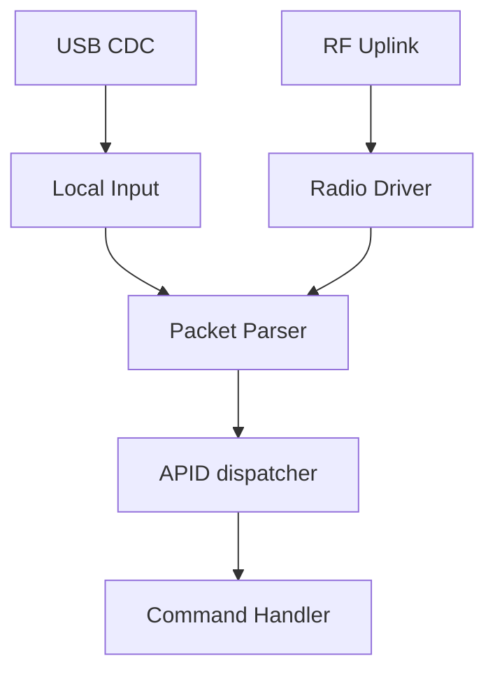

# Phase 1: Assisted Analysis

White-box analysis uses public information to accelerate the same discovery process performed during blind reconnaissance. Instead of starting from traces and component markings, the operator starts from repositories, firmware, schematics, documentation, and public writeups.

The risk this chapter demonstrates is often called a failure of "security by obscurity." Public design information is not automatically bad; open systems can be secure. The failure occurs when the system depends on attackers not knowing frequencies, packet formats, APIDs, debug paths, or command handlers.

**Primary SPARTA TTPs:**


- **Gather Spacecraft Design Information**
  - REC-0001.01 Software Design
  - REC-0001.02 Firmware
  - REC-0001.04 Data Bus
- **Gather Spacecraft Communications Information**
  - REC-0003.01 Communications Equipment
  - REC-0003.02 Commanding Details
  - REC-0003.03 Mission-Specific Channel Scanning
- **Eavesdropping**
  - REC-0005.01 Uplink Intercept Eavesdropping
  - REC-0005.02 Downlink Intercept
- **Gather FSW Development Information**
  - REC-0006.01 Development Environment

## Step 1: Open-Source Intelligence

The objective is to acquire the design history, technical specifications, and implementation details of the FlatSat system before touching the hardware.

Useful starting queries:

```text
"flatsat" "pwnsat"
"Pwnsat" "FlatSat"
"Pwnsat" "firmware"
"Pwnsat" "SX1262"
```

In this context:

- `FlatSat` refers to the satellite-like laboratory hardware.
- `Pwnsat` refers to the vulnerable educational mission/platform.

Relevant public sources may include:

- Main hardware repository: [Pwnsat/FlatSat](https://github.com/Pwnsat/FlatSat)
- Firmware repository: [Pwnsat/FlatSat_Firmware](https://github.com/Pwnsat/FlatSat_Firmware)
- Project blog or conference material.
- Release artifacts such as firmware binaries or ELF files.

## What to Collect

| Source              | Information to Extract                                                            |
| ------------------- | --------------------------------------------------------------------------------- |
| Hardware repository | Schematics, board layout, component list, pinout, test points.                    |
| Firmware repository | APIDs, packet format, command handlers, radio configuration.                      |
| Build files         | Toolchain, target MCU, libraries, compile flags.                                  |
| Releases            | Firmware binaries, ELF symbols, version history.                                  |
| Blog posts          | Architecture diagrams, frequencies, operator workflow, intended mission behavior. |

The output of OSINT should be a technical dossier, not a pile of links.

## Step 2: Hardware Architecture From Public Data

Public design material should be converted into a hardware table.

| Component | Description | Interface | Security Relevance |
| --- | --- | --- | --- |
| MCU | Raspberry Pi RP2040 | Dual-core ARM Cortex-M0+ | Runs flight software and packet handlers. |
| Radio 0 | SX1262 LoRa uplink | SPI0, NSS pin 17 in the observed design | Receives telecommands. |
| Radio 1 | SX1262 LoRa downlink | SPI0, NSS pin 5 in the observed design | Sends telemetry. |
| IMU | LIS2DH12 accelerometer | I2C, SDA 20, SCL 21 | Source of motion telemetry. |
| ENV | BME280 environmental sensor | I2C, SDA 20, SCL 21 | Source of environmental telemetry. |
| Status LED | WS2812B NeoPixel | GPIO 15 | Visual system state indicator. |
| USB | TinyUSB CDC | USB data lines | Local command, debugging, or ground-station simulation path. |

This table should be compared against black-box findings. If the logic analyzer found I2C on two active channels, and the schematic says both sensors are on SDA 20/SCL 21, the two discovery paths reinforce each other.

## Step 3: Firmware Architecture

The firmware uses the RP2040 as a small flight computer. The design can be understood as an asymmetric multiprocessing model:

- **Core 0, mission control and RF:** manages the radio interfaces, sensor acquisition, telemetry generation, and telecommand processing.
- **Core 1, OBC data link:** handles TinyUSB/USB CDC behavior, providing a local high-speed path for command and control or ground-station simulation.

This split matters for security because attacker-controlled input may enter through more than one path:



If both paths reuse the same parser, one bug can become reachable through local and RF interfaces.

## Step 4: Communication Parameters

The firmware and documentation identify two mission-specific RF paths:

| Path | Frequency | Direction | Purpose |
| --- | --- | --- | --- |
| Uplink | 918 MHz | Ground to spacecraft | Telecommands. |
| Downlink | 916 MHz | Spacecraft to ground | Telemetry. |

In a controlled lab, these values allow the researcher to configure receivers and transmitters for capture and replay testing. In real-world operations, this information would be sensitive because it narrows the scanning problem.

## Step 5: Space Packet Protocol Use

Pwnsat uses a CCSDS Space Packet Protocol-inspired format to route messages by **Application Process Identifier**, or APID.

The firmware categorizes traffic into:

- **Telecommands, TC:** commands sent to the spacecraft.
- **Telemetry, TM:** status or data sent from the spacecraft.

Observed APID registry:

| APID | Function | Type | Payload Description |
| --- | --- | --- | --- |
| `0x01` | PING | TC/TM | Connectivity heartbeat or acknowledgement. |
| `0x02` | RESET | TC | Triggers watchdog or hardware reset behavior. |
| `0x04` | THRUSTER | TC/TM | Sets or reports simulated thruster power levels. |
| `0x07` | FLASH | TC/TM | Triggers fragmented image or firmware transfer behavior. |
| `0x08` | SEND_TM | TM | Standard periodic sensor telemetry frame. |

Each APID should be treated as a separate attack surface. The question is not only "does the parser accept the packet?" but "what state changes after dispatch?"

## Step 6: Worker and Timing Analysis

The telemetry worker behaves like a non-blocking state machine. Instead of long blocking delays, it uses timeout structures to schedule periodic tasks while remaining responsive to incoming commands.

Observed timing model:

| Task | Interval | Security Relevance |
| --- | --- | --- |
| Sensor telemetry | About 10.5 seconds | Gives a downlink timing signal and sensor correlation point. |
| Sync or ping | About 15 seconds | Helps identify liveness and sequence behavior. |
| Idle frame | About 20 seconds | Helps distinguish normal background traffic from command responses. |

Timing is useful during reversing because it lets you classify packets even before every byte is understood.

Example:

```text
Every ~10.5 s: telemetry-sized downlink frame
Every ~15.0 s: short heartbeat or sync frame
After TC packet: immediate response or state change
```

## Step 7: Source Code Review Targets

When reviewing firmware, prioritize code that handles untrusted input.

| Target | What to Look For |
| --- | --- |
| Radio receive callback | Raw packet length, buffer ownership, error handling. |
| SPP parser | Header parsing, endian handling, length validation, APID extraction. |
| APID dispatcher | Default cases, missing authorization, fall-through behavior. |
| Command handlers | Unsafe copies, integer underflow/overflow, state-changing commands. |
| Telemetry builder | Sensitive data exposure, inconsistent lengths, uninitialized memory. |
| Flash handler | Fragment counting, bounds checking, write offsets. |
| Reset handler | Missing safety checks, unauthenticated denial of service. |

Red flags:

- Trusting packet length directly.
- Copying payloads before verifying bounds.
- Using APID values as array indexes without range checks.
- Accepting state-changing commands without authentication.
- Returning internal memory or diagnostic data in telemetry.
- Separate RF and USB paths with inconsistent validation.

## Step 8: White-Box to Black-Box Correlation

White-box information should be validated on the actual board.

| White-Box Claim | Black-Box Validation |
| --- | --- |
| Sensors use I2C on SDA/SCL | Capture two idle-high lines and decode addresses. |
| SX1262 radios use SPI | Capture SPI transactions during radio initialization. |
| Uplink is 918 MHz | Observe lab telecommands on configured receiver. |
| Downlink is 916 MHz | Observe periodic telemetry on configured receiver. |
| APID `0x02` resets board | Send a lab packet and confirm reboot behavior. |
| Telemetry every ~10.5 s | Measure packet timing in downlink capture. |

This correlation step prevents documentation drift from becoming a false assumption.

> Assisted analysis should make later exploitation more precise, not more reckless. The better the map, the smaller and cleaner each experiment can be.
